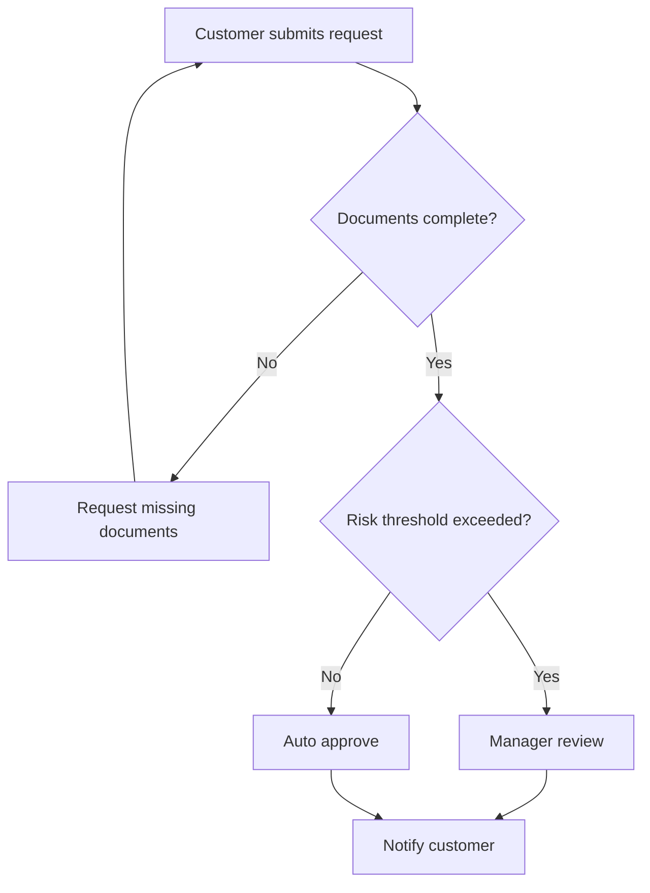

# Process Modeling With AI

<div class="lesson-meta">
  <span>AI-Augmented BA Workflow</span>
  <span>Software BA</span>
  <span>Core</span>
</div>

## Learning outcomes

- Use AI to create first-pass process maps.
- Add exception paths, roles, SLAs, and controls.
- Review process diagrams for missing ownership and policy decisions.

## Why this matters for BA work

<div class="ba-callout">
AI can draft process flows, but BA quality comes from decisions, exceptions, ownership, and operational constraints.
</div>

This lesson matters because process models are where hidden requirements usually surface: handoffs, exception paths, timing, ownership, and system boundaries. AI can convert text into diagrams, but the BA must test whether the diagram exposes operational truth. A beautiful flow that misses escalation or manual override is dangerous.

## Common difficulties for BAs

In AI-Augmented BA Workflow, Process Modeling With AI becomes difficult when messy notes, half-validated decisions, and incomplete stakeholder context must become a shared artifact quickly. A BA should inspect the points below before treating an AI-supported artifact as ready for stakeholder decision or delivery handoff.

| Difficulty | Why it is hard in BA work | How a BA should handle it |
| --- | --- | --- |
| Accepting the first AI diagram because it looks clean. | The mistake "Accepting the first AI diagram because it looks clean." appears when the team discusses source attribution, conflict visibility, workshop decision flow, and backlog readiness without agreeing which source is authoritative. AI can smooth over the disagreement, so the BA must keep uncertainty visible. | Apply this control: keep speaker/source attribution visible until the responsible stakeholder confirms meaning. Then use the stronger pattern "Use the diagram as a review object and challenge every decision, handoff, and alternate path." and ask who must approve the artifact before it affects scope, build, test, or release. |
| Omitting exceptions and manual work. | For Process Modeling With AI, the friction is that AI can draft process flows, but BA quality comes from decisions, exceptions, ownership, and operational constraints. The weak pattern is tempting because AI can produce a fluent answer before the BA has checked ownership, source freshness, or decision rights. | Apply this control: keep speaker/source attribution visible until the responsible stakeholder confirms meaning. Then use the stronger pattern "Add failure, cancellation, timeout, escalation, and override paths." and ask who must approve the artifact before it affects scope, build, test, or release. |
| Using process boxes without owners. | This becomes hard when Process Review Checklist is expected to support the validated working artifact. If the BA does not challenge the draft, unsupported assumptions may enter planning, testing, or stakeholder communication. | Apply this control: keep speaker/source attribution visible until the responsible stakeholder confirms meaning. Then use the stronger pattern "Separate actors, systems, external services, and human reviewers into distinct lanes." and ask who must approve the artifact before it affects scope, build, test, or release. |

## Where this applies in real projects

Use this lesson when discovery or refinement produces more raw input than the BA can safely synthesize by hand in the available time. The practical output is not a longer document; it is Process Review Checklist with enough evidence, ownership, and decision clarity for the next project conversation.

| Project moment | How to apply this lesson | Concrete BA output |
| --- | --- | --- |
| Discovery | Ask AI to add exception paths to one existing flow. | Process Review Checklist showing source attribution, conflict visibility, workshop decision flow, and backlog readiness, with the action "Ask AI to add exception paths to one existing flow." translated into a reviewable decision, requirement, checklist, or question for the next meeting. |
| Synthesis | Mark every decision diamond with a business rule. | Process Review Checklist showing source evidence, with the action "Mark every decision diamond with a business rule." translated into a reviewable decision, requirement, checklist, or question for the next meeting. |
| Refinement | Add owner labels to process steps. | Process Review Checklist showing decision owner, with the action "Add owner labels to process steps." translated into a reviewable decision, requirement, checklist, or question for the next meeting. |

## If this is missing

If Process Modeling With AI is missing, important signals from interviews, tickets, process notes, or decisions may be lost before they reach the backlog. The BA can still recover, but only by converting the polished AI draft back into explicit evidence, assumptions, owners, and testable decisions.

| If missing | Project impact | Recovery action |
| --- | --- | --- |
| Ask AI to draw a process from a paragraph and accept it | The generated flow may omit exceptions, ownership, timing, and integration constraints. | Recover by using the stronger pattern: Use the diagram as a review object and challenge every decision, handoff, and alternate path. Rework Process Review Checklist until it exposes source attribution, conflict visibility, workshop decision flow, and backlog readiness, and do not share it as final until evidence, ownership, and validation path are explicit. |
| Model only the happy path | Delivery teams discover queues, retries, and manual work too late. | Recover by using the stronger pattern: Add failure, cancellation, timeout, escalation, and override paths. Rework Process Review Checklist until it exposes source attribution, conflict visibility, workshop decision flow, and backlog readiness, and do not share it as final until evidence, ownership, and validation path are explicit. |
| Mix user actions and system actions in one lane | Responsibility and automation boundaries become unclear. | Recover by using the stronger pattern: Separate actors, systems, external services, and human reviewers into distinct lanes. Rework Process Review Checklist until it exposes source attribution, conflict visibility, workshop decision flow, and backlog readiness, and do not share it as final until evidence, ownership, and validation path are explicit. |

## Mental model or core concept

Process modeling is not drawing boxes; it is clarifying work, decision rights, handoffs, and failure handling. AI can convert text into a flow, but the BA should challenge the draft: who owns each step, what triggers the next step, what happens when data is missing, and which controls are required.

## Practical BA example

AI drafts a clean onboarding flow: submit documents, verify, approve. The BA adds missing-document loop, duplicate customer check, risk review, SLA timer, manual override, and customer notification rules. The diagram becomes a decision tool, not decoration.

## Diagram



## BA artifact

### Process Review Checklist

| Flow element | BA review question | Evidence needed | Common gap |
| --- | --- | --- | --- |
| Actor | Who performs or owns the step? | Role matrix or SOP. | System step with no owner. |
| Decision | What rule chooses the branch? | Policy or business rule. | Diamond with vague condition. |
| Exception | What happens when input is invalid? | Support scripts and error logs. | Happy path only. |
| SLA/control | What timing or audit control applies? | Operational metric or compliance rule. | No escalation or audit. |

## AI expert note

AI-assisted process modeling should be treated as a hypothesis of the workflow. The expert BA asks whether every decision has a rule, every exception has an owner, every system interaction has a boundary, and every loop has a stopping condition. Diagrams should trigger better questions, not decorate requirements.

## Bad vs better example

| Weak pattern | Why it fails | Stronger BA pattern |
| --- | --- | --- |
| Ask AI to draw a process from a paragraph and accept it | The generated flow may omit exceptions, ownership, timing, and integration constraints. | Use the diagram as a review object and challenge every decision, handoff, and alternate path. |
| Model only the happy path | Delivery teams discover queues, retries, and manual work too late. | Add failure, cancellation, timeout, escalation, and override paths. |
| Mix user actions and system actions in one lane | Responsibility and automation boundaries become unclear. | Separate actors, systems, external services, and human reviewers into distinct lanes. |

## AI collaboration prompt

```text
Convert this process description into a Mermaid flowchart. Include actors, decision rules, exception paths, SLAs, handoffs, inputs, outputs, controls, and unresolved policy questions. After the diagram, list missing ownership or rule gaps.
```

## Mistakes to avoid

- Accepting the first AI diagram because it looks clean.
- Omitting exceptions and manual work.
- Using process boxes without owners.
- Drawing decisions without decision rules.

## Apply this tomorrow

1. Ask AI to add exception paths to one existing flow.
2. Mark every decision diamond with a business rule.
3. Add owner labels to process steps.
4. Review the diagram with support or operations, not only product.

## What a BA should remember

- A useful process diagram exposes decisions and handoffs.
- Exceptions often contain the real requirements.
- AI drafts flow; BA validates operation.
