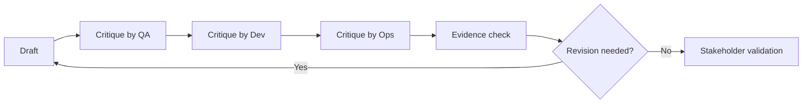

# Review Loops and Critique

<div class="lesson-meta">
  <span>AI Collaboration and Context Engineering</span>
  <span>Software BA</span>
  <span>Core</span>
</div>

## Learning outcomes

- Use AI as drafter, critic, counterparty, and gap finder.
- Run multi-perspective reviews for BA artifacts.
- Convert critique into prioritized revisions.

## Why this matters for BA work

<div class="ba-callout">
The strongest BA use of AI is not drafting faster; it is creating disciplined critique loops before artifacts reach the team.
</div>

Business Analysts sit between problem framing, stakeholder meaning, delivery constraints, and product decisions. In AI work, that position becomes more important because unclear language can create false certainty quickly. This lesson gives you a practical control you can apply before AI output becomes scope, backlog, or delivery commitment.

## Mental model or core concept

One-pass AI output is risky. A review loop makes AI work safer: draft, critique, revise, evidence-check, and stakeholder-validate. The BA can ask AI to review from product, QA, engineering, security, operations, and user perspectives, then decide which findings matter.

## Practical BA example

A generated SRS section looks complete. A critique pass finds that audit logging is missing, error states are vague, and a support workflow is not covered. The BA turns findings into revision tasks and validation questions instead of shipping the first draft.

## Diagram



## BA artifact

### Multi-Perspective Critique Grid

| Perspective | What to inspect | Finding format | Revision action |
| --- | --- | --- | --- |
| QA | Testability, edge cases, expected results. | Defect plus test scenario. | Rewrite AC and add negative case. |
| Developer | API, data, integration assumptions. | Implementation risk. | Clarify contract or dependency. |
| Operations | Support, monitoring, failure handling. | Runbook gap. | Add support flow and alert rule. |
| Compliance | Privacy, audit, policy constraints. | Control gap. | Add evidence and approval step. |

## AI collaboration prompt

```text
Review this artifact from QA, developer, operations, compliance, support, and end-user perspectives. Return findings with severity, evidence, affected section, revision recommendation, and validation question. Do not rewrite yet; critique first.
```

## Mistakes to avoid

- Asking AI to improve the draft without first diagnosing it.
- Accepting all critique findings equally.
- Skipping evidence for critique.
- Not preserving the revision decision trail.

## Apply this tomorrow

1. Run one draft through a QA critique prompt.
2. Ask AI to rank findings by delivery risk.
3. Convert critique into a revision backlog.
4. Share top three risks with the team before refinement.

## What a BA should remember

- Critique is where AI often creates the most BA value.
- Review loops make uncertainty visible.
- The BA chooses which critique findings become changes.
