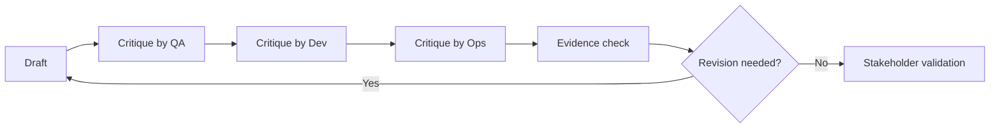

# Review Loops and Critique

<div class="lesson-meta">
  <span>AI Collaboration and Context Engineering</span>
  <span>Software BA</span>
  <span>Core</span>
</div>

## Learning outcomes

- Use AI as drafter, critic, counterparty, and gap finder.
- Run multi-perspective reviews for BA artifacts.
- Convert critique into prioritized revisions.

## Why this matters for BA work

<div class="ba-callout">
The strongest BA use of AI is not drafting faster; it is creating disciplined critique loops before artifacts reach the team.
</div>

This lesson matters because first AI drafts are optimized for fluency, not necessarily for correctness, risk, or delivery readiness. Review loops turn AI from a drafting shortcut into a quality system. BAs can use critique passes to expose ambiguity, missing rules, unsupported claims, test gaps, and stakeholder decisions before artifacts move downstream.

## Common difficulties for BAs

In AI Collaboration and Context Engineering, Review Loops and Critique becomes difficult when AI can draft quickly, but reviewers need repeatable context, structured output, and critique rules to trust the result. A BA should inspect the points below before treating an AI-supported artifact as ready for stakeholder decision or delivery handoff.

| Difficulty | Why it is hard in BA work | How a BA should handle it |
| --- | --- | --- |
| Asking AI to improve the draft without first diagnosing it. | The mistake "Asking AI to improve the draft without first diagnosing it." appears when the team discusses context package quality, prompt reuse, critique loop, and output contract without agreeing which source is authoritative. AI can smooth over the disagreement, so the BA must keep uncertainty visible. | Apply this control: separate context preparation, generation, critique, and human approval into visible steps. Then use the stronger pattern "Run critique passes for evidence, specificity, testability, and risk before sharing." and ask who must approve the artifact before it affects scope, build, test, or release. |
| Accepting all critique findings equally. | For Review Loops and Critique, the friction is that The strongest BA use of AI is not drafting faster; it is creating disciplined critique loops before artifacts reach the team. The weak pattern is tempting because AI can produce a fluent answer before the BA has checked ownership, source freshness, or decision rights. | Apply this control: separate context preparation, generation, critique, and human approval into visible steps. Then use the stronger pattern "Use a rubric with required lenses, severity, source reference, and recommended fix." and ask who must approve the artifact before it affects scope, build, test, or release. |
| Skipping evidence for critique. | This becomes hard when Multi-Perspective Critique Grid is expected to support the repeatable collaboration pattern. If the BA does not challenge the draft, unsupported assumptions may enter planning, testing, or stakeholder communication. | Apply this control: separate context preparation, generation, critique, and human approval into visible steps. Then use the stronger pattern "Convert critique findings into a defect register or decision log with owners." and ask who must approve the artifact before it affects scope, build, test, or release. |

## Where this applies in real projects

Use this lesson when a BA team wants reusable AI collaboration patterns instead of one-off prompts that depend on individual habit. The practical output is not a longer document; it is Multi-Perspective Critique Grid with enough evidence, ownership, and decision clarity for the next project conversation.

| Project moment | How to apply this lesson | Concrete BA output |
| --- | --- | --- |
| Context setup | Run one draft through a QA critique prompt. | Multi-Perspective Critique Grid showing context package quality, prompt reuse, critique loop, and output contract, with the action "Run one draft through a QA critique prompt." translated into a reviewable decision, requirement, checklist, or question for the next meeting. |
| Prompt reuse | Ask AI to rank findings by delivery risk. | Multi-Perspective Critique Grid showing source evidence, with the action "Ask AI to rank findings by delivery risk." translated into a reviewable decision, requirement, checklist, or question for the next meeting. |
| Peer review | Convert critique into a revision backlog. | Multi-Perspective Critique Grid showing decision owner, with the action "Convert critique into a revision backlog." translated into a reviewable decision, requirement, checklist, or question for the next meeting. |

## If this is missing

If Review Loops and Critique is missing, outputs vary by person, assumptions stay hidden, and review quality depends on who happened to write the prompt. The BA can still recover, but only by converting the polished AI draft back into explicit evidence, assumptions, owners, and testable decisions.

| If missing | Project impact | Recovery action |
| --- | --- | --- |
| Accept the first AI draft because it reads well | Fluency can hide ambiguity, false claims, and untestable wording. | Recover by using the stronger pattern: Run critique passes for evidence, specificity, testability, and risk before sharing. Rework Multi-Perspective Critique Grid until it exposes context package quality, prompt reuse, critique loop, and output contract, and do not share it as final until evidence, ownership, and validation path are explicit. |
| Ask a generic question like what is wrong with this | The critique may be shallow and miss the BA quality dimensions. | Recover by using the stronger pattern: Use a rubric with required lenses, severity, source reference, and recommended fix. Rework Multi-Perspective Critique Grid until it exposes context package quality, prompt reuse, critique loop, and output contract, and do not share it as final until evidence, ownership, and validation path are explicit. |
| Let review comments remain informal | The team cannot track whether risks were resolved. | Recover by using the stronger pattern: Convert critique findings into a defect register or decision log with owners. Rework Multi-Perspective Critique Grid until it exposes context package quality, prompt reuse, critique loop, and output contract, and do not share it as final until evidence, ownership, and validation path are explicit. |

## Mental model or core concept

One-pass AI output is risky. A review loop makes AI work safer: draft, critique, revise, evidence-check, and stakeholder-validate. The BA can ask AI to review from product, QA, engineering, security, operations, and user perspectives, then decide which findings matter.

## Practical BA example

A generated SRS section looks complete. A critique pass finds that audit logging is missing, error states are vague, and a support workflow is not covered. The BA turns findings into revision tasks and validation questions instead of shipping the first draft.

## Diagram



## BA artifact

### Multi-Perspective Critique Grid

| Perspective | What to inspect | Finding format | Revision action |
| --- | --- | --- | --- |
| QA | Testability, edge cases, expected results. | Defect plus test scenario. | Rewrite AC and add negative case. |
| Developer | API, data, integration assumptions. | Implementation risk. | Clarify contract or dependency. |
| Operations | Support, monitoring, failure handling. | Runbook gap. | Add support flow and alert rule. |
| Compliance | Privacy, audit, policy constraints. | Control gap. | Add evidence and approval step. |

## AI expert note

The most effective AI workflows separate creation from critique. Expert BAs design named review lenses: evidence, testability, risk, stakeholder conflict, operational feasibility, and compliance. Asking the same model to critique its own draft helps, but stronger practice uses explicit rubrics, source checks, and human review for high-risk decisions.

## Bad vs better example

| Weak pattern | Why it fails | Stronger BA pattern |
| --- | --- | --- |
| Accept the first AI draft because it reads well | Fluency can hide ambiguity, false claims, and untestable wording. | Run critique passes for evidence, specificity, testability, and risk before sharing. |
| Ask a generic question like what is wrong with this | The critique may be shallow and miss the BA quality dimensions. | Use a rubric with required lenses, severity, source reference, and recommended fix. |
| Let review comments remain informal | The team cannot track whether risks were resolved. | Convert critique findings into a defect register or decision log with owners. |

## AI collaboration prompt

```text
Review this artifact from QA, developer, operations, compliance, support, and end-user perspectives. Return findings with severity, evidence, affected section, revision recommendation, and validation question. Do not rewrite yet; critique first.
```

## Mistakes to avoid

- Asking AI to improve the draft without first diagnosing it.
- Accepting all critique findings equally.
- Skipping evidence for critique.
- Not preserving the revision decision trail.

## Apply this tomorrow

1. Run one draft through a QA critique prompt.
2. Ask AI to rank findings by delivery risk.
3. Convert critique into a revision backlog.
4. Share top three risks with the team before refinement.

## What a BA should remember

- Critique is where AI often creates the most BA value.
- Review loops make uncertainty visible.
- The BA chooses which critique findings become changes.
