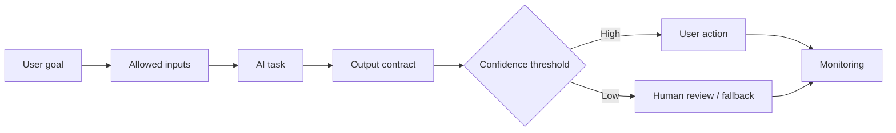

# Specifying AI-Enabled Features

<div class="lesson-meta">
  <span>Building AI-Enabled Products as a BA</span>
  <span>Software BA</span>
  <span>Advanced</span>
</div>

## Learning outcomes

- Write requirements for probabilistic AI behavior.
- Specify input, output, confidence, fallback, and evaluation.
- Avoid deterministic acceptance criteria for non-deterministic systems.

## Why this matters for BA work

<div class="ba-callout">
AI-enabled features require requirements for data, output quality, uncertainty, user control, and monitoring.
</div>

This lesson matters because specifying an AI-enabled feature is different from specifying a deterministic screen or workflow. The BA must define task boundary, allowed input, output contract, confidence behavior, evaluation, human review, fallback, monitoring, and user messaging. Without those controls, the feature cannot be tested, trusted, or operated.

## Common difficulties for BAs

In Building AI-Enabled Products as a BA, Specifying AI-Enabled Features becomes difficult when AI product behavior contains uncertainty, safety boundaries, evaluation design, fallback, monitoring, and user trust concerns. A BA should inspect the points below before treating an AI-supported artifact as ready for stakeholder decision or delivery handoff.

| Difficulty | Why it is hard in BA work | How a BA should handle it |
| --- | --- | --- |
| Writing acceptance criteria as if AI output is always deterministic. | The mistake "Writing acceptance criteria as if AI output is always deterministic." appears when the team discusses AI task boundary, evaluation set, human review, fallback, telemetry, and harm controls without agreeing which source is authoritative. AI can smooth over the disagreement, so the BA must keep uncertainty visible. | Apply this control: make confidence, refusal, escalation, correction capture, and monitoring part of the requirement. Then use the stronger pattern "Define supported intents, source rules, output format, confidence thresholds, and unsupported-question handling." and ask who must approve the artifact before it affects scope, build, test, or release. |
| Ignoring low-confidence behavior. | For Specifying AI-Enabled Features, the friction is that AI-enabled features require requirements for data, output quality, uncertainty, user control, and monitoring. The weak pattern is tempting because AI can produce a fluent answer before the BA has checked ownership, source freshness, or decision rights. | Apply this control: make confidence, refusal, escalation, correction capture, and monitoring part of the requirement. Then use the stronger pattern "Create curated evaluation cases covering common, edge, adversarial, and fallback scenarios." and ask who must approve the artifact before it affects scope, build, test, or release. |
| Not specifying correction and feedback loops. | This becomes hard when AI Feature Specification Canvas is expected to support the AI feature operating contract. If the BA does not challenge the draft, unsupported assumptions may enter planning, testing, or stakeholder communication. | Apply this control: make confidence, refusal, escalation, correction capture, and monitoring part of the requirement. Then use the stronger pattern "Specify monitoring events, quality metrics, review cadence, and owner response." and ask who must approve the artifact before it affects scope, build, test, or release. |

## Where this applies in real projects

Use this lesson when the BA is specifying a feature where AI output changes user action, operational workload, or customer experience. The practical output is not a longer document; it is AI Feature Specification Canvas with enough evidence, ownership, and decision clarity for the next project conversation.

| Project moment | How to apply this lesson | Concrete BA output |
| --- | --- | --- |
| AI behavior design | Add a confidence threshold question to one AI feature idea. | AI Feature Specification Canvas showing AI task boundary, evaluation set, human review, fallback, telemetry, and harm controls, with the action "Add a confidence threshold question to one AI feature idea." translated into a reviewable decision, requirement, checklist, or question for the next meeting. |
| Evaluation planning | Define the output contract before UI design. | AI Feature Specification Canvas showing source evidence, with the action "Define the output contract before UI design." translated into a reviewable decision, requirement, checklist, or question for the next meeting. |
| Operations handoff | Write one fallback scenario. | AI Feature Specification Canvas showing decision owner, with the action "Write one fallback scenario." translated into a reviewable decision, requirement, checklist, or question for the next meeting. |

## If this is missing

If Specifying AI-Enabled Features is missing, the feature may ship without clear confidence rules, human review triggers, fallback paths, or monitoring events. The BA can still recover, but only by converting the polished AI draft back into explicit evidence, assumptions, owners, and testable decisions.

| If missing | Project impact | Recovery action |
| --- | --- | --- |
| Specify that the AI assistant should answer user questions | The task boundary, allowed sources, refusal behavior, and quality bar are undefined. | Recover by using the stronger pattern: Define supported intents, source rules, output format, confidence thresholds, and unsupported-question handling. Rework AI Feature Specification Canvas until it exposes AI task boundary, evaluation set, human review, fallback, telemetry, and harm controls, and do not share it as final until evidence, ownership, and validation path are explicit. |
| Use demo examples as acceptance criteria | Demo cases are usually optimistic and do not prove production readiness. | Recover by using the stronger pattern: Create curated evaluation cases covering common, edge, adversarial, and fallback scenarios. Rework AI Feature Specification Canvas until it exposes AI task boundary, evaluation set, human review, fallback, telemetry, and harm controls, and do not share it as final until evidence, ownership, and validation path are explicit. |
| Ignore post-launch monitoring | AI behavior can drift as data, prompts, sources, or user behavior change. | Recover by using the stronger pattern: Specify monitoring events, quality metrics, review cadence, and owner response. Rework AI Feature Specification Canvas until it exposes AI task boundary, evaluation set, human review, fallback, telemetry, and harm controls, and do not share it as final until evidence, ownership, and validation path are explicit. |

## Mental model or core concept

AI features do not behave like ordinary deterministic features. The BA must specify what task the model performs, what data it can use, what output contract it must follow, what confidence threshold matters, how users correct it, when humans review it, and how quality is monitored after release.

## Practical BA example

A support triage assistant classifies tickets into billing, technical, and policy categories. The BA specifies training examples, output labels, confidence thresholds, escalation to human review, correction capture, audit record, and evaluation metrics such as precision on high-risk categories.

## Diagram



## BA artifact

### AI Feature Specification Canvas

| Area | Requirement question | Example requirement | Acceptance signal |
| --- | --- | --- | --- |
| Model task | What does AI decide or generate? | Classify ticket into approved category list. | Output category is one of defined labels. |
| Input data | What context is allowed? | Use ticket text, account tier, and product area. | No restricted PII included. |
| Uncertainty | What happens below confidence threshold? | Below 0.75 route to human triage. | Low-confidence cases enter review queue. |
| Evaluation | How is quality measured? | Precision for billing category >= 90%. | Evaluation set passes threshold. |

## AI expert note

The expert BA treats the model as one component inside a product system. Requirements should cover data flow, prompt or retrieval context, model behavior constraints, evaluation dataset, acceptance thresholds, misuse cases, audit logs, and operational ownership. The user experience must communicate uncertainty honestly without creating unnecessary friction.

## Bad vs better example

| Weak pattern | Why it fails | Stronger BA pattern |
| --- | --- | --- |
| Specify that the AI assistant should answer user questions | The task boundary, allowed sources, refusal behavior, and quality bar are undefined. | Define supported intents, source rules, output format, confidence thresholds, and unsupported-question handling. |
| Use demo examples as acceptance criteria | Demo cases are usually optimistic and do not prove production readiness. | Create curated evaluation cases covering common, edge, adversarial, and fallback scenarios. |
| Ignore post-launch monitoring | AI behavior can drift as data, prompts, sources, or user behavior change. | Specify monitoring events, quality metrics, review cadence, and owner response. |

## AI collaboration prompt

```text
Specify this AI-enabled feature using: user goal, AI task, allowed inputs, prohibited inputs, output contract, confidence threshold, human review trigger, fallback behavior, user correction, audit needs, safety constraints, evaluation metrics, and monitoring events.
```

## Mistakes to avoid

- Writing acceptance criteria as if AI output is always deterministic.
- Ignoring low-confidence behavior.
- Not specifying correction and feedback loops.
- Measuring only user satisfaction without output quality metrics.

## Apply this tomorrow

1. Add a confidence threshold question to one AI feature idea.
2. Define the output contract before UI design.
3. Write one fallback scenario.
4. Ask data or engineering what evaluation set is available.

## What a BA should remember

- AI requirements must describe uncertainty.
- Output quality is part of functional behavior.
- Human review and fallback are product features, not afterthoughts.
