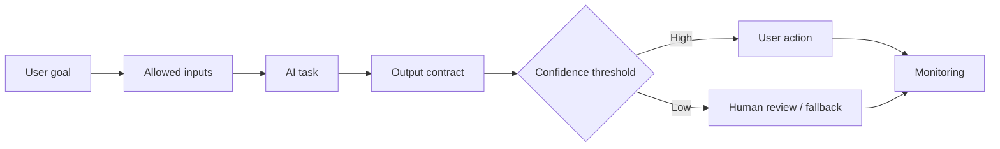

# Specifying AI-Enabled Features

<div class="lesson-meta">
  <span>Building AI-Enabled Products as a BA</span>
  <span>Software BA</span>
  <span>Advanced</span>
</div>

## Learning outcomes

- Write requirements for probabilistic AI behavior.
- Specify input, output, confidence, fallback, and evaluation.
- Avoid deterministic acceptance criteria for non-deterministic systems.

## Why this matters for BA work

<div class="ba-callout">
AI-enabled features require requirements for data, output quality, uncertainty, user control, and monitoring.
</div>

Business Analysts sit between problem framing, stakeholder meaning, delivery constraints, and product decisions. In AI work, that position becomes more important because unclear language can create false certainty quickly. This lesson gives you a practical control you can apply before AI output becomes scope, backlog, or delivery commitment.

## Mental model or core concept

AI features do not behave like ordinary deterministic features. The BA must specify what task the model performs, what data it can use, what output contract it must follow, what confidence threshold matters, how users correct it, when humans review it, and how quality is monitored after release.

## Practical BA example

A support triage assistant classifies tickets into billing, technical, and policy categories. The BA specifies training examples, output labels, confidence thresholds, escalation to human review, correction capture, audit record, and evaluation metrics such as precision on high-risk categories.

## Diagram



## BA artifact

### AI Feature Specification Canvas

| Area | Requirement question | Example requirement | Acceptance signal |
| --- | --- | --- | --- |
| Model task | What does AI decide or generate? | Classify ticket into approved category list. | Output category is one of defined labels. |
| Input data | What context is allowed? | Use ticket text, account tier, and product area. | No restricted PII included. |
| Uncertainty | What happens below confidence threshold? | Below 0.75 route to human triage. | Low-confidence cases enter review queue. |
| Evaluation | How is quality measured? | Precision for billing category >= 90%. | Evaluation set passes threshold. |

## AI collaboration prompt

```text
Specify this AI-enabled feature using: user goal, AI task, allowed inputs, prohibited inputs, output contract, confidence threshold, human review trigger, fallback behavior, user correction, audit needs, safety constraints, evaluation metrics, and monitoring events.
```

## Mistakes to avoid

- Writing acceptance criteria as if AI output is always deterministic.
- Ignoring low-confidence behavior.
- Not specifying correction and feedback loops.
- Measuring only user satisfaction without output quality metrics.

## Apply this tomorrow

1. Add a confidence threshold question to one AI feature idea.
2. Define the output contract before UI design.
3. Write one fallback scenario.
4. Ask data or engineering what evaluation set is available.

## What a BA should remember

- AI requirements must describe uncertainty.
- Output quality is part of functional behavior.
- Human review and fallback are product features, not afterthoughts.
