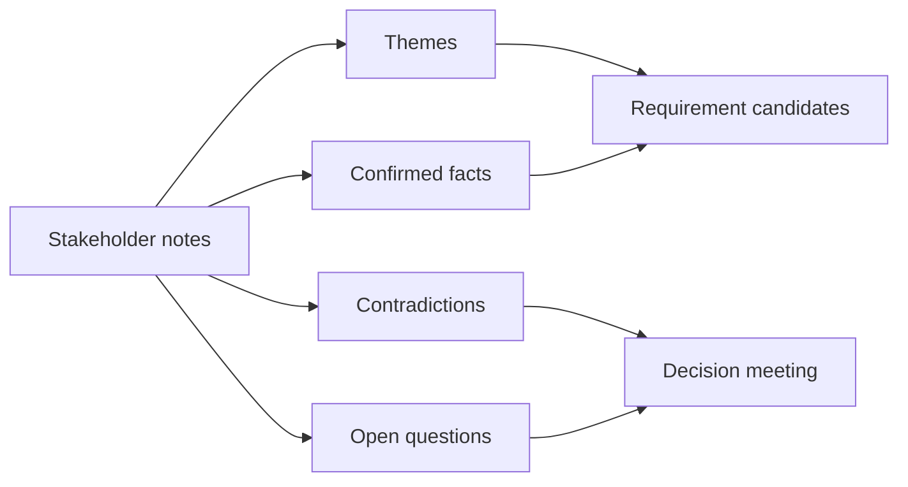

# Stakeholder Interviews and Synthesis

<div class="lesson-meta">
  <span>AI-Augmented BA Workflow</span>
  <span>Software BA</span>
  <span>Core</span>
</div>

## Learning outcomes

- Turn messy notes into themes, facts, contradictions, and requirement candidates.
- Keep stakeholder attribution instead of flattening nuance.
- Prepare conflict-resolution questions.

## Why this matters for BA work

<div class="ba-callout">
AI can summarize interviews quickly, but synthesis requires preserving contradictions, attribution, and decisions.
</div>

Business Analysts sit between problem framing, stakeholder meaning, delivery constraints, and product decisions. In AI work, that position becomes more important because unclear language can create false certainty quickly. This lesson gives you a practical control you can apply before AI output becomes scope, backlog, or delivery commitment.

## Mental model or core concept

Interview synthesis is not the same as summarization. A summary compresses; synthesis compares. BA synthesis should preserve who said what, which statements agree, which conflict, which decisions are implied, and which questions must be resolved before requirements are written.

## Practical BA example

Sales says discount approval takes one day; finance says exceptions can take five days; operations says VIP requests bypass the queue. AI can cluster notes, but the BA must expose the policy conflict and ask leaders to decide priority and audit rules.

## Diagram



## BA artifact

### Interview Synthesis Board

| Theme | Confirmed fact | Contradiction | Follow-up question |
| --- | --- | --- | --- |
| Approval time | Standard request usually one day. | Finance exception takes up to five days. | Which SLA is promised to customers? |
| VIP handling | VIP requests are treated differently. | No documented bypass rule. | Who can approve VIP bypass? |
| Audit | Finance needs exception trace. | Sales uses email approval. | What audit record is mandatory? |
| Ownership | Managers approve discounts. | No backup owner for absence. | Who owns approval when manager is unavailable? |

## AI collaboration prompt

```text
Synthesize these interview notes into themes, confirmed facts, contradictions, implied requirements, open questions, and decision owners. Preserve stakeholder attribution and do not merge conflicting statements into a false consensus.
```

## Mistakes to avoid

- Producing a pretty summary that hides disagreement.
- Removing stakeholder attribution.
- Converting every interview statement into a requirement.
- Failing to separate current-state facts from desired future-state decisions.

## Apply this tomorrow

1. Add a contradiction column to your interview summary.
2. Ask AI to identify false consensus in notes.
3. Tag every requirement candidate with speaker/source.
4. Schedule decision follow-up for unresolved conflicts.

## What a BA should remember

- Synthesis protects nuance.
- Contradiction is valuable discovery data.
- Attribution makes requirements defensible.
