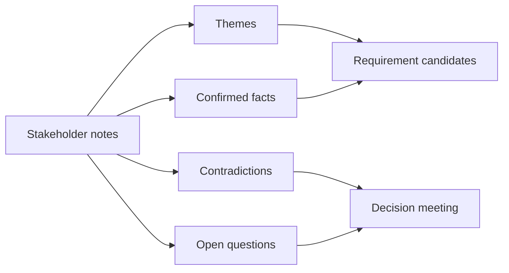

# Stakeholder Interviews and Synthesis

<div class="lesson-meta">
  <span>AI-Augmented BA Workflow</span>
  <span>Software BA</span>
  <span>Core</span>
</div>

## Learning outcomes

- Turn messy notes into themes, facts, contradictions, and requirement candidates.
- Keep stakeholder attribution instead of flattening nuance.
- Prepare conflict-resolution questions.

## Why this matters for BA work

<div class="ba-callout">
AI can summarize interviews quickly, but synthesis requires preserving contradictions, attribution, and decisions.
</div>

This lesson matters because AI can summarize interviews quickly, but speed can flatten disagreement, source attribution, and political nuance. For BA work, the important output is not a neat summary; it is a reliable synthesis that preserves who said what, where stakeholders conflict, which decision is missing, and what evidence still needs validation.

## Common difficulties for BAs

In AI-Augmented BA Workflow, Stakeholder Interviews and Synthesis becomes difficult when messy notes, half-validated decisions, and incomplete stakeholder context must become a shared artifact quickly. A BA should inspect the points below before treating an AI-supported artifact as ready for stakeholder decision or delivery handoff.

| Difficulty | Why it is hard in BA work | How a BA should handle it |
| --- | --- | --- |
| Producing a pretty summary that hides disagreement. | The mistake "Producing a pretty summary that hides disagreement." appears when the team discusses source attribution, conflict visibility, workshop decision flow, and backlog readiness without agreeing which source is authoritative. AI can smooth over the disagreement, so the BA must keep uncertainty visible. | Apply this control: keep speaker/source attribution visible until the responsible stakeholder confirms meaning. Then use the stronger pattern "Request themes with speaker attribution, conflict points, evidence strength, and follow-up questions." and ask who must approve the artifact before it affects scope, build, test, or release. |
| Removing stakeholder attribution. | For Stakeholder Interviews and Synthesis, the friction is that AI can summarize interviews quickly, but synthesis requires preserving contradictions, attribution, and decisions. The weak pattern is tempting because AI can produce a fluent answer before the BA has checked ownership, source freshness, or decision rights. | Apply this control: keep speaker/source attribution visible until the responsible stakeholder confirms meaning. Then use the stronger pattern "Keep role, context, scenario, and decision impact attached to each synthesized need." and ask who must approve the artifact before it affects scope, build, test, or release. |
| Converting every interview statement into a requirement. | This becomes hard when Interview Synthesis Board is expected to support the validated working artifact. If the BA does not challenge the draft, unsupported assumptions may enter planning, testing, or stakeholder communication. | Apply this control: keep speaker/source attribution visible until the responsible stakeholder confirms meaning. Then use the stronger pattern "Combine sentiment with frequency, risk, revenue, compliance, and decision ownership." and ask who must approve the artifact before it affects scope, build, test, or release. |

## Where this applies in real projects

Use this lesson when discovery or refinement produces more raw input than the BA can safely synthesize by hand in the available time. The practical output is not a longer document; it is Interview Synthesis Board with enough evidence, ownership, and decision clarity for the next project conversation.

| Project moment | How to apply this lesson | Concrete BA output |
| --- | --- | --- |
| Discovery | Add a contradiction column to your interview summary. | Interview Synthesis Board showing source attribution, conflict visibility, workshop decision flow, and backlog readiness, with the action "Add a contradiction column to your interview summary." translated into a reviewable decision, requirement, checklist, or question for the next meeting. |
| Synthesis | Ask AI to identify false consensus in notes. | Interview Synthesis Board showing source evidence, with the action "Ask AI to identify false consensus in notes." translated into a reviewable decision, requirement, checklist, or question for the next meeting. |
| Refinement | Tag every requirement candidate with speaker/source. | Interview Synthesis Board showing decision owner, with the action "Tag every requirement candidate with speaker/source." translated into a reviewable decision, requirement, checklist, or question for the next meeting. |

## If this is missing

If Stakeholder Interviews and Synthesis is missing, important signals from interviews, tickets, process notes, or decisions may be lost before they reach the backlog. The BA can still recover, but only by converting the polished AI draft back into explicit evidence, assumptions, owners, and testable decisions.

| If missing | Project impact | Recovery action |
| --- | --- | --- |
| Ask AI for a clean summary of all interviews | A clean summary can erase contradictions and minority but critical concerns. | Recover by using the stronger pattern: Request themes with speaker attribution, conflict points, evidence strength, and follow-up questions. Rework Interview Synthesis Board until it exposes source attribution, conflict visibility, workshop decision flow, and backlog readiness, and do not share it as final until evidence, ownership, and validation path are explicit. |
| Merge similar stakeholder statements into one need | Different roles may use the same words for different operational problems. | Recover by using the stronger pattern: Keep role, context, scenario, and decision impact attached to each synthesized need. Rework Interview Synthesis Board until it exposes source attribution, conflict visibility, workshop decision flow, and backlog readiness, and do not share it as final until evidence, ownership, and validation path are explicit. |
| Treat transcript sentiment as priority | Emotion signals importance but does not prove business value or feasibility. | Recover by using the stronger pattern: Combine sentiment with frequency, risk, revenue, compliance, and decision ownership. Rework Interview Synthesis Board until it exposes source attribution, conflict visibility, workshop decision flow, and backlog readiness, and do not share it as final until evidence, ownership, and validation path are explicit. |

## Mental model or core concept

Interview synthesis is not the same as summarization. A summary compresses; synthesis compares. BA synthesis should preserve who said what, which statements agree, which conflict, which decisions are implied, and which questions must be resolved before requirements are written.

## Practical BA example

Sales says discount approval takes one day; finance says exceptions can take five days; operations says VIP requests bypass the queue. AI can cluster notes, but the BA must expose the policy conflict and ask leaders to decide priority and audit rules.

## Diagram



## BA artifact

### Interview Synthesis Board

| Theme | Confirmed fact | Contradiction | Follow-up question |
| --- | --- | --- | --- |
| Approval time | Standard request usually one day. | Finance exception takes up to five days. | Which SLA is promised to customers? |
| VIP handling | VIP requests are treated differently. | No documented bypass rule. | Who can approve VIP bypass? |
| Audit | Finance needs exception trace. | Sales uses email approval. | What audit record is mandatory? |
| Ownership | Managers approve discounts. | No backup owner for absence. | Who owns approval when manager is unavailable? |

## AI expert note

Interview synthesis should treat transcripts as evidence, not objective truth. AI can cluster themes and detect contradictions, but the BA must preserve attribution, role context, emotion, and decision authority. Expert practice is to separate quote-backed facts, interpreted needs, conflicts, and follow-up questions before drafting any requirement.

## Bad vs better example

| Weak pattern | Why it fails | Stronger BA pattern |
| --- | --- | --- |
| Ask AI for a clean summary of all interviews | A clean summary can erase contradictions and minority but critical concerns. | Request themes with speaker attribution, conflict points, evidence strength, and follow-up questions. |
| Merge similar stakeholder statements into one need | Different roles may use the same words for different operational problems. | Keep role, context, scenario, and decision impact attached to each synthesized need. |
| Treat transcript sentiment as priority | Emotion signals importance but does not prove business value or feasibility. | Combine sentiment with frequency, risk, revenue, compliance, and decision ownership. |

## Stakeholder questions to ask

| Stakeholder | Question | Why the BA asks it |
| --- | --- | --- |
| Product owner | Which outcome should Stakeholder Interviews and Synthesis improve, and what trade-off are you willing to accept? | Prevents AI output from optimizing for a vague goal. |
| Engineering lead | What source, system, data, or constraint would make Interview Synthesis Board hard to implement? | Turns hidden technical constraints into visible requirement questions. |
| QA lead | Which rule, exception, or user state must be testable before you trust this artifact? | Converts fluent AI wording into observable behavior. |
| Operations or support | What failure path would create manual work if the lesson principle "Synthesis protects nuance" is ignored? | Surfaces support load, exception handling, and operating impact. |

## Decision log entries

| Decision item | Options to capture | Owner | Evidence needed |
| --- | --- | --- | --- |
| Scope boundary for Interview Synthesis Board | Must-have, later, out of scope | Product owner | Business outcome and release constraint |
| Authority for source attribution, conflict visibility, workshop decision flow, and backlog readiness | Documented source, stakeholder decision, assumption to validate | BA + accountable stakeholder | Source ID, date, and approval status |
| Review gate before handoff | Peer review, QA review, engineering review, formal approval | BA lead or project lead | Risk level and receiving-team readiness |
| Recovery if Producing a pretty summary that hides disagreement. | Rewrite, defer, escalate, or run validation workshop | Decision owner | Impact on scope, testability, and release risk |

## Definition of Ready / Done

| Gate | Ready signal | Done signal |
| --- | --- | --- |
| Definition of Ready | Sources for source attribution, conflict visibility, workshop decision flow, and backlog readiness are labeled and current. | Interview Synthesis Board can be reviewed without guessing missing context. |
| Definition of Ready | Open assumptions have owners and validation paths. | Stakeholders can decide whether to accept, reject, or defer each assumption. |
| Definition of Done | The artifact applies this control: keep speaker/source attribution visible until the responsible stakeholder confirms meaning. | Delivery, QA, or governance teams can act on the artifact. |
| Definition of Done | The weak pattern "Producing a pretty summary that hides disagreement." has been explicitly checked. | No unsupported AI claim is treated as an approved requirement. |

## Before and after artifact example

| Before | AI draft risk | Senior BA revision |
| --- | --- | --- |
| Prompt: "Create Interview Synthesis Board for Stakeholder Interviews and Synthesis." | The model may invent source facts, owners, thresholds, or implementation rules. | Add sources, scope boundary, source authority, output schema, and the instruction: Request themes with speaker attribution, conflict points, evidence strength, and follow-up questions. |
| Draft statement: "Add a contradiction column to your interview summary." | Useful action, but not yet tied to a decision owner or acceptance signal. | Rewrite as a project step with owner, expected artifact, review gate, and evidence required before handoff. |
| Final-looking paragraph about validated working artifact | The tone may hide uncertainty and missing stakeholder approval. | Convert it into a table of fact, assumption, decision needed, risk, and validation question. |

## Manual verification after AI output

| Verification lens | Manual check | Pass signal |
| --- | --- | --- |
| Evidence | Trace every important statement in Interview Synthesis Board to a source, decision, or labeled assumption. | No unsupported claim remains hidden. |
| Completeness | Check source attribution, conflict visibility, workshop decision flow, and backlog readiness against the intended audience and receiving team. | The artifact answers what product, engineering, QA, and operations need. |
| Testability | Ask whether QA can create positive, negative, boundary, and exception scenarios. | Ambiguous wording has been rewritten or logged as a question. |
| Accountability | Confirm who approves, who reviews, and who acts when the artifact is wrong. | Owners and escalation path are explicit. |

## AI collaboration prompt

```text
Synthesize these interview notes into themes, confirmed facts, contradictions, implied requirements, open questions, and decision owners. Preserve stakeholder attribution and do not merge conflicting statements into a false consensus.
```

## Mistakes to avoid

- Producing a pretty summary that hides disagreement.
- Removing stakeholder attribution.
- Converting every interview statement into a requirement.
- Failing to separate current-state facts from desired future-state decisions.

## Apply this tomorrow

1. Add a contradiction column to your interview summary.
2. Ask AI to identify false consensus in notes.
3. Tag every requirement candidate with speaker/source.
4. Schedule decision follow-up for unresolved conflicts.

## What a BA should remember

- Synthesis protects nuance.
- Contradiction is valuable discovery data.
- Attribution makes requirements defensible.
