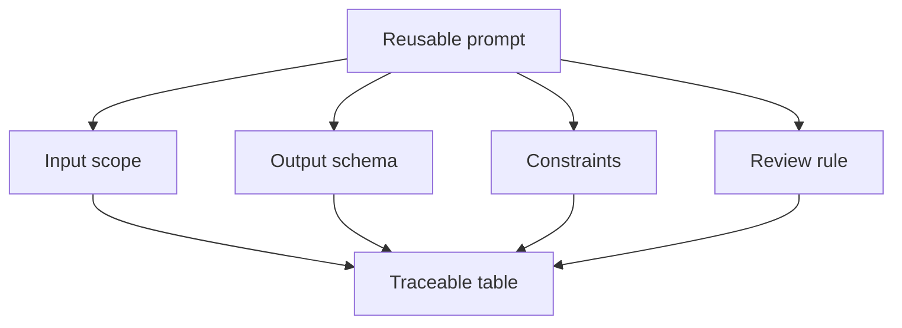

# Structured Outputs and Reusable Prompts

<div class="lesson-meta">
  <span>AI Collaboration and Context Engineering</span>
  <span>Software BA</span>
  <span>Core</span>
</div>

## Learning outcomes

- Design output tables and schemas for BA tasks.
- Create reusable prompts for repeated analysis work.
- Make AI output easier to review, compare, and trace.

## Why this matters for BA work

<div class="ba-callout">
Structured output turns AI from a chat response into a reviewable BA artifact.
</div>

This lesson matters because BA artifacts must be compared, reviewed, traced, and handed off. Free-form AI prose is hard to validate at scale. Structured outputs make missing fields visible, enforce evidence discipline, and let teams reuse prompts for stories, risks, requirements, decisions, and review findings without starting from scratch.

## Common difficulties for BAs

In AI Collaboration and Context Engineering, Structured Outputs and Reusable Prompts becomes difficult when AI can draft quickly, but reviewers need repeatable context, structured output, and critique rules to trust the result. A BA should inspect the points below before treating an AI-supported artifact as ready for stakeholder decision or delivery handoff.

| Difficulty | Why it is hard in BA work | How a BA should handle it |
| --- | --- | --- |
| Using free-form output for tasks that need comparison. | The mistake "Using free-form output for tasks that need comparison." appears when the team discusses context package quality, prompt reuse, critique loop, and output contract without agreeing which source is authoritative. AI can smooth over the disagreement, so the BA must keep uncertainty visible. | Apply this control: separate context preparation, generation, critique, and human approval into visible steps. Then use the stronger pattern "Use tables or JSON-like structures with required columns and explicit missing-value handling." and ask who must approve the artifact before it affects scope, build, test, or release. |
| Forgetting IDs and source references. | For Structured Outputs and Reusable Prompts, the friction is that Structured output turns AI from a chat response into a reviewable BA artifact. The weak pattern is tempting because AI can produce a fluent answer before the BA has checked ownership, source freshness, or decision rights. | Apply this control: separate context preparation, generation, critique, and human approval into visible steps. Then use the stronger pattern "Define output schema, acceptance criteria, review rubric, and revision instructions." and ask who must approve the artifact before it affects scope, build, test, or release. |
| Creating prompts that cannot be reused by another BA. | This becomes hard when Reusable Prompt Contract is expected to support the repeatable collaboration pattern. If the BA does not challenge the draft, unsupported assumptions may enter planning, testing, or stakeholder communication. | Apply this control: separate context preparation, generation, critique, and human approval into visible steps. Then use the stronger pattern "Validate each row for source support, decision status, and testability." and ask who must approve the artifact before it affects scope, build, test, or release. |

## Where this applies in real projects

Use this lesson when a BA team wants reusable AI collaboration patterns instead of one-off prompts that depend on individual habit. The practical output is not a longer document; it is Reusable Prompt Contract with enough evidence, ownership, and decision clarity for the next project conversation.

| Project moment | How to apply this lesson | Concrete BA output |
| --- | --- | --- |
| Context setup | Convert one common prompt into a reusable prompt contract. | Reusable Prompt Contract showing context package quality, prompt reuse, critique loop, and output contract, with the action "Convert one common prompt into a reusable prompt contract." translated into a reviewable decision, requirement, checklist, or question for the next meeting. |
| Prompt reuse | Add output columns for source, severity, and owner. | Reusable Prompt Contract showing source evidence, with the action "Add output columns for source, severity, and owner." translated into a reviewable decision, requirement, checklist, or question for the next meeting. |
| Peer review | Ask AI to self-check against the output schema. | Reusable Prompt Contract showing decision owner, with the action "Ask AI to self-check against the output schema." translated into a reviewable decision, requirement, checklist, or question for the next meeting. |

## If this is missing

If Structured Outputs and Reusable Prompts is missing, outputs vary by person, assumptions stay hidden, and review quality depends on who happened to write the prompt. The BA can still recover, but only by converting the polished AI draft back into explicit evidence, assumptions, owners, and testable decisions.

| If missing | Project impact | Recovery action |
| --- | --- | --- |
| Ask AI for a detailed analysis in paragraphs | Important fields like owner, evidence, risk, and action can disappear. | Recover by using the stronger pattern: Use tables or JSON-like structures with required columns and explicit missing-value handling. Rework Reusable Prompt Contract until it exposes context package quality, prompt reuse, critique loop, and output contract, and do not share it as final until evidence, ownership, and validation path are explicit. |
| Reuse a prompt without a quality contract | The same prompt may produce inconsistent artifacts across projects. | Recover by using the stronger pattern: Define output schema, acceptance criteria, review rubric, and revision instructions. Rework Reusable Prompt Contract until it exposes context package quality, prompt reuse, critique loop, and output contract, and do not share it as final until evidence, ownership, and validation path are explicit. |
| Treat structured output as automatically correct | A table can look precise while containing unsupported data. | Recover by using the stronger pattern: Validate each row for source support, decision status, and testability. Rework Reusable Prompt Contract until it exposes context package quality, prompt reuse, critique loop, and output contract, and do not share it as final until evidence, ownership, and validation path are explicit. |

## Mental model or core concept

Unstructured answers are hard to verify. Structured output gives the BA columns, IDs, severity levels, source references, and owners. This makes the result inspectable by product, dev, QA, and stakeholders. Reusable prompts should define input, output contract, constraints, and review rules.

## Practical BA example

Instead of asking 'summarize this meeting,' the BA asks for a table with decision, evidence, owner, impacted requirement, risk, and open question. The output can be converted into Jira tasks, decision logs, and follow-up actions.

## Diagram



## BA artifact

### Reusable Prompt Contract

| Contract part | Required content | Why it helps | Example |
| --- | --- | --- | --- |
| Input scope | What source is included and excluded. | Avoids hidden context drift. | Use transcript T1 and policy P2 only. |
| Output columns | Fields the artifact must contain. | Makes review systematic. | ID, issue, severity, evidence, question. |
| Constraints | Rules AI must follow. | Prevents unsupported content. | Do not invent policy. |
| Review rule | How output will be judged. | Aligns with BA quality. | Every row needs source or assumption. |

## AI expert note

Structured output is a control surface. The schema tells the model what dimensions matter and tells reviewers what must be checked. Expert BAs include source ID, assumption flag, confidence, decision owner, testability, risk level, and next action fields so the output supports governance, not just readability.

## Bad vs better example

| Weak pattern | Why it fails | Stronger BA pattern |
| --- | --- | --- |
| Ask AI for a detailed analysis in paragraphs | Important fields like owner, evidence, risk, and action can disappear. | Use tables or JSON-like structures with required columns and explicit missing-value handling. |
| Reuse a prompt without a quality contract | The same prompt may produce inconsistent artifacts across projects. | Define output schema, acceptance criteria, review rubric, and revision instructions. |
| Treat structured output as automatically correct | A table can look precise while containing unsupported data. | Validate each row for source support, decision status, and testability. |

## Stakeholder questions to ask

| Stakeholder | Question | Why the BA asks it |
| --- | --- | --- |
| Product owner | Which outcome should Structured Outputs and Reusable Prompts improve, and what trade-off are you willing to accept? | Prevents AI output from optimizing for a vague goal. |
| Engineering lead | What source, system, data, or constraint would make Reusable Prompt Contract hard to implement? | Turns hidden technical constraints into visible requirement questions. |
| QA lead | Which rule, exception, or user state must be testable before you trust this artifact? | Converts fluent AI wording into observable behavior. |
| Operations or support | What failure path would create manual work if the lesson principle "Structure is a quality control" is ignored? | Surfaces support load, exception handling, and operating impact. |

## Decision log entries

| Decision item | Options to capture | Owner | Evidence needed |
| --- | --- | --- | --- |
| Scope boundary for Reusable Prompt Contract | Must-have, later, out of scope | Product owner | Business outcome and release constraint |
| Authority for context package quality, prompt reuse, critique loop, and output contract | Documented source, stakeholder decision, assumption to validate | BA + accountable stakeholder | Source ID, date, and approval status |
| Review gate before handoff | Peer review, QA review, engineering review, formal approval | BA lead or project lead | Risk level and receiving-team readiness |
| Recovery if Using free-form output for tasks that need comparison. | Rewrite, defer, escalate, or run validation workshop | Decision owner | Impact on scope, testability, and release risk |

## Definition of Ready / Done

| Gate | Ready signal | Done signal |
| --- | --- | --- |
| Definition of Ready | Sources for context package quality, prompt reuse, critique loop, and output contract are labeled and current. | Reusable Prompt Contract can be reviewed without guessing missing context. |
| Definition of Ready | Open assumptions have owners and validation paths. | Stakeholders can decide whether to accept, reject, or defer each assumption. |
| Definition of Done | The artifact applies this control: separate context preparation, generation, critique, and human approval into visible steps. | Delivery, QA, or governance teams can act on the artifact. |
| Definition of Done | The weak pattern "Using free-form output for tasks that need comparison." has been explicitly checked. | No unsupported AI claim is treated as an approved requirement. |

## Before and after artifact example

| Before | AI draft risk | Senior BA revision |
| --- | --- | --- |
| Prompt: "Create Reusable Prompt Contract for Structured Outputs and Reusable Prompts." | The model may invent source facts, owners, thresholds, or implementation rules. | Add sources, scope boundary, source authority, output schema, and the instruction: Use tables or JSON-like structures with required columns and explicit missing-value handling. |
| Draft statement: "Convert one common prompt into a reusable prompt contract." | Useful action, but not yet tied to a decision owner or acceptance signal. | Rewrite as a project step with owner, expected artifact, review gate, and evidence required before handoff. |
| Final-looking paragraph about repeatable collaboration pattern | The tone may hide uncertainty and missing stakeholder approval. | Convert it into a table of fact, assumption, decision needed, risk, and validation question. |

## Manual verification after AI output

| Verification lens | Manual check | Pass signal |
| --- | --- | --- |
| Evidence | Trace every important statement in Reusable Prompt Contract to a source, decision, or labeled assumption. | No unsupported claim remains hidden. |
| Completeness | Check context package quality, prompt reuse, critique loop, and output contract against the intended audience and receiving team. | The artifact answers what product, engineering, QA, and operations need. |
| Testability | Ask whether QA can create positive, negative, boundary, and exception scenarios. | Ambiguous wording has been rewritten or logged as a question. |
| Accountability | Confirm who approves, who reviews, and who acts when the artifact is wrong. | Owners and escalation path are explicit. |

## AI collaboration prompt

```text
Create a reusable prompt for this BA task. Include purpose, input assumptions, required context, output schema, constraints, quality rubric, and a self-check section. Keep it generic enough to reuse but specific enough to produce reviewable output.
```

## Mistakes to avoid

- Using free-form output for tasks that need comparison.
- Forgetting IDs and source references.
- Creating prompts that cannot be reused by another BA.
- Not specifying how severe issues should be ranked.

## Apply this tomorrow

1. Convert one common prompt into a reusable prompt contract.
2. Add output columns for source, severity, and owner.
3. Ask AI to self-check against the output schema.
4. Store the prompt in your team library.

## What a BA should remember

- Structure is a quality control.
- Good prompts define output, not just task.
- Reusable prompts turn individual skill into team capability.
