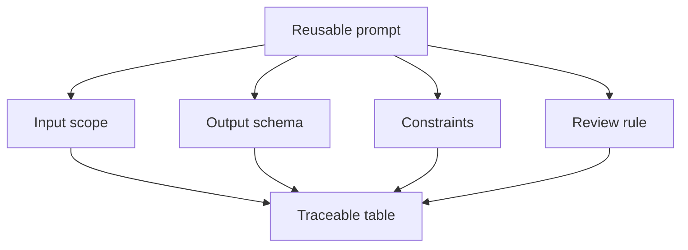

# Structured Outputs and Reusable Prompts

<div class="lesson-meta">
  <span>AI Collaboration and Context Engineering</span>
  <span>Software BA</span>
  <span>Core</span>
</div>

## Learning outcomes

- Design output tables and schemas for BA tasks.
- Create reusable prompts for repeated analysis work.
- Make AI output easier to review, compare, and trace.

## Why this matters for BA work

<div class="ba-callout">
Structured output turns AI from a chat response into a reviewable BA artifact.
</div>

Business Analysts sit between problem framing, stakeholder meaning, delivery constraints, and product decisions. In AI work, that position becomes more important because unclear language can create false certainty quickly. This lesson gives you a practical control you can apply before AI output becomes scope, backlog, or delivery commitment.

## Mental model or core concept

Unstructured answers are hard to verify. Structured output gives the BA columns, IDs, severity levels, source references, and owners. This makes the result inspectable by product, dev, QA, and stakeholders. Reusable prompts should define input, output contract, constraints, and review rules.

## Practical BA example

Instead of asking 'summarize this meeting,' the BA asks for a table with decision, evidence, owner, impacted requirement, risk, and open question. The output can be converted into Jira tasks, decision logs, and follow-up actions.

## Diagram



## BA artifact

### Reusable Prompt Contract

| Contract part | Required content | Why it helps | Example |
| --- | --- | --- | --- |
| Input scope | What source is included and excluded. | Avoids hidden context drift. | Use transcript T1 and policy P2 only. |
| Output columns | Fields the artifact must contain. | Makes review systematic. | ID, issue, severity, evidence, question. |
| Constraints | Rules AI must follow. | Prevents unsupported content. | Do not invent policy. |
| Review rule | How output will be judged. | Aligns with BA quality. | Every row needs source or assumption. |

## AI collaboration prompt

```text
Create a reusable prompt for this BA task. Include purpose, input assumptions, required context, output schema, constraints, quality rubric, and a self-check section. Keep it generic enough to reuse but specific enough to produce reviewable output.
```

## Mistakes to avoid

- Using free-form output for tasks that need comparison.
- Forgetting IDs and source references.
- Creating prompts that cannot be reused by another BA.
- Not specifying how severe issues should be ranked.

## Apply this tomorrow

1. Convert one common prompt into a reusable prompt contract.
2. Add output columns for source, severity, and owner.
3. Ask AI to self-check against the output schema.
4. Store the prompt in your team library.

## What a BA should remember

- Structure is a quality control.
- Good prompts define output, not just task.
- Reusable prompts turn individual skill into team capability.
