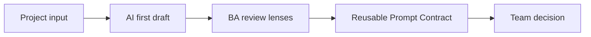
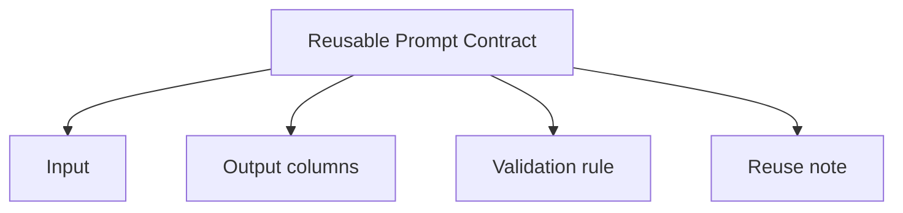

# Structured Outputs and Reusable Prompts

<div class="lesson-meta">
  <span>AI Collaboration and Context Engineering</span>
  <span>Software BA</span>
  <span>Core</span>
</div>

## Story mode: project walkthrough

<div class="story-mode-panel">
  <p class="story-eyebrow">Story prototype</p>
  <h3>A table beats a beautiful paragraph in backlog review</h3>
  <p class="story-intro">Maya receives different BAs producing different gap-analysis formats from the same input. Instead of asking AI for a final answer, she uses the lesson pattern to make the situation visible, reviewable, and useful for the next project decision.</p>
  <div class="story-scene-grid">
<article class="story-scene">
  <span>Scene 1</span>
  <b>01</b>
  <strong>The request is vague</strong>
  <p>The team gives Maya different BAs producing different gap-analysis formats from the same input and expects a clean answer by the end of the day.</p>
</article>
<article class="story-scene">
  <span>Scene 2</span>
  <b>02</b>
  <strong>AI creates a first draft</strong>
  <p>The draft is helpful, but it hides uncertainty around Output columns and Validation rule.</p>
</article>
<article class="story-scene">
  <span>Scene 3</span>
  <b>03</b>
  <strong>Maya turns it into BA evidence</strong>
  <p>She adds source notes, owners, examples, and a focused Reusable Prompt Contract review table instead of forwarding the raw AI output.</p>
</article>
<article class="story-scene">
  <span>Scene 4</span>
  <b>04</b>
  <strong>The team can decide</strong>
  <p>The final Reusable Prompt Contract shows what is ready, what is risky, and what needs a human decision.</p>
</article>
  </div>
  <div class="visual-takeaway-strip">
<span>Structured output needs context</span>
<span>Schema must be reviewable</span>
<span>Reusable prompt becomes a BA question</span>
  </div>
</div>

## AI words in plain English

| AI term | Simple meaning | BA use |
| --- | --- | --- |
| Structured output | An AI answer in a defined table, JSON, or template. | Use it to name the work clearly before asking AI to help. |
| Schema | The required fields and shape of the output. | Use it as a review lens, not as a decorative AI word. |
| Reusable prompt | A prompt pattern that can be used consistently across tasks. | Turn it into a checklist item or stakeholder question. |
| Validation | Checking whether output meets rules and evidence. | Define the rule before the team treats the output as ready. |

## Reality check: how this shows up in projects

<div class="fact-card-grid">
<article class="fact-card">
  <strong>A fast draft can hide weak thinking</strong>
  <span>Ask what evidence, owner, and decision the draft depends on.</span>
  <p>AI can produce Reusable Prompt Contract quickly, but speed does not prove quality.</p>
</article>
<article class="fact-card">
  <strong>Stakeholders need simple language</strong>
  <span>Explain the term in one sentence before using it in a requirement.</span>
  <p>Terms like Structured output and Schema can confuse people outside the AI conversation.</p>
</article>
<article class="fact-card">
  <strong>The Reusable Prompt Contract must travel</strong>
  <span>Make the next action visible for each receiving team.</span>
  <p>Product, Engineering, QA, and Operations each read this Reusable Prompt Contract differently.</p>
</article>
</div>

## Visual walkthrough



## Visual decision map

<div class="visual-ba-map">
  <h3>Reusable Prompt Contract: what the BA should look for</h3>
<div>
  <strong>Input</strong>
  <span>What the BA must make explicit first.</span>
  <em>Write it in plain language.</em>
</div>
<div>
  <strong>Output columns</strong>
  <span>Where AI can help but may also hide uncertainty.</span>
  <em>Add review criteria.</em>
</div>
<div>
  <strong>Validation rule</strong>
  <span>What can break if the team skips validation.</span>
  <em>Create a decision question.</em>
</div>
<div>
  <strong>Reuse note</strong>
  <span>What makes the artifact safe to hand off.</span>
  <em>Name owner, evidence, and next step.</em>
</div>
</div>

## Learning outcomes

- Explain Structured output in simple BA language.
- Use AI to draft a better Reusable Prompt Contract.
- Review the output before it becomes scope, test, or delivery work.

## Why this matters for BA work

<div class="ba-callout">
Structured outputs turn AI from a chat answer into a reviewable BA artifact.
</div>

Structured outputs matter because BA work has to be compared, reviewed, and reused. A table, schema, or checklist makes AI output easier to validate than a long paragraph, especially when multiple BAs need the same standard across projects.

## Common difficulties for BAs

| Difficulty | Why it is hard in BA work | How a BA handles it |
| --- | --- | --- |
| The team uses Structured output without a shared meaning. | People nod in meetings while imagining different outcomes. | Start with a one-sentence definition and show how it changes the Reusable Prompt Contract. |
| AI output looks more complete than the input deserves. | A fluent draft can hide missing examples, owners, or edge cases. | Ask AI to list assumptions and missing evidence before drafting the final artifact. |
| Reviewers need different details. | Product cares about value, Engineering about constraints, QA about testability, and Ops about support. | Add columns or sections for each receiving team instead of writing one generic paragraph. |

## Where this applies in real projects

| Project moment | BA move | Concrete output |
| --- | --- | --- |
| Discovery workshop | Use AI to organize notes into input, risks, and open questions. | Reusable Prompt Contract with source notes and owners. |
| Backlog refinement | Convert AI suggestions into small, testable decisions. | Story, rule, or checklist item with acceptance signal. |
| Handoff review | Ask AI to critique the artifact from Product, Dev, QA, and Ops viewpoints. | Review table with action owner and status. |

## If this is missing

If Structured Outputs and Reusable Prompts is missing, the team may still produce documents, but they will be harder to trust, test, and maintain.

| If missing | Project impact | Recovery action |
| --- | --- | --- |
| No shared explanation for Structured output | Stakeholders agree verbally but expect different behavior later. | Add a plain-language definition and example. |
| No review of AI assumptions | Unsupported ideas become scope. | Move assumptions into an owner-based validation list. |
| No concrete Reusable Prompt Contract | The learning stays abstract and does not help delivery. | Produce the artifact as a small table, not a long essay. |

## Mental model or core concept

Structured Outputs and Reusable Prompts is easiest to understand as a BA control: make the messy thing visible, let AI help structure it, then review it with humans before it becomes delivery work.

## Practical BA example

Instead of asking for a gap analysis paragraph, Maya asks for columns: requirement, issue type, evidence, severity, owner question, and suggested action. The team can sort, assign, and review the output.

## Diagram



## BA artifact

### Reusable Prompt Contract

| Artifact line | What the BA writes | Ready signal | Risk signal |
| --- | --- | --- | --- |
| Input | Write the concrete input in project language. | A stakeholder can confirm it. | It is still a slogan. |
| Output columns | Describe how AI helps and where it may be wrong. | Review criteria are visible. | The draft hides uncertainty. |
| Validation rule | Capture the gap, conflict, edge case, or risk. | Owner and next action are named. | The issue is buried in prose. |
| Reuse note | Define the handoff rule or completion signal. | QA or Engineering can act on it. | No receiving team knows what to do. |

## AI expert note

As an AI reviewer, I would check whether Structured Outputs and Reusable Prompts changes the BA artifact in a practical way. Good AI use should expose missing context, create structure, and make review easier. If it only produces nicer wording, the BA has not captured enough value yet.

## Bad vs better example

| Weak pattern | Why it fails | Better BA pattern |
| --- | --- | --- |
| Ask AI to "do Structured Outputs and Reusable Prompts" with no source context. | The model fills gaps with plausible wording. | Provide source notes, examples, boundaries, and review criteria. |
| Share the first answer as final. | The team cannot see assumptions or weak evidence. | Run a critique pass and label open decisions. |
| Use AI terms with no explanation. | Business stakeholders disengage or misunderstand. | Explain each term in plain language before using it in scope. |

## Stakeholder questions to ask

| Stakeholder | Question | Why the BA asks |
| --- | --- | --- |
| Product owner | Which outcome should Structured Outputs and Reusable Prompts improve first? | Keeps AI work tied to business value. |
| Engineering lead | Which source, system, or constraint could make Reusable Prompt Contract hard to implement? | Turns hidden technical constraints into requirement questions. |
| QA lead | Which behavior must be testable before we trust this artifact? | Converts fluent AI text into observable checks. |
| Operations or support | What failure path creates manual work after release? | Surfaces support load and fallback needs. |

## Decision log entries

| Decision item | Options to capture | Owner | Evidence needed |
| --- | --- | --- | --- |
| Scope boundary for Reusable Prompt Contract | Must-have, later, out of scope | Product owner | Business outcome and release constraint |
| Authority for Input and Output columns | Documented source, stakeholder decision, assumption to validate | BA + accountable stakeholder | Source ID, date, and approval status |
| Review gate before handoff | Peer review, QA review, engineering review, formal approval | BA lead or project lead | Risk level and receiving-team readiness |
| Recovery if Using Structured output as jargon instead of a project decision. | Rewrite, defer, escalate, or run validation workshop | Decision owner | Impact on scope, testability, and release risk |

## Definition of Ready / Done

| Gate | Ready signal | Done signal |
| --- | --- | --- |
| Definition of Ready | Sources for Input are named. | Reusable Prompt Contract can be reviewed without guessing context. |
| Definition of Ready | Open assumptions have owners and validation paths. | Stakeholders can accept, reject, or defer each assumption. |
| Definition of Done | The artifact applies this principle: Structured outputs turn AI from a chat answer into a reviewable BA artifact. | Delivery, QA, or governance teams can act on it. |
| Definition of Done | The weak pattern "Ask AI to "do Structured Outputs and Reusable Prompts" with no source context." has been checked. | No unsupported AI claim is treated as approved scope. |

## Before and after artifact example

| Before | AI draft risk | Senior BA revision |
| --- | --- | --- |
| Prompt: "Create Reusable Prompt Contract." | The model may invent source facts, owners, or thresholds. | Add sources, scope boundary, output schema, and review criteria. |
| Draft statement: "Use AI to organize notes into input, risks, and open questions." | Useful, but not tied to owner or acceptance signal. | Rewrite as a project step with owner, expected artifact, and review gate. |
| Final-looking paragraph | Tone may hide uncertainty or missing stakeholder approval. | Convert into fact, assumption, decision needed, risk, and validation question. |

## Manual verification after AI output

| Verification lens | Manual check | Pass signal |
| --- | --- | --- |
| Evidence | Trace important statements in Reusable Prompt Contract to a source, decision, or labeled assumption. | No unsupported claim remains hidden. |
| Completeness | Check Input, Output columns, Validation rule, Reuse note against the intended audience. | Product, Engineering, QA, and Operations have what they need. |
| Testability | Ask whether QA can create positive, negative, boundary, and exception scenarios. | Ambiguous wording is rewritten or logged as a question. |
| Accountability | Confirm who approves, who reviews, and who acts when output is wrong. | Owners and escalation path are explicit. |

## AI collaboration prompt

```text
Use the supplied project notes to create a Reusable Prompt Contract. First explain the key terms in simple language. Then produce a table with evidence, assumption, risk, owner question, and recommended next action. Do not invent facts that are not in the notes.
```

## Mistakes to avoid

- Using Structured output as jargon instead of a project decision.
- Letting AI write around missing evidence.
- Sending output to another team without owner, status, or next action.

## Apply this tomorrow

1. Take one current project note and ask AI for a Reusable Prompt Contract.
2. Add a plain-language definition for Structured output.
3. Run one critique pass from QA or Engineering viewpoint.

## What a BA should remember

- Structured output should help the project move, not sound impressive.
- AI drafts; BA validates.
- A small reviewable artifact beats a long generic explanation.
