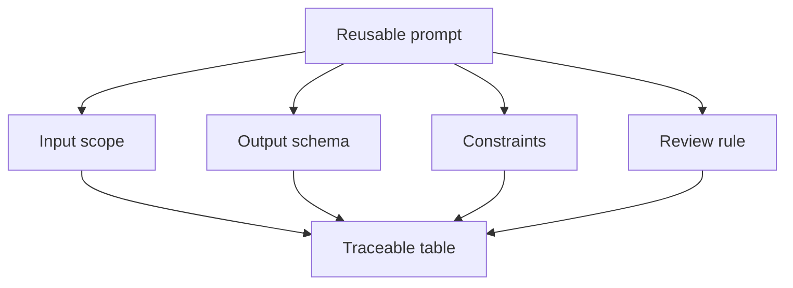

# Structured Outputs and Reusable Prompts

<div class="lesson-meta">
  <span>AI Collaboration and Context Engineering</span>
  <span>Software BA</span>
  <span>Core</span>
</div>

## Learning outcomes

- Design output tables and schemas for BA tasks.
- Create reusable prompts for repeated analysis work.
- Make AI output easier to review, compare, and trace.

## Why this matters for BA work

<div class="ba-callout">
Structured output turns AI from a chat response into a reviewable BA artifact.
</div>

This lesson matters because BA artifacts must be compared, reviewed, traced, and handed off. Free-form AI prose is hard to validate at scale. Structured outputs make missing fields visible, enforce evidence discipline, and let teams reuse prompts for stories, risks, requirements, decisions, and review findings without starting from scratch.

## Common difficulties for BAs

In real projects, this topic is difficult because the BA must turn messy evidence into decisions without letting AI hide uncertainty. Watch for these friction points before treating the output as ready.

| Difficulty | Why it is hard in BA work | How a BA should handle it |
| --- | --- | --- |
| Using free-form output for tasks that need comparison. | This is hard because Structured Outputs and Reusable Prompts is usually applied under deadline pressure, incomplete evidence, and stakeholder disagreement. A fluent AI draft can make the gap less visible. | Use source labels, explicit assumptions, and a named review owner before turning this into backlog, specification, or delivery commitment. |
| Forgetting IDs and source references. | This is hard because Structured Outputs and Reusable Prompts is usually applied under deadline pressure, incomplete evidence, and stakeholder disagreement. A fluent AI draft can make the gap less visible. | Use source labels, explicit assumptions, and a named review owner before turning this into backlog, specification, or delivery commitment. |
| Creating prompts that cannot be reused by another BA. | This is hard because Structured Outputs and Reusable Prompts is usually applied under deadline pressure, incomplete evidence, and stakeholder disagreement. A fluent AI draft can make the gap less visible. | Use source labels, explicit assumptions, and a named review owner before turning this into backlog, specification, or delivery commitment. |

## Where this applies in real projects

This lesson is useful when the BA needs to move from conversation, policy, design, or technical input into a shared artifact that the team can implement and test.

| Project moment | How to apply this lesson | Concrete BA output |
| --- | --- | --- |
| Discovery | Convert one common prompt into a reusable prompt contract. | Reusable Prompt Contract: a reviewable artifact that connects the learned concept to decisions, acceptance criteria, risks, or stakeholder alignment. |
| Refinement | Add output columns for source, severity, and owner. | Reusable Prompt Contract: a reviewable artifact that connects the learned concept to decisions, acceptance criteria, risks, or stakeholder alignment. |
| Delivery | Ask AI to self-check against the output schema. | Reusable Prompt Contract: a reviewable artifact that connects the learned concept to decisions, acceptance criteria, risks, or stakeholder alignment. |

## If this is missing

If this capability is missing, AI may still produce polished text, but the project loses reviewability. The result is usually rework, hidden assumptions, weak acceptance criteria, or business decisions made without enough evidence.

| If missing | Project impact | Recovery action |
| --- | --- | --- |
| Ask AI for a detailed analysis in paragraphs | Important fields like owner, evidence, risk, and action can disappear. | Recover by using the stronger pattern: Use tables or JSON-like structures with required columns and explicit missing-value handling. Then re-check the artifact against evidence, testability, ownership, and business impact before sharing it. |
| Reuse a prompt without a quality contract | The same prompt may produce inconsistent artifacts across projects. | Recover by using the stronger pattern: Define output schema, acceptance criteria, review rubric, and revision instructions. Then re-check the artifact against evidence, testability, ownership, and business impact before sharing it. |
| Treat structured output as automatically correct | A table can look precise while containing unsupported data. | Recover by using the stronger pattern: Validate each row for source support, decision status, and testability. Then re-check the artifact against evidence, testability, ownership, and business impact before sharing it. |

## Mental model or core concept

Unstructured answers are hard to verify. Structured output gives the BA columns, IDs, severity levels, source references, and owners. This makes the result inspectable by product, dev, QA, and stakeholders. Reusable prompts should define input, output contract, constraints, and review rules.

## Practical BA example

Instead of asking 'summarize this meeting,' the BA asks for a table with decision, evidence, owner, impacted requirement, risk, and open question. The output can be converted into Jira tasks, decision logs, and follow-up actions.

## Diagram



## BA artifact

### Reusable Prompt Contract

| Contract part | Required content | Why it helps | Example |
| --- | --- | --- | --- |
| Input scope | What source is included and excluded. | Avoids hidden context drift. | Use transcript T1 and policy P2 only. |
| Output columns | Fields the artifact must contain. | Makes review systematic. | ID, issue, severity, evidence, question. |
| Constraints | Rules AI must follow. | Prevents unsupported content. | Do not invent policy. |
| Review rule | How output will be judged. | Aligns with BA quality. | Every row needs source or assumption. |

## AI expert note

Structured output is a control surface. The schema tells the model what dimensions matter and tells reviewers what must be checked. Expert BAs include source ID, assumption flag, confidence, decision owner, testability, risk level, and next action fields so the output supports governance, not just readability.

## Bad vs better example

| Weak pattern | Why it fails | Stronger BA pattern |
| --- | --- | --- |
| Ask AI for a detailed analysis in paragraphs | Important fields like owner, evidence, risk, and action can disappear. | Use tables or JSON-like structures with required columns and explicit missing-value handling. |
| Reuse a prompt without a quality contract | The same prompt may produce inconsistent artifacts across projects. | Define output schema, acceptance criteria, review rubric, and revision instructions. |
| Treat structured output as automatically correct | A table can look precise while containing unsupported data. | Validate each row for source support, decision status, and testability. |

## AI collaboration prompt

```text
Create a reusable prompt for this BA task. Include purpose, input assumptions, required context, output schema, constraints, quality rubric, and a self-check section. Keep it generic enough to reuse but specific enough to produce reviewable output.
```

## Mistakes to avoid

- Using free-form output for tasks that need comparison.
- Forgetting IDs and source references.
- Creating prompts that cannot be reused by another BA.
- Not specifying how severe issues should be ranked.

## Apply this tomorrow

1. Convert one common prompt into a reusable prompt contract.
2. Add output columns for source, severity, and owner.
3. Ask AI to self-check against the output schema.
4. Store the prompt in your team library.

## What a BA should remember

- Structure is a quality control.
- Good prompts define output, not just task.
- Reusable prompts turn individual skill into team capability.
