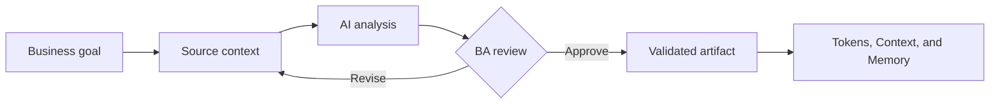

# Tokens, Context, and Memory

<div class="lesson-meta">
  <span>AI Foundations for Business Analysts</span>
  <span>Software BA</span>
  <span>Core</span>
</div>

## Learning outcomes

- Explain tokens, context, and memory in business language.
- Apply the concept to a realistic BA workflow.
- Use AI output as draft evidence, not as unchecked truth.
- Identify the review questions a BA must ask before sharing the artifact.

## Why this matters for BA work

AI changes how analysis work is produced, but it does not remove the BA's accountability for clarity, evidence, and decisions.

<div class="ba-callout">
Learn why context windows, token budgets, and session memory shape the quality of AI-assisted analysis.
</div>

## Core concept

The useful BA pattern is controlled collaboration: provide the model with business context, ask for structured output, require evidence, then review the result against goals, rules, risks, and stakeholder decisions.

## Practical BA example

A BA uploads a long SRS and asks for all missing requirements. If the context is incomplete or poorly chunked, the answer may miss entire modules. Better work starts with section maps, source IDs, and staged review.

## Diagram



## BA workflow

1. Frame the business question before opening the AI tool.
2. Provide source context and explicit constraints.
3. Ask for structured output that maps back to the source.
4. Run a critique pass for ambiguity, gaps, risk, and testability.
5. Convert the result into an artifact the team can inspect and own.

## Prompt or template

```text
Create a source map first. List sections, source IDs, assumptions, and open questions. Then review one section at a time for missing, ambiguous, conflicting, and non-testable requirements.
```

## What a BA should remember

- AI is a reasoning accelerator, not a decision owner.
- Ground every important claim in source context or stakeholder confirmation.
- A good BA keeps the review loop visible: draft, critique, revise, validate.
