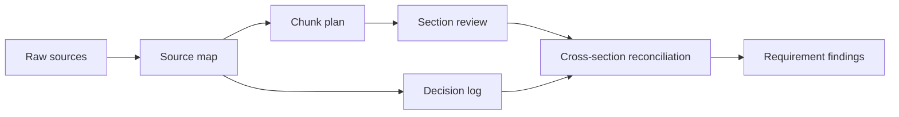

# Tokens, Context, and Memory

<div class="lesson-meta">
  <span>AI Foundations for Business Analysts</span>
  <span>Software BA</span>
  <span>Core</span>
</div>

## Learning outcomes

- Explain token and context limits in BA terms.
- Prepare long requirements or transcripts for staged AI review.
- Use source maps to reduce missed requirements.

## Why this matters for BA work

<div class="ba-callout">
Context is the working surface of AI analysis; poor context design creates confident but incomplete BA artifacts.
</div>

This lesson matters because most BA artifacts depend on long histories: transcripts, policies, decisions, exceptions, and prior commitments. AI tools can only reason over the context they can see and retain. A BA who controls source maps and chunking plans reduces missed requirements, stale policy reuse, and shallow summaries that look organized but lose critical detail.

## Common difficulties for BAs

In real projects, this topic is difficult because the BA must turn messy evidence into decisions without letting AI hide uncertainty. Watch for these friction points before treating the output as ready.

| Difficulty | Why it is hard in BA work | How a BA should handle it |
| --- | --- | --- |
| Uploading everything and asking one broad question. | This is hard because Tokens, Context, and Memory is usually applied under deadline pressure, incomplete evidence, and stakeholder disagreement. A fluent AI draft can make the gap less visible. | Use source labels, explicit assumptions, and a named review owner before turning this into backlog, specification, or delivery commitment. |
| Mixing old and new policy without freshness labels. | This is hard because Tokens, Context, and Memory is usually applied under deadline pressure, incomplete evidence, and stakeholder disagreement. A fluent AI draft can make the gap less visible. | Use source labels, explicit assumptions, and a named review owner before turning this into backlog, specification, or delivery commitment. |
| Letting the model summarize away edge cases. | This is hard because Tokens, Context, and Memory is usually applied under deadline pressure, incomplete evidence, and stakeholder disagreement. A fluent AI draft can make the gap less visible. | Use source labels, explicit assumptions, and a named review owner before turning this into backlog, specification, or delivery commitment. |

## Where this applies in real projects

This lesson is useful when the BA needs to move from conversation, policy, design, or technical input into a shared artifact that the team can implement and test.

| Project moment | How to apply this lesson | Concrete BA output |
| --- | --- | --- |
| Discovery | Create source IDs for one document before using AI. | Context Pack Checklist: a reviewable artifact that connects the learned concept to decisions, acceptance criteria, risks, or stakeholder alignment. |
| Refinement | Ask AI to summarize per section, not whole document at once. | Context Pack Checklist: a reviewable artifact that connects the learned concept to decisions, acceptance criteria, risks, or stakeholder alignment. |
| Delivery | Mark old, current, and draft sources separately. | Context Pack Checklist: a reviewable artifact that connects the learned concept to decisions, acceptance criteria, risks, or stakeholder alignment. |

## If this is missing

If this capability is missing, AI may still produce polished text, but the project loses reviewability. The result is usually rework, hidden assumptions, weak acceptance criteria, or business decisions made without enough evidence.

| If missing | Project impact | Recovery action |
| --- | --- | --- |
| Upload all documents and ask for all gaps | The model may summarize broadly and miss late, rare, or cross-document constraints. | Recover by using the stronger pattern: Review by source ID and module, then run a reconciliation pass for conflicts and omissions. Then re-check the artifact against evidence, testability, ownership, and business impact before sharing it. |
| Mix old policy, draft notes, and approved decisions without labels | The model cannot reliably know what is current or authoritative. | Recover by using the stronger pattern: Label source status, effective date, owner, and confidence before analysis. Then re-check the artifact against evidence, testability, ownership, and business impact before sharing it. |
| Use chat history as project memory | Important decisions become inaccessible, reordered, or invisible to other team members. | Recover by using the stronger pattern: Create an explicit context pack with source map, decision log, and open questions. Then re-check the artifact against evidence, testability, ownership, and business impact before sharing it. |

## Mental model or core concept

A model only works with the context it can see. Long documents, scattered notes, and multi-meeting histories must be structured into chunks, source IDs, summaries, and review passes. BA context engineering is similar to preparing a workshop pack: decide what evidence matters, label it, and review it in a controlled order.

## Practical BA example

A 70-page SRS is dropped into an AI tool with 'find all gaps.' The model returns a polished list but misses integration requirements in later pages. A better BA creates a source map, reviews per module, then asks AI to reconcile cross-module conflicts.

## Diagram



## BA artifact

### Context Pack Checklist

| Pack item | Why it matters | BA action | Failure if missing |
| --- | --- | --- | --- |
| Source map | Prevents invisible gaps | List sections, owners, and IDs. | AI reviews only the loudest sections. |
| Chunk plan | Keeps analysis focused | Review module by module. | Long context becomes shallow summary. |
| Decision log | Preserves stakeholder commitments | Include dated decisions and owners. | AI reopens already-settled scope. |
| Open questions | Separates unknowns from facts | Track unresolved items explicitly. | Model fills blanks with guesses. |

## AI expert note

Expert AI use treats context as an analysis asset. Long-context models still suffer from attention dilution, source conflict, and recency ambiguity. The BA should design review passes, source IDs, chunk purpose, decision logs, and reconciliation steps so that AI output remains traceable rather than becoming an attractive summary of incomplete evidence.

## Bad vs better example

| Weak pattern | Why it fails | Stronger BA pattern |
| --- | --- | --- |
| Upload all documents and ask for all gaps | The model may summarize broadly and miss late, rare, or cross-document constraints. | Review by source ID and module, then run a reconciliation pass for conflicts and omissions. |
| Mix old policy, draft notes, and approved decisions without labels | The model cannot reliably know what is current or authoritative. | Label source status, effective date, owner, and confidence before analysis. |
| Use chat history as project memory | Important decisions become inaccessible, reordered, or invisible to other team members. | Create an explicit context pack with source map, decision log, and open questions. |

## AI collaboration prompt

```text
Create a context pack from these sources. Return source IDs, section summaries, decision log, known constraints, unresolved questions, and recommended review order. Do not analyze requirements until the context pack is complete.
```

## Mistakes to avoid

- Uploading everything and asking one broad question.
- Mixing old and new policy without freshness labels.
- Letting the model summarize away edge cases.
- Forgetting to include decisions already made by stakeholders.

## Apply this tomorrow

1. Create source IDs for one document before using AI.
2. Ask AI to summarize per section, not whole document at once.
3. Mark old, current, and draft sources separately.
4. Run a second pass for cross-section conflicts.

## What a BA should remember

- AI quality is bounded by visible context.
- Source maps are a BA control, not an admin detail.
- Staged review beats one giant prompt.
