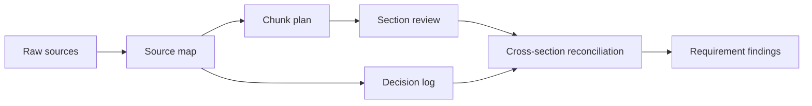

# Tokens, Context, and Memory

<div class="lesson-meta">
  <span>AI Foundations for Business Analysts</span>
  <span>Software BA</span>
  <span>Core</span>
</div>

## Learning outcomes

- Explain token and context limits in BA terms.
- Prepare long requirements or transcripts for staged AI review.
- Use source maps to reduce missed requirements.

## Why this matters for BA work

<div class="ba-callout">
Context is the working surface of AI analysis; poor context design creates confident but incomplete BA artifacts.
</div>

This lesson matters because most BA artifacts depend on long histories: transcripts, policies, decisions, exceptions, and prior commitments. AI tools can only reason over the context they can see and retain. A BA who controls source maps and chunking plans reduces missed requirements, stale policy reuse, and shallow summaries that look organized but lose critical detail.

## Common difficulties for BAs

In AI Foundations for Business Analysts, Tokens, Context, and Memory becomes difficult when stakeholders expect a simple AI answer while the actual issue depends on model capability, data readiness, tool boundaries, and business decision risk. A BA should inspect the points below before treating an AI-supported artifact as ready for stakeholder decision or delivery handoff.

| Difficulty | Why it is hard in BA work | How a BA should handle it |
| --- | --- | --- |
| Uploading everything and asking one broad question. | The mistake "Uploading everything and asking one broad question." appears when the team discusses problem fit, model boundary, data dependency, and decision risk without agreeing which source is authoritative. AI can smooth over the disagreement, so the BA must keep uncertainty visible. | Apply this control: ask the model to compare AI and non-AI options before drafting requirements. Then use the stronger pattern "Review by source ID and module, then run a reconciliation pass for conflicts and omissions." and ask who must approve the artifact before it affects scope, build, test, or release. |
| Mixing old and new policy without freshness labels. | For Tokens, Context, and Memory, the friction is that Context is the working surface of AI analysis; poor context design creates confident but incomplete BA artifacts. The weak pattern is tempting because AI can produce a fluent answer before the BA has checked ownership, source freshness, or decision rights. | Apply this control: ask the model to compare AI and non-AI options before drafting requirements. Then use the stronger pattern "Label source status, effective date, owner, and confidence before analysis." and ask who must approve the artifact before it affects scope, build, test, or release. |
| Letting the model summarize away edge cases. | This becomes hard when Context Pack Checklist is expected to support the solution-shape decision. If the BA does not challenge the draft, unsupported assumptions may enter planning, testing, or stakeholder communication. | Apply this control: ask the model to compare AI and non-AI options before drafting requirements. Then use the stronger pattern "Create an explicit context pack with source map, decision log, and open questions." and ask who must approve the artifact before it affects scope, build, test, or release. |

## Where this applies in real projects

Use this lesson when an AI idea first enters discovery, vendor discussion, roadmap planning, or feasibility analysis. The practical output is not a longer document; it is Context Pack Checklist with enough evidence, ownership, and decision clarity for the next project conversation.

| Project moment | How to apply this lesson | Concrete BA output |
| --- | --- | --- |
| Idea intake | Create source IDs for one document before using AI. | Context Pack Checklist showing problem fit, model boundary, data dependency, and decision risk, with the action "Create source IDs for one document before using AI." translated into a reviewable decision, requirement, checklist, or question for the next meeting. |
| Feasibility review | Ask AI to summarize per section, not whole document at once. | Context Pack Checklist showing source evidence, with the action "Ask AI to summarize per section, not whole document at once." translated into a reviewable decision, requirement, checklist, or question for the next meeting. |
| Solution framing | Mark old, current, and draft sources separately. | Context Pack Checklist showing decision owner, with the action "Mark old, current, and draft sources separately." translated into a reviewable decision, requirement, checklist, or question for the next meeting. |

## If this is missing

If Tokens, Context, and Memory is missing, the team may choose a tool before understanding the problem shape, creating expensive automation that does not match the business outcome. The BA can still recover, but only by converting the polished AI draft back into explicit evidence, assumptions, owners, and testable decisions.

| If missing | Project impact | Recovery action |
| --- | --- | --- |
| Upload all documents and ask for all gaps | The model may summarize broadly and miss late, rare, or cross-document constraints. | Recover by using the stronger pattern: Review by source ID and module, then run a reconciliation pass for conflicts and omissions. Rework Context Pack Checklist until it exposes problem fit, model boundary, data dependency, and decision risk, and do not share it as final until evidence, ownership, and validation path are explicit. |
| Mix old policy, draft notes, and approved decisions without labels | The model cannot reliably know what is current or authoritative. | Recover by using the stronger pattern: Label source status, effective date, owner, and confidence before analysis. Rework Context Pack Checklist until it exposes problem fit, model boundary, data dependency, and decision risk, and do not share it as final until evidence, ownership, and validation path are explicit. |
| Use chat history as project memory | Important decisions become inaccessible, reordered, or invisible to other team members. | Recover by using the stronger pattern: Create an explicit context pack with source map, decision log, and open questions. Rework Context Pack Checklist until it exposes problem fit, model boundary, data dependency, and decision risk, and do not share it as final until evidence, ownership, and validation path are explicit. |

## Mental model or core concept

A model only works with the context it can see. Long documents, scattered notes, and multi-meeting histories must be structured into chunks, source IDs, summaries, and review passes. BA context engineering is similar to preparing a workshop pack: decide what evidence matters, label it, and review it in a controlled order.

## Practical BA example

A 70-page SRS is dropped into an AI tool with 'find all gaps.' The model returns a polished list but misses integration requirements in later pages. A better BA creates a source map, reviews per module, then asks AI to reconcile cross-module conflicts.

## Diagram



## BA artifact

### Context Pack Checklist

| Pack item | Why it matters | BA action | Failure if missing |
| --- | --- | --- | --- |
| Source map | Prevents invisible gaps | List sections, owners, and IDs. | AI reviews only the loudest sections. |
| Chunk plan | Keeps analysis focused | Review module by module. | Long context becomes shallow summary. |
| Decision log | Preserves stakeholder commitments | Include dated decisions and owners. | AI reopens already-settled scope. |
| Open questions | Separates unknowns from facts | Track unresolved items explicitly. | Model fills blanks with guesses. |

## AI expert note

Expert AI use treats context as an analysis asset. Long-context models still suffer from attention dilution, source conflict, and recency ambiguity. The BA should design review passes, source IDs, chunk purpose, decision logs, and reconciliation steps so that AI output remains traceable rather than becoming an attractive summary of incomplete evidence.

## Bad vs better example

| Weak pattern | Why it fails | Stronger BA pattern |
| --- | --- | --- |
| Upload all documents and ask for all gaps | The model may summarize broadly and miss late, rare, or cross-document constraints. | Review by source ID and module, then run a reconciliation pass for conflicts and omissions. |
| Mix old policy, draft notes, and approved decisions without labels | The model cannot reliably know what is current or authoritative. | Label source status, effective date, owner, and confidence before analysis. |
| Use chat history as project memory | Important decisions become inaccessible, reordered, or invisible to other team members. | Create an explicit context pack with source map, decision log, and open questions. |

## AI collaboration prompt

```text
Create a context pack from these sources. Return source IDs, section summaries, decision log, known constraints, unresolved questions, and recommended review order. Do not analyze requirements until the context pack is complete.
```

## Mistakes to avoid

- Uploading everything and asking one broad question.
- Mixing old and new policy without freshness labels.
- Letting the model summarize away edge cases.
- Forgetting to include decisions already made by stakeholders.

## Apply this tomorrow

1. Create source IDs for one document before using AI.
2. Ask AI to summarize per section, not whole document at once.
3. Mark old, current, and draft sources separately.
4. Run a second pass for cross-section conflicts.

## What a BA should remember

- AI quality is bounded by visible context.
- Source maps are a BA control, not an admin detail.
- Staged review beats one giant prompt.
