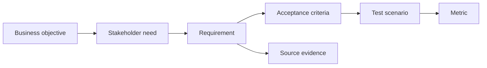

# Traceability and Testability

<div class="lesson-meta">
  <span>Requirements Engineering With AI</span>
  <span>Software BA</span>
  <span>Core</span>
</div>

## Learning outcomes

- Build traceability chains across goals, requirements, criteria, and tests.
- Use AI to find orphan requirements and weak test links.
- Improve release decisions with evidence.

## Why this matters for BA work

<div class="ba-callout">
Traceability makes AI-assisted requirements accountable from business goal to test evidence.
</div>

Business Analysts sit between problem framing, stakeholder meaning, delivery constraints, and product decisions. In AI work, that position becomes more important because unclear language can create false certainty quickly. This lesson gives you a practical control you can apply before AI output becomes scope, backlog, or delivery commitment.

## Mental model or core concept

Traceability connects why a requirement exists to how it will be verified. AI can help build matrices and identify gaps, but the BA must decide which links are real. A strong traceability chain maps business objective, stakeholder need, requirement, acceptance criteria, test scenario, metric, and source evidence.

## Practical BA example

A release has 80 stories. AI finds 12 stories with no linked business objective and 8 high-priority objectives with no test scenario. The BA uses the matrix to clean scope and reduce release risk.

## Diagram



## BA artifact

### Traceability Chain

| Link | Question | Example | Gap signal |
| --- | --- | --- | --- |
| Objective to need | Whose problem does this solve? | Reduce onboarding drop-off for new customers. | No named stakeholder. |
| Need to requirement | What system behavior supports it? | Send missing-doc reminder within 24 hours. | Behavior not observable. |
| Requirement to AC | How is done verified? | Given missing doc, then reminder is sent. | No failure case. |
| AC to metric | How will impact be measured? | Drop-off rate decreases by 10%. | No success metric. |

## AI collaboration prompt

```text
Create a traceability matrix from these artifacts. Include business objective, stakeholder need, requirement ID, acceptance criteria, test scenario, metric, source evidence, and gaps. Flag orphan requirements and objectives without tests.
```

## Mistakes to avoid

- Treating traceability as documentation overhead.
- Linking items mechanically without checking meaning.
- Missing test scenarios for high-risk requirements.
- Using AI-generated links without human review.

## Apply this tomorrow

1. Build a traceability chain for one epic.
2. Ask AI to identify orphan stories.
3. Add source evidence to high-risk requirements.
4. Review metric alignment with product owner.

## What a BA should remember

- Traceability is accountability.
- Testability starts before QA receives the story.
- AI can draft matrices; BA verifies links.
