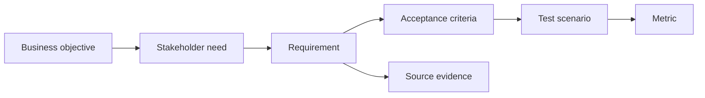

# Traceability and Testability

<div class="lesson-meta">
  <span>Requirements Engineering With AI</span>
  <span>Software BA</span>
  <span>Core</span>
</div>

## Learning outcomes

- Build traceability chains across goals, requirements, criteria, and tests.
- Use AI to find orphan requirements and weak test links.
- Improve release decisions with evidence.

## Why this matters for BA work

<div class="ba-callout">
Traceability makes AI-assisted requirements accountable from business goal to test evidence.
</div>

This lesson matters because AI-assisted artifacts can multiply quickly, making it easy to lose the chain from business goal to requirement, source, decision, test, and release evidence. Traceability protects teams from elegant but unproven requirements. Testability turns AI suggestions into behavior that delivery teams can verify.

## Common difficulties for BAs

In Requirements Engineering With AI, Traceability and Testability becomes difficult when business rules, edge cases, quality attributes, and testability constraints must survive the move from conversation into backlog. A BA should inspect the points below before treating an AI-supported artifact as ready for stakeholder decision or delivery handoff.

| Difficulty | Why it is hard in BA work | How a BA should handle it |
| --- | --- | --- |
| Treating traceability as documentation overhead. | The mistake "Treating traceability as documentation overhead." appears when the team discusses ambiguity, NFR risk, traceability, testability, and rule ownership without agreeing which source is authoritative. AI can smooth over the disagreement, so the BA must keep uncertainty visible. | Apply this control: force every requirement statement to expose actor, trigger, data, rule, exception, and verification signal. Then use the stronger pattern "Record source IDs, prompt context, reviewer, decision owner, and artifact version." and ask who must approve the artifact before it affects scope, build, test, or release. |
| Linking items mechanically without checking meaning. | For Traceability and Testability, the friction is that Traceability makes AI-assisted requirements accountable from business goal to test evidence. The weak pattern is tempting because AI can produce a fluent answer before the BA has checked ownership, source freshness, or decision rights. | Apply this control: force every requirement statement to expose actor, trigger, data, rule, exception, and verification signal. Then use the stronger pattern "Trace each requirement to positive, negative, fallback, and monitoring tests." and ask who must approve the artifact before it affects scope, build, test, or release. |
| Missing test scenarios for high-risk requirements. | This becomes hard when Traceability Chain is expected to support the delivery-ready requirement. If the BA does not challenge the draft, unsupported assumptions may enter planning, testing, or stakeholder communication. | Apply this control: force every requirement statement to expose actor, trigger, data, rule, exception, and verification signal. Then use the stronger pattern "Use trace links in refinement, QA planning, change impact, and release decisions." and ask who must approve the artifact before it affects scope, build, test, or release. |

## Where this applies in real projects

Use this lesson when requirements are being refined, split, clarified, tested, or challenged by QA and delivery teams. The practical output is not a longer document; it is Traceability Chain with enough evidence, ownership, and decision clarity for the next project conversation.

| Project moment | How to apply this lesson | Concrete BA output |
| --- | --- | --- |
| Backlog refinement | Build a traceability chain for one epic. | Traceability Chain showing ambiguity, NFR risk, traceability, testability, and rule ownership, with the action "Build a traceability chain for one epic." translated into a reviewable decision, requirement, checklist, or question for the next meeting. |
| QA alignment | Ask AI to identify orphan stories. | Traceability Chain showing source evidence, with the action "Ask AI to identify orphan stories." translated into a reviewable decision, requirement, checklist, or question for the next meeting. |
| Release readiness | Add source evidence to high-risk requirements. | Traceability Chain showing decision owner, with the action "Add source evidence to high-risk requirements." translated into a reviewable decision, requirement, checklist, or question for the next meeting. |

## If this is missing

If Traceability and Testability is missing, requirements may look complete but still fail implementation, testing, release readiness, or operational support. The BA can still recover, but only by converting the polished AI draft back into explicit evidence, assumptions, owners, and testable decisions.

| If missing | Project impact | Recovery action |
| --- | --- | --- |
| Keep AI drafts in chat and copy useful parts into tickets | The source, assumption, and review trail disappear. | Recover by using the stronger pattern: Record source IDs, prompt context, reviewer, decision owner, and artifact version. Rework Traceability Chain until it exposes ambiguity, NFR risk, traceability, testability, and rule ownership, and do not share it as final until evidence, ownership, and validation path are explicit. |
| Write tests only for happy-path generated behavior | AI features fail in edge cases, low confidence, and unsupported input. | Recover by using the stronger pattern: Trace each requirement to positive, negative, fallback, and monitoring tests. Rework Traceability Chain until it exposes ambiguity, NFR risk, traceability, testability, and rule ownership, and do not share it as final until evidence, ownership, and validation path are explicit. |
| Treat traceability as a compliance spreadsheet | The team fills fields without using them to manage risk. | Recover by using the stronger pattern: Use trace links in refinement, QA planning, change impact, and release decisions. Rework Traceability Chain until it exposes ambiguity, NFR risk, traceability, testability, and rule ownership, and do not share it as final until evidence, ownership, and validation path are explicit. |

## Mental model or core concept

Traceability connects why a requirement exists to how it will be verified. AI can help build matrices and identify gaps, but the BA must decide which links are real. A strong traceability chain maps business objective, stakeholder need, requirement, acceptance criteria, test scenario, metric, and source evidence.

## Practical BA example

A release has 80 stories. AI finds 12 stories with no linked business objective and 8 high-priority objectives with no test scenario. The BA uses the matrix to clean scope and reduce release risk.

## Diagram



## BA artifact

### Traceability Chain

| Link | Question | Example | Gap signal |
| --- | --- | --- | --- |
| Objective to need | Whose problem does this solve? | Reduce onboarding drop-off for new customers. | No named stakeholder. |
| Need to requirement | What system behavior supports it? | Send missing-doc reminder within 24 hours. | Behavior not observable. |
| Requirement to AC | How is done verified? | Given missing doc, then reminder is sent. | No failure case. |
| AC to metric | How will impact be measured? | Drop-off rate decreases by 10%. | No success metric. |

## AI expert note

For AI work, traceability should include evidence source, prompt or context package, model-assisted assumption, reviewer, decision owner, and evaluation case. Expert BAs treat traceability as risk control, not documentation overhead. If a requirement cannot be traced or tested, it should not become delivery commitment.

## Bad vs better example

| Weak pattern | Why it fails | Stronger BA pattern |
| --- | --- | --- |
| Keep AI drafts in chat and copy useful parts into tickets | The source, assumption, and review trail disappear. | Record source IDs, prompt context, reviewer, decision owner, and artifact version. |
| Write tests only for happy-path generated behavior | AI features fail in edge cases, low confidence, and unsupported input. | Trace each requirement to positive, negative, fallback, and monitoring tests. |
| Treat traceability as a compliance spreadsheet | The team fills fields without using them to manage risk. | Use trace links in refinement, QA planning, change impact, and release decisions. |

## Stakeholder questions to ask

| Stakeholder | Question | Why the BA asks it |
| --- | --- | --- |
| Product owner | Which outcome should Traceability and Testability improve, and what trade-off are you willing to accept? | Prevents AI output from optimizing for a vague goal. |
| Engineering lead | What source, system, data, or constraint would make Traceability Chain hard to implement? | Turns hidden technical constraints into visible requirement questions. |
| QA lead | Which rule, exception, or user state must be testable before you trust this artifact? | Converts fluent AI wording into observable behavior. |
| Operations or support | What failure path would create manual work if the lesson principle "Traceability is accountability" is ignored? | Surfaces support load, exception handling, and operating impact. |

## Decision log entries

| Decision item | Options to capture | Owner | Evidence needed |
| --- | --- | --- | --- |
| Scope boundary for Traceability Chain | Must-have, later, out of scope | Product owner | Business outcome and release constraint |
| Authority for ambiguity, NFR risk, traceability, testability, and rule ownership | Documented source, stakeholder decision, assumption to validate | BA + accountable stakeholder | Source ID, date, and approval status |
| Review gate before handoff | Peer review, QA review, engineering review, formal approval | BA lead or project lead | Risk level and receiving-team readiness |
| Recovery if Treating traceability as documentation overhead. | Rewrite, defer, escalate, or run validation workshop | Decision owner | Impact on scope, testability, and release risk |

## Definition of Ready / Done

| Gate | Ready signal | Done signal |
| --- | --- | --- |
| Definition of Ready | Sources for ambiguity, NFR risk, traceability, testability, and rule ownership are labeled and current. | Traceability Chain can be reviewed without guessing missing context. |
| Definition of Ready | Open assumptions have owners and validation paths. | Stakeholders can decide whether to accept, reject, or defer each assumption. |
| Definition of Done | The artifact applies this control: force every requirement statement to expose actor, trigger, data, rule, exception, and verification signal. | Delivery, QA, or governance teams can act on the artifact. |
| Definition of Done | The weak pattern "Treating traceability as documentation overhead." has been explicitly checked. | No unsupported AI claim is treated as an approved requirement. |

## Before and after artifact example

| Before | AI draft risk | Senior BA revision |
| --- | --- | --- |
| Prompt: "Create Traceability Chain for Traceability and Testability." | The model may invent source facts, owners, thresholds, or implementation rules. | Add sources, scope boundary, source authority, output schema, and the instruction: Record source IDs, prompt context, reviewer, decision owner, and artifact version. |
| Draft statement: "Build a traceability chain for one epic." | Useful action, but not yet tied to a decision owner or acceptance signal. | Rewrite as a project step with owner, expected artifact, review gate, and evidence required before handoff. |
| Final-looking paragraph about delivery-ready requirement | The tone may hide uncertainty and missing stakeholder approval. | Convert it into a table of fact, assumption, decision needed, risk, and validation question. |

## Manual verification after AI output

| Verification lens | Manual check | Pass signal |
| --- | --- | --- |
| Evidence | Trace every important statement in Traceability Chain to a source, decision, or labeled assumption. | No unsupported claim remains hidden. |
| Completeness | Check ambiguity, NFR risk, traceability, testability, and rule ownership against the intended audience and receiving team. | The artifact answers what product, engineering, QA, and operations need. |
| Testability | Ask whether QA can create positive, negative, boundary, and exception scenarios. | Ambiguous wording has been rewritten or logged as a question. |
| Accountability | Confirm who approves, who reviews, and who acts when the artifact is wrong. | Owners and escalation path are explicit. |

## AI collaboration prompt

```text
Create a traceability matrix from these artifacts. Include business objective, stakeholder need, requirement ID, acceptance criteria, test scenario, metric, source evidence, and gaps. Flag orphan requirements and objectives without tests.
```

## Mistakes to avoid

- Treating traceability as documentation overhead.
- Linking items mechanically without checking meaning.
- Missing test scenarios for high-risk requirements.
- Using AI-generated links without human review.

## Apply this tomorrow

1. Build a traceability chain for one epic.
2. Ask AI to identify orphan stories.
3. Add source evidence to high-risk requirements.
4. Review metric alignment with product owner.

## What a BA should remember

- Traceability is accountability.
- Testability starts before QA receives the story.
- AI can draft matrices; BA verifies links.
