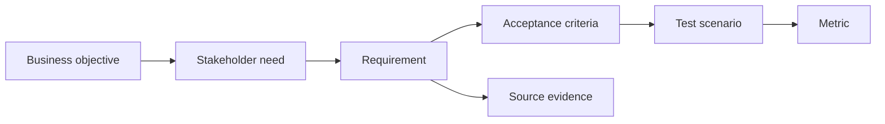

# Traceability and Testability

<div class="lesson-meta">
  <span>Requirements Engineering With AI</span>
  <span>Software BA</span>
  <span>Core</span>
</div>

## Learning outcomes

- Build traceability chains across goals, requirements, criteria, and tests.
- Use AI to find orphan requirements and weak test links.
- Improve release decisions with evidence.

## Why this matters for BA work

<div class="ba-callout">
Traceability makes AI-assisted requirements accountable from business goal to test evidence.
</div>

This lesson matters because AI-assisted artifacts can multiply quickly, making it easy to lose the chain from business goal to requirement, source, decision, test, and release evidence. Traceability protects teams from elegant but unproven requirements. Testability turns AI suggestions into behavior that delivery teams can verify.

## Common difficulties for BAs

In real projects, this topic is difficult because the BA must turn messy evidence into decisions without letting AI hide uncertainty. Watch for these friction points before treating the output as ready.

| Difficulty | Why it is hard in BA work | How a BA should handle it |
| --- | --- | --- |
| Treating traceability as documentation overhead. | This is hard because Traceability and Testability is usually applied under deadline pressure, incomplete evidence, and stakeholder disagreement. A fluent AI draft can make the gap less visible. | Use source labels, explicit assumptions, and a named review owner before turning this into backlog, specification, or delivery commitment. |
| Linking items mechanically without checking meaning. | This is hard because Traceability and Testability is usually applied under deadline pressure, incomplete evidence, and stakeholder disagreement. A fluent AI draft can make the gap less visible. | Use source labels, explicit assumptions, and a named review owner before turning this into backlog, specification, or delivery commitment. |
| Missing test scenarios for high-risk requirements. | This is hard because Traceability and Testability is usually applied under deadline pressure, incomplete evidence, and stakeholder disagreement. A fluent AI draft can make the gap less visible. | Use source labels, explicit assumptions, and a named review owner before turning this into backlog, specification, or delivery commitment. |

## Where this applies in real projects

This lesson is useful when the BA needs to move from conversation, policy, design, or technical input into a shared artifact that the team can implement and test.

| Project moment | How to apply this lesson | Concrete BA output |
| --- | --- | --- |
| Discovery | Build a traceability chain for one epic. | Traceability Chain: a reviewable artifact that connects the learned concept to decisions, acceptance criteria, risks, or stakeholder alignment. |
| Refinement | Ask AI to identify orphan stories. | Traceability Chain: a reviewable artifact that connects the learned concept to decisions, acceptance criteria, risks, or stakeholder alignment. |
| Delivery | Add source evidence to high-risk requirements. | Traceability Chain: a reviewable artifact that connects the learned concept to decisions, acceptance criteria, risks, or stakeholder alignment. |

## If this is missing

If this capability is missing, AI may still produce polished text, but the project loses reviewability. The result is usually rework, hidden assumptions, weak acceptance criteria, or business decisions made without enough evidence.

| If missing | Project impact | Recovery action |
| --- | --- | --- |
| Keep AI drafts in chat and copy useful parts into tickets | The source, assumption, and review trail disappear. | Recover by using the stronger pattern: Record source IDs, prompt context, reviewer, decision owner, and artifact version. Then re-check the artifact against evidence, testability, ownership, and business impact before sharing it. |
| Write tests only for happy-path generated behavior | AI features fail in edge cases, low confidence, and unsupported input. | Recover by using the stronger pattern: Trace each requirement to positive, negative, fallback, and monitoring tests. Then re-check the artifact against evidence, testability, ownership, and business impact before sharing it. |
| Treat traceability as a compliance spreadsheet | The team fills fields without using them to manage risk. | Recover by using the stronger pattern: Use trace links in refinement, QA planning, change impact, and release decisions. Then re-check the artifact against evidence, testability, ownership, and business impact before sharing it. |

## Mental model or core concept

Traceability connects why a requirement exists to how it will be verified. AI can help build matrices and identify gaps, but the BA must decide which links are real. A strong traceability chain maps business objective, stakeholder need, requirement, acceptance criteria, test scenario, metric, and source evidence.

## Practical BA example

A release has 80 stories. AI finds 12 stories with no linked business objective and 8 high-priority objectives with no test scenario. The BA uses the matrix to clean scope and reduce release risk.

## Diagram



## BA artifact

### Traceability Chain

| Link | Question | Example | Gap signal |
| --- | --- | --- | --- |
| Objective to need | Whose problem does this solve? | Reduce onboarding drop-off for new customers. | No named stakeholder. |
| Need to requirement | What system behavior supports it? | Send missing-doc reminder within 24 hours. | Behavior not observable. |
| Requirement to AC | How is done verified? | Given missing doc, then reminder is sent. | No failure case. |
| AC to metric | How will impact be measured? | Drop-off rate decreases by 10%. | No success metric. |

## AI expert note

For AI work, traceability should include evidence source, prompt or context package, model-assisted assumption, reviewer, decision owner, and evaluation case. Expert BAs treat traceability as risk control, not documentation overhead. If a requirement cannot be traced or tested, it should not become delivery commitment.

## Bad vs better example

| Weak pattern | Why it fails | Stronger BA pattern |
| --- | --- | --- |
| Keep AI drafts in chat and copy useful parts into tickets | The source, assumption, and review trail disappear. | Record source IDs, prompt context, reviewer, decision owner, and artifact version. |
| Write tests only for happy-path generated behavior | AI features fail in edge cases, low confidence, and unsupported input. | Trace each requirement to positive, negative, fallback, and monitoring tests. |
| Treat traceability as a compliance spreadsheet | The team fills fields without using them to manage risk. | Use trace links in refinement, QA planning, change impact, and release decisions. |

## AI collaboration prompt

```text
Create a traceability matrix from these artifacts. Include business objective, stakeholder need, requirement ID, acceptance criteria, test scenario, metric, source evidence, and gaps. Flag orphan requirements and objectives without tests.
```

## Mistakes to avoid

- Treating traceability as documentation overhead.
- Linking items mechanically without checking meaning.
- Missing test scenarios for high-risk requirements.
- Using AI-generated links without human review.

## Apply this tomorrow

1. Build a traceability chain for one epic.
2. Ask AI to identify orphan stories.
3. Add source evidence to high-risk requirements.
4. Review metric alignment with product owner.

## What a BA should remember

- Traceability is accountability.
- Testability starts before QA receives the story.
- AI can draft matrices; BA verifies links.
