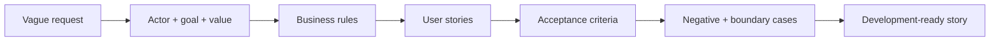

# User Stories and Acceptance Criteria

<div class="lesson-meta">
  <span>AI-Augmented BA Workflow</span>
  <span>Software BA</span>
  <span>Core</span>
</div>

## Learning outcomes

- Transform vague requests into testable user stories.
- Use AI to generate edge cases without losing business intent.
- Write acceptance criteria that development and QA can inspect.

## Why this matters for BA work

<div class="ba-callout">
AI can draft stories fast, but the BA must preserve business rules, negative paths, permissions, and testability.
</div>

Business Analysts sit between problem framing, stakeholder meaning, delivery constraints, and product decisions. In AI work, that position becomes more important because unclear language can create false certainty quickly. This lesson gives you a practical control you can apply before AI output becomes scope, backlog, or delivery commitment.

## Mental model or core concept

A user story captures actor, goal, and value; acceptance criteria define observable conditions of done. AI is useful for expansion: alternative paths, validation rules, permissions, and negative cases. The BA must prevent generic criteria by providing business rules and asking for testable scenarios.

## Practical BA example

The request 'users can update profiles' becomes multiple stories: edit contact info, verify email change, restrict sensitive fields, audit admin changes, and handle failed validation. AI helps draft scenarios, but the BA validates rules with product, security, and support.

## Diagram



## BA artifact

### Story Quality Rubric

| Criterion | Good signal | Weak signal | BA action |
| --- | --- | --- | --- |
| Actor and value | Actor and business value are explicit. | Story only says system shall. | Rewrite from user goal. |
| Business rule | Rules and thresholds are named. | Rule hidden in vague wording. | Add rule source or open question. |
| Acceptance criteria | Given-When-Then covers success and failure. | Only happy path exists. | Add negative and boundary cases. |
| Testability | QA can verify expected result. | Uses subjective terms. | Replace vague terms with observable outcomes. |

## AI collaboration prompt

```text
Convert this request into user stories and Given-When-Then acceptance criteria. Include actor, goal, business value, business rules, permissions, negative cases, boundary cases, audit needs, and unresolved questions. Flag any criteria that are not testable.
```

## Mistakes to avoid

- Generating many stories without business value.
- Writing acceptance criteria that repeat the story.
- Missing permissions and audit.
- Ignoring negative paths because the happy path looks simple.

## Apply this tomorrow

1. Pick one vague story and ask AI for missing business rules.
2. Add two negative acceptance criteria.
3. Ask QA to review testability before refinement.
4. Tag each criterion with source or assumption.

## What a BA should remember

- AI can expand scenarios, but BA owns business intent.
- Acceptance criteria are a contract for behavior.
- Negative paths are where hidden requirements surface.
