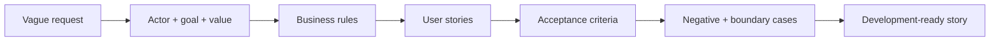

# User Stories and Acceptance Criteria

<div class="lesson-meta">
  <span>AI-Augmented BA Workflow</span>
  <span>Software BA</span>
  <span>Core</span>
</div>

## Learning outcomes

- Transform vague requests into testable user stories.
- Use AI to generate edge cases without losing business intent.
- Write acceptance criteria that development and QA can inspect.

## Why this matters for BA work

<div class="ba-callout">
AI can draft stories fast, but the BA must preserve business rules, negative paths, permissions, and testability.
</div>

This lesson matters because AI can produce many stories quickly, but volume is not readiness. Development-ready BA work requires actor clarity, business value, observable behavior, boundaries, negative cases, permissions, and release decisions. If the BA does not control the structure, AI-generated stories become attractive backlog noise.

## Common difficulties for BAs

In AI-Augmented BA Workflow, User Stories and Acceptance Criteria becomes difficult when messy notes, half-validated decisions, and incomplete stakeholder context must become a shared artifact quickly. A BA should inspect the points below before treating an AI-supported artifact as ready for stakeholder decision or delivery handoff.

| Difficulty | Why it is hard in BA work | How a BA should handle it |
| --- | --- | --- |
| Generating many stories without business value. | The mistake "Generating many stories without business value." appears when the team discusses source attribution, conflict visibility, workshop decision flow, and backlog readiness without agreeing which source is authoritative. AI can smooth over the disagreement, so the BA must keep uncertainty visible. | Apply this control: keep speaker/source attribution visible until the responsible stakeholder confirms meaning. Then use the stronger pattern "Start from user goals, split by permission, workflow step, exception, and business value." and ask who must approve the artifact before it affects scope, build, test, or release. |
| Writing acceptance criteria that repeat the story. | For User Stories and Acceptance Criteria, the friction is that AI can draft stories fast, but the BA must preserve business rules, negative paths, permissions, and testability. The weak pattern is tempting because AI can produce a fluent answer before the BA has checked ownership, source freshness, or decision rights. | Apply this control: keep speaker/source attribution visible until the responsible stakeholder confirms meaning. Then use the stronger pattern "Write Given-When-Then criteria with data, state, actor, boundary, and expected result." and ask who must approve the artifact before it affects scope, build, test, or release. |
| Missing permissions and audit. | This becomes hard when Story Quality Rubric is expected to support the validated working artifact. If the BA does not challenge the draft, unsupported assumptions may enter planning, testing, or stakeholder communication. | Apply this control: keep speaker/source attribution visible until the responsible stakeholder confirms meaning. Then use the stronger pattern "Require negative, boundary, audit, and role-based acceptance criteria before refinement." and ask who must approve the artifact before it affects scope, build, test, or release. |

## Where this applies in real projects

Use this lesson when discovery or refinement produces more raw input than the BA can safely synthesize by hand in the available time. The practical output is not a longer document; it is Story Quality Rubric with enough evidence, ownership, and decision clarity for the next project conversation.

| Project moment | How to apply this lesson | Concrete BA output |
| --- | --- | --- |
| Discovery | Pick one vague story and ask AI for missing business rules. | Story Quality Rubric showing source attribution, conflict visibility, workshop decision flow, and backlog readiness, with the action "Pick one vague story and ask AI for missing business rules." translated into a reviewable decision, requirement, checklist, or question for the next meeting. |
| Synthesis | Add two negative acceptance criteria. | Story Quality Rubric showing source evidence, with the action "Add two negative acceptance criteria." translated into a reviewable decision, requirement, checklist, or question for the next meeting. |
| Refinement | Ask QA to review testability before refinement. | Story Quality Rubric showing decision owner, with the action "Ask QA to review testability before refinement." translated into a reviewable decision, requirement, checklist, or question for the next meeting. |

## If this is missing

If User Stories and Acceptance Criteria is missing, important signals from interviews, tickets, process notes, or decisions may be lost before they reach the backlog. The BA can still recover, but only by converting the polished AI draft back into explicit evidence, assumptions, owners, and testable decisions.

| If missing | Project impact | Recovery action |
| --- | --- | --- |
| Generate ten user stories for the feature | The backlog grows without proving which stories are valuable or releasable. | Recover by using the stronger pattern: Start from user goals, split by permission, workflow step, exception, and business value. Rework Story Quality Rubric until it exposes source attribution, conflict visibility, workshop decision flow, and backlog readiness, and do not share it as final until evidence, ownership, and validation path are explicit. |
| Accept criteria that say the system works correctly | QA and developers cannot observe or automate vague success. | Recover by using the stronger pattern: Write Given-When-Then criteria with data, state, actor, boundary, and expected result. Rework Story Quality Rubric until it exposes source attribution, conflict visibility, workshop decision flow, and backlog readiness, and do not share it as final until evidence, ownership, and validation path are explicit. |
| Ignore negative and permission cases | The happy path hides production defects and security issues. | Recover by using the stronger pattern: Require negative, boundary, audit, and role-based acceptance criteria before refinement. Rework Story Quality Rubric until it exposes source attribution, conflict visibility, workshop decision flow, and backlog readiness, and do not share it as final until evidence, ownership, and validation path are explicit. |

## Mental model or core concept

A user story captures actor, goal, and value; acceptance criteria define observable conditions of done. AI is useful for expansion: alternative paths, validation rules, permissions, and negative cases. The BA must prevent generic criteria by providing business rules and asking for testable scenarios.

## Practical BA example

The request 'users can update profiles' becomes multiple stories: edit contact info, verify email change, restrict sensitive fields, audit admin changes, and handle failed validation. AI helps draft scenarios, but the BA validates rules with product, security, and support.

## Diagram



## BA artifact

### Story Quality Rubric

| Criterion | Good signal | Weak signal | BA action |
| --- | --- | --- | --- |
| Actor and value | Actor and business value are explicit. | Story only says system shall. | Rewrite from user goal. |
| Business rule | Rules and thresholds are named. | Rule hidden in vague wording. | Add rule source or open question. |
| Acceptance criteria | Given-When-Then covers success and failure. | Only happy path exists. | Add negative and boundary cases. |
| Testability | QA can verify expected result. | Uses subjective terms. | Replace vague terms with observable outcomes. |

## AI expert note

A user story is a decision container, not just a sentence template. AI is helpful for variation, edge cases, and Given-When-Then drafting, but it tends to overgeneralize. The BA should evaluate each story for one user goal, testable outcome, explicit rule source, and clear split from adjacent behavior.

## Bad vs better example

| Weak pattern | Why it fails | Stronger BA pattern |
| --- | --- | --- |
| Generate ten user stories for the feature | The backlog grows without proving which stories are valuable or releasable. | Start from user goals, split by permission, workflow step, exception, and business value. |
| Accept criteria that say the system works correctly | QA and developers cannot observe or automate vague success. | Write Given-When-Then criteria with data, state, actor, boundary, and expected result. |
| Ignore negative and permission cases | The happy path hides production defects and security issues. | Require negative, boundary, audit, and role-based acceptance criteria before refinement. |

## AI collaboration prompt

```text
Convert this request into user stories and Given-When-Then acceptance criteria. Include actor, goal, business value, business rules, permissions, negative cases, boundary cases, audit needs, and unresolved questions. Flag any criteria that are not testable.
```

## Mistakes to avoid

- Generating many stories without business value.
- Writing acceptance criteria that repeat the story.
- Missing permissions and audit.
- Ignoring negative paths because the happy path looks simple.

## Apply this tomorrow

1. Pick one vague story and ask AI for missing business rules.
2. Add two negative acceptance criteria.
3. Ask QA to review testability before refinement.
4. Tag each criterion with source or assumption.

## What a BA should remember

- AI can expand scenarios, but BA owns business intent.
- Acceptance criteria are a contract for behavior.
- Negative paths are where hidden requirements surface.
