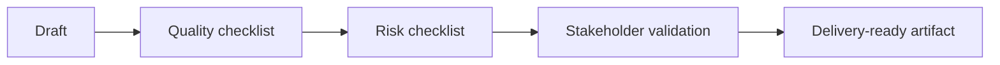

# Checklists

| Area | BA checks |
| --- | --- |
| Context | Goal, users, source material, constraints, output format |
| Quality | Ambiguity, conflict, missing rules, testability, NFRs |
| AI product | Data, confidence, fallback, human review, monitoring |
| Governance | PII, policy, approved tools, audit trail, risk tier |

## Review flow

