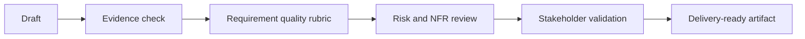

# Checklists and Rubrics

| Checklist | What to verify |
| --- | --- |
| Requirement quality | Actor, behavior, business rule, data, edge case, NFR, testability, source evidence |
| AI output review | Facts, assumptions, unsupported claims, missing context, severity, owner |
| AI feature spec | Task, input, output, confidence, fallback, human review, evaluation, monitoring |
| RAG governance | Source authority, freshness, access control, citation, conflict handling, fallback |
| BA team adoption | Use-case tier, approved tools, data policy, quality gate, metric, escalation |

## Review flow

## Scoring guide

- 1 means the artifact is risky or unclear.
- 2 means the artifact is usable with known gaps.
- 3 means the artifact is delivery-ready and evidence-backed.
