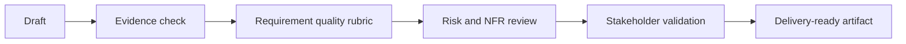

# Checklists and Rubrics

| Checklist | What to verify |
| --- | --- |
| Requirement quality | Actor, behavior, business rule, data, edge case, NFR, testability, source evidence |
| AI output review | Facts, assumptions, unsupported claims, missing context, severity, owner |
| AI feature spec | Task, input, output, confidence, fallback, human review, evaluation, monitoring |
| RAG governance | Source authority, freshness, access control, citation, conflict handling, fallback |
| Prompt injection | User-controlled input, retrieved content, tool action, instruction hierarchy, refusal, escalation, logging |
| Bias and fairness | Affected groups, proxy variables, historical bias, explainability, appeal path, fairness metric |
| Observability | Evaluation set, output logs, correction capture, drift signal, alert threshold, dashboard owner |
| Model selection | Task fit, context need, latency, quality bar, privacy, access control, cost guardrail, fallback model |
| BA team adoption | Use-case tier, approved tools, data policy, quality gate, metric, escalation |

## Review flow

## Scoring guide

- 1 means the artifact is risky or unclear.
- 2 means the artifact is usable with known gaps.
- 3 means the artifact is delivery-ready and evidence-backed.

## AI risk controls BAs should request

- Prompt injection: define what user input, retrieved documents, and tool outputs are allowed to influence.
- Bias: require representative evaluation cases and a way for users or operators to challenge harmful outcomes.
- Observability: log enough model input, output, confidence, fallback, and correction data to learn after release.
- Access control: verify that the AI cannot retrieve or reveal information beyond the user's permission.
- Cost guardrail: define token budget, volume assumptions, escalation rules, and lower-cost fallback for routine tasks.
