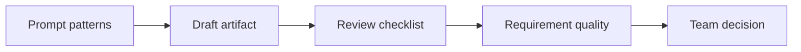

# Resource Library

Reusable material for BA work with AI.

## Resources

- [Prompt Library](./prompt-library)
- [Checklists](./checklists)
- [Glossary](./glossary)

## Resource map

```mermaid
flowchart LR
    A["Prompt patterns"] --> B["Draft artifact"]
    B --> C["Review checklist"]
    C --> D["Requirement quality"]
    D --> E["Team decision"]
```
