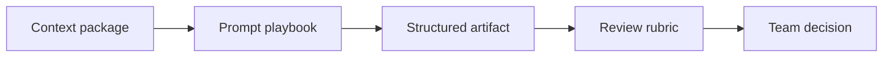

# Resource Library

Reusable playbooks for BA work with AI.

## Resources

- [Prompt Playbook](./prompt-library)
- [Checklists and Rubrics](./checklists)
- [Glossary](./glossary)

## Resource map

## How to use the library

1. Start from the checklist for your task.
2. Use a prompt pattern only after source context is ready.
3. Require AI to label assumptions and unsupported claims.
4. Convert output into a BA-owned artifact before sharing it.
