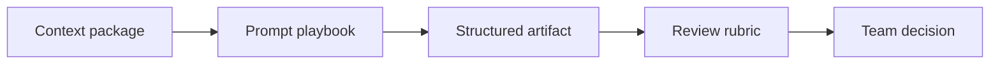

# Resource Library

Reusable playbooks for BA work with AI.

## Resources

- [Prompt Playbook](./prompt-library)
- [Checklists and Rubrics](./checklists)
- [Glossary](./glossary)

## Project-ready templates

<a class="template-card" href="./ai-feature-requirement-template"><strong>AI Feature Requirement Template</strong>Use this when a feature contains model output, generated recommendations, classification, summarization, retrieval, or AI-assisted decisions.</a>
<a class="template-card" href="./acceptance-criteria-quality-rubric"><strong>Acceptance Criteria Quality Rubric</strong>Use this to review AI-generated or human-written acceptance criteria before sprint refinement.</a>
<a class="template-card" href="./ui-state-requirement-template"><strong>UI State Requirement Template</strong>Use this when translating Figma, wireframes, or a screen idea into implementable frontend requirements.</a>
<a class="template-card" href="./api-contract-checklist"><strong>API Contract Checklist</strong>Use this when a BA must align frontend needs, backend constraints, QA expectations, and business rules around an API.</a>
<a class="template-card" href="./rag-knowledge-contract-canvas"><strong>RAG Knowledge Contract Canvas</strong>Use this before specifying a knowledge assistant, policy assistant, support assistant, or document Q&A feature.</a>
<a class="template-card" href="./prompt-review-checklist"><strong>Prompt Review Checklist</strong>Use this before turning a one-off prompt into a reusable team prompt or workflow.</a>
<a class="template-card" href="./ai-risk-human-review-matrix"><strong>AI Risk and Human Review Matrix</strong>Use this to decide when AI output can proceed, when it needs review, and when it must fallback or escalate.</a>
<a class="template-card" href="./decision-log-template"><strong>Decision Log Template</strong>Use this when AI-assisted analysis produces options, trade-offs, or open questions that require human accountability.</a>
<a class="template-card" href="./definition-of-ready-done-ai-ba"><strong>Definition of Ready and Done for AI-Augmented BA Work</strong>Use this to define quality gates before AI-assisted BA artifacts enter refinement, build, test, or release decisions.</a>

## Resource map

## How to use the library

1. Start from the checklist for your task.
2. Use a prompt pattern only after source context is ready.
3. Require AI to label assumptions and unsupported claims.
4. Convert output into a BA-owned artifact before sharing it.
