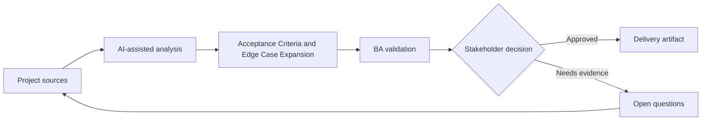

# Acceptance Criteria and Edge Case Expansion

<div class="case-meta">
  <span>Requirements and backlog</span>
  <span>Requirements quality</span>
  <span>Project use case</span>
</div>

## Project context

A team is preparing a feature for account limit changes. The initial requirement says admins can update limits, but it does not define thresholds, approval rules, notification behavior, audit, or what happens when requests fail. In a real delivery environment, this work usually appears under time pressure: stakeholders want clarity, delivery needs a backlog, QA needs testable behavior, and operations needs a process that can survive exceptions. The BA uses AI here to accelerate analysis and synthesis, but the BA remains accountable for evidence, business meaning, stakeholder decisioning, and artifact quality.

## BA challenge

The BA must turn a simple requirement into testable acceptance criteria with positive, negative, boundary, permission, audit, and recovery scenarios. AI can expand edge cases, but the BA must keep only those supported by policy and stakeholder decisions. The practical difficulty is that AI can make early material look more complete than it is. A strong BA keeps the output reviewable by separating source-backed facts, assumptions, unsupported claims, decision gaps, and recommended next actions. The objective is not to make the document longer; it is to make the project decision clearer and safer.

## Where AI fits

<div class="ba-workbench-panel">
AI is useful in this use case when it is constrained to analysis support, pattern detection, structured drafting, and critique. It should not approve scope, invent policy, decide business trade-offs, or replace accountable stakeholder judgment.
</div>

- Generate edge-case categories from a requirement draft.
- Draft Given-When-Then criteria across positive and negative paths.
- Identify missing business rules and policy dependencies.
- Create QA review questions and traceability links.

## Inputs to prepare

- Requirement draft
- Policy thresholds
- Admin role matrix
- Audit requirements
- System error behavior notes

A BA should label these inputs before using AI: source owner, source date, approval status, sensitivity level, and whether the source is fact, opinion, policy, draft, or historical evidence. This preparation prevents the model from treating every input as equally current and authoritative.

## BA workflow

1. Ask AI to list observable behaviors and missing rules.
2. Generate criteria by scenario type: positive, negative, boundary, permission, audit, and failure recovery.
3. Remove criteria that invent policy values or unsupported thresholds.
4. Add source IDs and decision owners for every rule.
5. Review with QA for testability and with product for business intent.
6. Publish criteria with trace links to requirement and source evidence.

The workflow works best as a staged AI collaboration: first organize the evidence, then ask for analysis, then create the artifact, then run a critique pass. The BA should keep a visible decision log throughout the process so that AI-generated suggestions do not silently become approved scope.

## Diagram



## Deliverables

| Deliverable | What it contains | Owner | Done signal |
| --- | --- | --- | --- |
| Acceptance criteria matrix | Scenario, Given-When-Then, source, owner, and test type | BA | Every material rule is observable |
| Edge case register | Boundary, permission, error, audit, and concurrency cases | QA | Critical edge cases have test coverage |
| Clarification questions | Missing thresholds, roles, and exception rules | Product owner | Questions have owner and due date |
| Trace links | Requirement to source to criteria to test | BA | Criteria can be traced to evidence |

These deliverables should be treated as BA-owned artifacts. AI can draft them, but the BA must validate source support, stakeholder meaning, traceability, and whether the artifact is ready for handoff.

## Prompt to try

```text
Act as a senior AI-aware Business Analyst. Help me apply the "Acceptance Criteria and Edge Case Expansion" use case to my project. First ask for source evidence and constraints. Then create a structured analysis with project context, assumptions, AI-fit boundary, workflow steps, deliverables, risks, controls, open questions, and stakeholder decisions. Do not invent policy, thresholds, or approvals.
```

## Review checklist

- Every AI-produced statement is tied to a source, assumption, or validation question.
- The BA has separated drafting assistance from business approval.
- Workflow steps identify the human owner for decisions, review, and exceptions.
- Deliverables are traceable to project inputs and can be reviewed by QA, product, or operations.
- Risk controls are practical enough to be used in a real project meeting.
- Success metric: QA can convert acceptance criteria into test cases without asking for hidden business rules.

## Risks and controls

| Risk | Why it matters | BA control |
| --- | --- | --- |
| Invented thresholds | AI may create limits that policy never approved | Require source IDs for every numeric rule |
| Criteria overload | Too many low-value cases can slow refinement | Prioritize by risk, frequency, and failure cost |
| Untestable wording | Criteria may still use vague terms | Use observable state, actor, input, and expected result |
| Missing audit | Admin changes may lack compliance evidence | Add audit and permission criteria explicitly |

The key control is to make uncertainty visible. If evidence is weak, the output should create a validation question or decision item, not a final requirement. If the artifact influences delivery, release, compliance, customer experience, or operational workload, the BA should require explicit human review before handoff.
