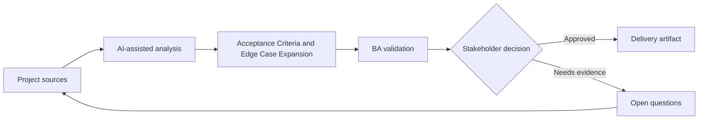

# Acceptance Criteria and Edge Case Expansion

<div class="case-meta">
  <span>Requirements and backlog</span>
  <span>Requirements quality</span>
  <span>Refinement</span>
  <span>Core</span>
  <span>Acceptance criteria matrix</span>
  <span>Project use case</span>
</div>

## Project context

A team is preparing a feature for account limit changes. The initial requirement says admins can update limits, but it does not define thresholds, approval rules, notification behavior, audit, or what happens when requests fail. In Requirements quality, this work usually starts when stories must become testable without losing business rules, exceptions, data needs, or NFRs. The BA should treat Requirement draft and Policy thresholds as evidence to organize, not as raw material for an unconstrained AI answer. The goal is to make the next decision clearer for the people who own the outcome.

## BA challenge

The BA must turn a simple requirement into testable acceptance criteria with positive, negative, boundary, permission, audit, and recovery scenarios. AI can expand edge cases, but the BA must keep only those supported by policy and stakeholder decisions. For Acceptance Criteria and Edge Case Expansion, the practical difficulty is vague criteria and unowned assumptions. AI can accelerate gap finding, rewrite critique, edge-case expansion, and acceptance-criteria drafting, but the BA must still expose assumptions, missing approvals, and the point where stakeholder judgment is required.

## Where AI fits

<div class="ba-workbench-panel">
AI fits this Requirements and backlog use case when it is constrained to gap finding, rewrite critique, edge-case expansion, and acceptance-criteria drafting. A useful first AI task is: Generate edge-case categories from a requirement draft. AI should not approve scope, invent policy, bypass approved rules, examples, edge cases, and QA expectations, or turn a draft into a final decision.
</div>

- Generate edge-case categories from a requirement draft.
- Draft Given-When-Then criteria across positive and negative paths.
- Identify missing business rules and policy dependencies.
- Create QA review questions and traceability links.

## Inputs to prepare

- Requirement draft
- Policy thresholds
- Admin role matrix
- Audit requirements
- System error behavior notes

Before prompting for Acceptance Criteria and Edge Case Expansion, label each input by owner, date, approval status, sensitivity, and role in the decision. The most important evidence lens is approved rules, examples, edge cases, and QA expectations; without it, AI may rank old notes, draft designs, and approved rules as if they had equal authority.

## BA workflow

1. Ask AI to list observable behaviors and missing rules.
2. Generate criteria by scenario type: positive, negative, boundary, permission, audit, and failure recovery.
3. Remove criteria that invent policy values or unsupported thresholds.
4. Add source IDs and decision owners for every rule.
5. Review with QA for testability and with product for business intent.
6. Publish criteria with trace links to requirement and source evidence.

Run the workflow as requirement clarification before sprint commitment: start with "Ask AI to list observable behaviors and missing rules.", then keep a visible decision log as the artifact moves toward Acceptance criteria matrix. This prevents AI suggestions from silently becoming backlog, design, release, or operational commitments.

## Diagram



## Deliverables

| Deliverable | What it contains | Owner | Done signal |
| --- | --- | --- | --- |
| Acceptance criteria matrix | Scenario, Given-When-Then, source, owner, and test type | BA | Every material rule is observable |
| Edge case register | Boundary, permission, error, audit, and concurrency cases | QA | Critical edge cases have test coverage |
| Clarification questions | Missing thresholds, roles, and exception rules | Product owner | Questions have owner and due date |
| Trace links | Requirement to source to criteria to test | BA | Criteria can be traced to evidence |

Treat Acceptance criteria matrix as a BA-owned delivery-ready backlog artifact. AI may draft structure, but the BA must validate whether "Every material rule is observable" is actually true, whether the artifact is traceable to source evidence, and whether the receiving team can act on it.

## Prompt to try

```text
Act as a senior AI-aware Business Analyst. Help me apply the "Acceptance Criteria and Edge Case Expansion" use case to my project. First ask for source evidence and constraints. Then create a structured analysis with project context, assumptions, AI-fit boundary, workflow steps, deliverables, risks, controls, open questions, and stakeholder decisions. Do not invent policy, thresholds, or approvals.
```

## Review checklist

- Requirement draft is labeled with owner, date, approval status, and sensitivity.
- Acceptance criteria matrix traces to source evidence and has a named human owner.
- The AI task stays inside gap finding, rewrite critique, edge-case expansion, and acceptance-criteria drafting and does not approve scope or policy.
- The "Invented thresholds" risk has a practical control: Require source IDs for every numeric rule.
- Open assumptions are converted into validation questions or stakeholder decisions.
- Success metric: QA can convert acceptance criteria into test cases without asking for hidden business rules.

## Risks and controls

| Risk | Why it matters | BA control |
| --- | --- | --- |
| Invented thresholds | AI may create limits that policy never approved | Require source IDs for every numeric rule |
| Criteria overload | Too many low-value cases can slow refinement | Prioritize by risk, frequency, and failure cost |
| Untestable wording | Criteria may still use vague terms | Use observable state, actor, input, and expected result |
| Missing audit | Admin changes may lack compliance evidence | Add audit and permission criteria explicitly |

The main control for the "Invented thresholds" risk is explicit human accountability: Require source IDs for every numeric rule. If evidence is weak, the output should create a validation question or decision item, not a final requirement.
