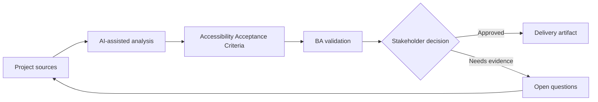

# Accessibility Acceptance Criteria

<div class="case-meta">
  <span>Frontend, UI, and UX</span>
  <span>Accessibility</span>
  <span>Project use case</span>
</div>

## Project context

A public portal must meet accessibility expectations, but the initial stories only mention visual layout and happy-path interactions. Keyboard navigation, screen reader labels, focus behavior, and contrast are not specified. In a real delivery environment, this work usually appears under time pressure: stakeholders want clarity, delivery needs a backlog, QA needs testable behavior, and operations needs a process that can survive exceptions. The BA uses AI here to accelerate analysis and synthesis, but the BA remains accountable for evidence, business meaning, stakeholder decisioning, and artifact quality.

## BA challenge

The BA must convert accessibility expectations into acceptance criteria that frontend and QA can implement and test. Accessibility cannot be a late checklist; it must be part of behavior requirements. The practical difficulty is that AI can make early material look more complete than it is. A strong BA keeps the output reviewable by separating source-backed facts, assumptions, unsupported claims, decision gaps, and recommended next actions. The objective is not to make the document longer; it is to make the project decision clearer and safer.

## Where AI fits

<div class="ba-workbench-panel">
AI is useful in this use case when it is constrained to analysis support, pattern detection, structured drafting, and critique. It should not approve scope, invent policy, decide business trade-offs, or replace accountable stakeholder judgment.
</div>

- Generate accessibility review questions by component and interaction.
- Draft acceptance criteria for keyboard, focus, label, contrast, and error behavior.
- Identify accessibility risks in forms, modals, tables, and dynamic updates.
- Create a QA checklist for assistive technology scenarios.

## Inputs to prepare

- UI design
- Component list
- Accessibility policy
- Form and modal behavior
- Target user groups

A BA should label these inputs before using AI: source owner, source date, approval status, sensitivity level, and whether the source is fact, opinion, policy, draft, or historical evidence. This preparation prevents the model from treating every input as equally current and authoritative.

## BA workflow

1. List components and interactions that need accessibility behavior.
2. Ask AI to generate criteria by accessibility lens.
3. Review labels, focus order, keyboard navigation, status announcements, and error messages.
4. Agree test responsibility with frontend and QA.
5. Add acceptance criteria to stories before refinement.
6. Track unresolved accessibility risks in the backlog.

The workflow works best as a staged AI collaboration: first organize the evidence, then ask for analysis, then create the artifact, then run a critique pass. The BA should keep a visible decision log throughout the process so that AI-generated suggestions do not silently become approved scope.

## Diagram



## Deliverables

| Deliverable | What it contains | Owner | Done signal |
| --- | --- | --- | --- |
| Accessibility criteria set | Component, behavior, criterion, and test method | BA | Criteria are story-ready |
| Keyboard flow map | Tab order, focus trap, escape behavior, and shortcut rules | Frontend | Keyboard users can complete task |
| Screen reader label list | Element, label, announcement, and dynamic update | UX and frontend | Assistive tech behavior is defined |
| Accessibility QA checklist | Manual checks, automated checks, and assistive scenarios | QA | Testing goes beyond visual layout |

These deliverables should be treated as BA-owned artifacts. AI can draft them, but the BA must validate source support, stakeholder meaning, traceability, and whether the artifact is ready for handoff.

## Prompt to try

```text
Act as a senior AI-aware Business Analyst. Help me apply the "Accessibility Acceptance Criteria" use case to my project. First ask for source evidence and constraints. Then create a structured analysis with project context, assumptions, AI-fit boundary, workflow steps, deliverables, risks, controls, open questions, and stakeholder decisions. Do not invent policy, thresholds, or approvals.
```

## Review checklist

- Every AI-produced statement is tied to a source, assumption, or validation question.
- The BA has separated drafting assistance from business approval.
- Workflow steps identify the human owner for decisions, review, and exceptions.
- Deliverables are traceable to project inputs and can be reviewed by QA, product, or operations.
- Risk controls are practical enough to be used in a real project meeting.
- Success metric: Accessibility is represented as testable behavior in user stories before frontend implementation starts.

## Risks and controls

| Risk | Why it matters | BA control |
| --- | --- | --- |
| Late accessibility | Fixing issues after build is expensive | Add accessibility criteria during refinement |
| Visual-only design | Screen reader users may not understand context | Specify labels and announcements |
| Keyboard trap | Users may get stuck in modals or menus | Define focus management and escape behavior |
| Error invisibility | Validation errors may not be announced | Specify accessible error behavior |

The key control is to make uncertainty visible. If evidence is weak, the output should create a validation question or decision item, not a final requirement. If the artifact influences delivery, release, compliance, customer experience, or operational workload, the BA should require explicit human review before handoff.
