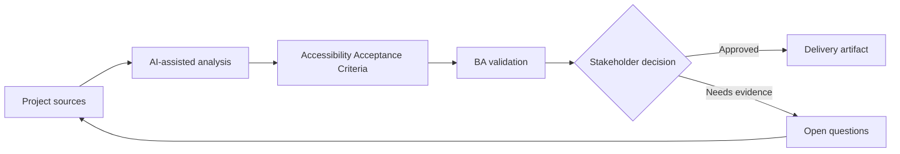

# Accessibility Acceptance Criteria

<div class="case-meta">
  <span>Frontend, UI, and UX</span>
  <span>Accessibility</span>
  <span>Project use case</span>
</div>

## Project context

A public portal must meet accessibility expectations, but the initial stories only mention visual layout and happy-path interactions. Keyboard navigation, screen reader labels, focus behavior, and contrast are not specified. In Accessibility, this work usually starts when screen behavior, accessibility, design states, analytics, and user feedback must become implementable requirements. The BA should treat UI design and Component list as evidence to organize, not as raw material for an unconstrained AI answer. The goal is to make the next decision clearer for the people who own the outcome.

## BA challenge

The BA must convert accessibility expectations into acceptance criteria that frontend and QA can implement and test. Accessibility cannot be a late checklist; it must be part of behavior requirements. For Accessibility Acceptance Criteria, the practical difficulty is missing states and unmeasurable UX. AI can accelerate UI-state analysis, content critique, accessibility review, event taxonomy, and edge-case discovery, but the BA must still expose assumptions, missing approvals, and the point where stakeholder judgment is required.

## Where AI fits

<div class="ba-workbench-panel">
AI fits this Frontend, UI, and UX use case when it is constrained to UI-state analysis, content critique, accessibility review, event taxonomy, and edge-case discovery. A useful first AI task is: Generate accessibility review questions by component and interaction. AI should not approve scope, invent policy, bypass wireframes, design tokens, user journeys, analytics questions, and accessibility expectations, or turn a draft into a final decision.
</div>

- Generate accessibility review questions by component and interaction.
- Draft acceptance criteria for keyboard, focus, label, contrast, and error behavior.
- Identify accessibility risks in forms, modals, tables, and dynamic updates.
- Create a QA checklist for assistive technology scenarios.

## Inputs to prepare

- UI design
- Component list
- Accessibility policy
- Form and modal behavior
- Target user groups

Before prompting for Accessibility Acceptance Criteria, label each input by owner, date, approval status, sensitivity, and role in the decision. The most important evidence lens is wireframes, design tokens, user journeys, analytics questions, and accessibility expectations; without it, AI may rank old notes, draft designs, and approved rules as if they had equal authority.

## BA workflow

1. List components and interactions that need accessibility behavior.
2. Ask AI to generate criteria by accessibility lens.
3. Review labels, focus order, keyboard navigation, status announcements, and error messages.
4. Agree test responsibility with frontend and QA.
5. Add acceptance criteria to stories before refinement.
6. Track unresolved accessibility risks in the backlog.

Run the workflow as screen-state review before frontend build: start with "List components and interactions that need accessibility behavior.", then keep a visible decision log as the artifact moves toward Accessibility criteria set. This prevents AI suggestions from silently becoming backlog, design, release, or operational commitments.

## Diagram



## Deliverables

| Deliverable | What it contains | Owner | Done signal |
| --- | --- | --- | --- |
| Accessibility criteria set | Component, behavior, criterion, and test method | BA | Criteria are story-ready |
| Keyboard flow map | Tab order, focus trap, escape behavior, and shortcut rules | Frontend | Keyboard users can complete task |
| Screen reader label list | Element, label, announcement, and dynamic update | UX and frontend | Assistive tech behavior is defined |
| Accessibility QA checklist | Manual checks, automated checks, and assistive scenarios | QA | Testing goes beyond visual layout |

Treat Accessibility criteria set as a BA-owned frontend requirement specification. AI may draft structure, but the BA must validate whether "Criteria are story-ready" is actually true, whether the artifact is traceable to source evidence, and whether the receiving team can act on it.

## Prompt to try

```text
Act as a senior AI-aware Business Analyst. Help me apply the "Accessibility Acceptance Criteria" use case to my project. First ask for source evidence and constraints. Then create a structured analysis with project context, assumptions, AI-fit boundary, workflow steps, deliverables, risks, controls, open questions, and stakeholder decisions. Do not invent policy, thresholds, or approvals.
```

## Review checklist

- UI design is labeled with owner, date, approval status, and sensitivity.
- Accessibility criteria set traces to source evidence and has a named human owner.
- The AI task stays inside UI-state analysis, content critique, accessibility review, event taxonomy, and edge-case discovery and does not approve scope or policy.
- The "Late accessibility" risk has a practical control: Add accessibility criteria during refinement.
- Open assumptions are converted into validation questions or stakeholder decisions.
- Success metric: Accessibility is represented as testable behavior in user stories before frontend implementation starts.

## Risks and controls

| Risk | Why it matters | BA control |
| --- | --- | --- |
| Late accessibility | Fixing issues after build is expensive | Add accessibility criteria during refinement |
| Visual-only design | Screen reader users may not understand context | Specify labels and announcements |
| Keyboard trap | Users may get stuck in modals or menus | Define focus management and escape behavior |
| Error invisibility | Validation errors may not be announced | Specify accessible error behavior |

The main control for the "Late accessibility" risk is explicit human accountability: Add accessibility criteria during refinement. If evidence is weak, the output should create a validation question or decision item, not a final requirement.
