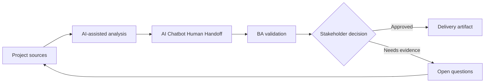

# AI Chatbot Human Handoff

<div class="case-meta">
  <span>AI-enabled product use cases</span>
  <span>Customer support</span>
  <span>Project use case</span>
</div>

## Project context

A customer support team wants a chatbot to answer common questions and hand off complex cases to agents. The business wants fewer tickets, but customer experience cannot degrade when the bot is uncertain. In a real delivery environment, this work usually appears under time pressure: stakeholders want clarity, delivery needs a backlog, QA needs testable behavior, and operations needs a process that can survive exceptions. The BA uses AI here to accelerate analysis and synthesis, but the BA remains accountable for evidence, business meaning, stakeholder decisioning, and artifact quality.

## BA challenge

The BA must specify supported intents, knowledge sources, refusal behavior, handoff triggers, transcript transfer, agent context, SLA, and monitoring. Handoff is a workflow requirement, not a fallback note. The practical difficulty is that AI can make early material look more complete than it is. A strong BA keeps the output reviewable by separating source-backed facts, assumptions, unsupported claims, decision gaps, and recommended next actions. The objective is not to make the document longer; it is to make the project decision clearer and safer.

## Where AI fits

<div class="ba-workbench-panel">
AI is useful in this use case when it is constrained to analysis support, pattern detection, structured drafting, and critique. It should not approve scope, invent policy, decide business trade-offs, or replace accountable stakeholder judgment.
</div>

- Draft intent catalog and unsupported intent behavior.
- Generate handoff trigger scenarios.
- Create agent context and transcript requirements.
- Design quality monitoring metrics for containment and customer harm.

## Inputs to prepare

- Support intent list
- FAQ and policy sources
- Escalation process
- Agent workflow
- Customer satisfaction data

A BA should label these inputs before using AI: source owner, source date, approval status, sensitivity level, and whether the source is fact, opinion, policy, draft, or historical evidence. This preparation prevents the model from treating every input as equally current and authoritative.

## BA workflow

1. Define supported and unsupported intents with source evidence.
2. Ask AI to generate handoff triggers such as low confidence, repeated failure, sentiment, risk, or regulated topic.
3. Specify what context transfers to the human agent.
4. Design user messaging that is honest and helpful.
5. Create monitoring metrics for containment, handoff quality, and repeat contact.
6. Review failure scenarios with support agents before launch.

The workflow works best as a staged AI collaboration: first organize the evidence, then ask for analysis, then create the artifact, then run a critique pass. The BA should keep a visible decision log throughout the process so that AI-generated suggestions do not silently become approved scope.

## Diagram



## Deliverables

| Deliverable | What it contains | Owner | Done signal |
| --- | --- | --- | --- |
| Intent catalog | Intent, source, answer behavior, unsupported behavior, and owner | BA and support | Intent boundaries are clear |
| Handoff rule matrix | Trigger, user message, agent queue, SLA, and context transfer | Support lead | Every trigger has workflow path |
| Agent context package | Conversation summary, user goal, attempted answer, and source references | BA | Agent receives useful context |
| Monitoring dashboard spec | Containment, fallback, repeat contact, CSAT, and escalation patterns | Operations | Quality is monitored beyond volume reduction |

These deliverables should be treated as BA-owned artifacts. AI can draft them, but the BA must validate source support, stakeholder meaning, traceability, and whether the artifact is ready for handoff.

## Prompt to try

```text
Act as a senior AI-aware Business Analyst. Help me apply the "AI Chatbot Human Handoff" use case to my project. First ask for source evidence and constraints. Then create a structured analysis with project context, assumptions, AI-fit boundary, workflow steps, deliverables, risks, controls, open questions, and stakeholder decisions. Do not invent policy, thresholds, or approvals.
```

## Review checklist

- Every AI-produced statement is tied to a source, assumption, or validation question.
- The BA has separated drafting assistance from business approval.
- Workflow steps identify the human owner for decisions, review, and exceptions.
- Deliverables are traceable to project inputs and can be reviewed by QA, product, or operations.
- Risk controls are practical enough to be used in a real project meeting.
- Success metric: The chatbot reduces simple workload while complex or risky cases reach humans with context and accountability.

## Risks and controls

| Risk | Why it matters | BA control |
| --- | --- | --- |
| Poor handoff | Customers repeat information and lose trust | Transfer transcript, summary, and source context |
| Over-containment | Business may optimize for fewer tickets at customer expense | Measure repeat contact and satisfaction |
| Unsupported intent invention | Bot may answer topics outside scope | Define refusal and escalation behavior |
| Agent workflow burden | Handoff may create extra work for agents | Design agent context package with support input |

The key control is to make uncertainty visible. If evidence is weak, the output should create a validation question or decision item, not a final requirement. If the artifact influences delivery, release, compliance, customer experience, or operational workload, the BA should require explicit human review before handoff.
