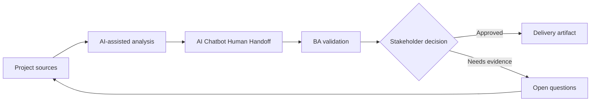

# AI Chatbot Human Handoff

<div class="case-meta">
  <span>AI-enabled product use cases</span>
  <span>Customer support</span>
  <span>AI product design</span>
  <span>Advanced</span>
  <span>Intent catalog</span>
  <span>Project use case</span>
</div>

## Project context

A customer support team wants a chatbot to answer common questions and hand off complex cases to agents. The business wants fewer tickets, but customer experience cannot degrade when the bot is uncertain. In Customer support, this work usually starts when AI behavior affects users directly and must include uncertainty, fallback, evaluation, and human review. The BA should treat Support intent list and FAQ and policy sources as evidence to organize, not as raw material for an unconstrained AI answer. The goal is to make the next decision clearer for the people who own the outcome.

## BA challenge

The BA must specify supported intents, knowledge sources, refusal behavior, handoff triggers, transcript transfer, agent context, SLA, and monitoring. Handoff is a workflow requirement, not a fallback note. For AI Chatbot Human Handoff, the practical difficulty is over-automation and unsafe confidence. AI can accelerate AI task framing, output contract drafting, evaluation planning, and safety-control critique, but the BA must still expose assumptions, missing approvals, and the point where stakeholder judgment is required.

## Where AI fits

<div class="ba-workbench-panel">
AI fits this AI-enabled product use cases use case when it is constrained to AI task framing, output contract drafting, evaluation planning, and safety-control critique. A useful first AI task is: Draft intent catalog and unsupported intent behavior. AI should not approve scope, invent policy, bypass approved sources, model limits, evaluation cases, and human decision triggers, or turn a draft into a final decision.
</div>

- Draft intent catalog and unsupported intent behavior.
- Generate handoff trigger scenarios.
- Create agent context and transcript requirements.
- Design quality monitoring metrics for containment and customer harm.

## Inputs to prepare

- Support intent list
- FAQ and policy sources
- Escalation process
- Agent workflow
- Customer satisfaction data

Before prompting for AI Chatbot Human Handoff, label each input by owner, date, approval status, sensitivity, and role in the decision. The most important evidence lens is approved sources, model limits, evaluation cases, and human decision triggers; without it, AI may rank old notes, draft designs, and approved rules as if they had equal authority.

## BA workflow

1. Define supported and unsupported intents with source evidence.
2. Ask AI to generate handoff triggers such as low confidence, repeated failure, sentiment, risk, or regulated topic.
3. Specify what context transfers to the human agent.
4. Design user messaging that is honest and helpful.
5. Create monitoring metrics for containment, handoff quality, and repeat contact.
6. Review failure scenarios with support agents before launch.

Run the workflow as AI operating contract before build: start with "Define supported and unsupported intents with source evidence.", then keep a visible decision log as the artifact moves toward Intent catalog. This prevents AI suggestions from silently becoming backlog, design, release, or operational commitments.

## Diagram



## Deliverables

| Deliverable | What it contains | Owner | Done signal |
| --- | --- | --- | --- |
| Intent catalog | Intent, source, answer behavior, unsupported behavior, and owner | BA and support | Intent boundaries are clear |
| Handoff rule matrix | Trigger, user message, agent queue, SLA, and context transfer | Support lead | Every trigger has workflow path |
| Agent context package | Conversation summary, user goal, attempted answer, and source references | BA | Agent receives useful context |
| Monitoring dashboard spec | Containment, fallback, repeat contact, CSAT, and escalation patterns | Operations | Quality is monitored beyond volume reduction |

Treat Intent catalog as a BA-owned AI behavior specification. AI may draft structure, but the BA must validate whether "Intent boundaries are clear" is actually true, whether the artifact is traceable to source evidence, and whether the receiving team can act on it.

## Prompt to try

```text
Act as a senior AI-aware Business Analyst. Help me apply the "AI Chatbot Human Handoff" use case to my project. First ask for source evidence and constraints. Then create a structured analysis with project context, assumptions, AI-fit boundary, workflow steps, deliverables, risks, controls, open questions, and stakeholder decisions. Do not invent policy, thresholds, or approvals.
```

## Review checklist

- Support intent list is labeled with owner, date, approval status, and sensitivity.
- Intent catalog traces to source evidence and has a named human owner.
- The AI task stays inside AI task framing, output contract drafting, evaluation planning, and safety-control critique and does not approve scope or policy.
- The "Poor handoff" risk has a practical control: Transfer transcript, summary, and source context.
- Open assumptions are converted into validation questions or stakeholder decisions.
- Success metric: The chatbot reduces simple workload while complex or risky cases reach humans with context and accountability.

## Risks and controls

| Risk | Why it matters | BA control |
| --- | --- | --- |
| Poor handoff | Customers repeat information and lose trust | Transfer transcript, summary, and source context |
| Over-containment | Business may optimize for fewer tickets at customer expense | Measure repeat contact and satisfaction |
| Unsupported intent invention | Bot may answer topics outside scope | Define refusal and escalation behavior |
| Agent workflow burden | Handoff may create extra work for agents | Design agent context package with support input |

The main control for the "Poor handoff" risk is explicit human accountability: Transfer transcript, summary, and source context. If evidence is weak, the output should create a validation question or decision item, not a final requirement.
