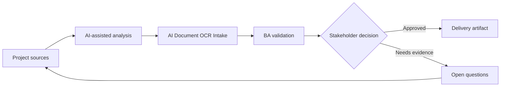

# AI Document OCR Intake

<div class="case-meta">
  <span>AI-enabled product use cases</span>
  <span>Document automation</span>
  <span>Project use case</span>
</div>

## Project context

An onboarding process requires customers to upload identity and compliance documents. Operations spends time reading PDFs, extracting fields, detecting missing pages, and asking customers to resubmit unclear documents. In Document automation, this work usually starts when AI behavior affects users directly and must include uncertainty, fallback, evaluation, and human review. The BA should treat Document type list and Field validation rules as evidence to organize, not as raw material for an unconstrained AI answer. The goal is to make the next decision clearer for the people who own the outcome.

## BA challenge

The BA must specify AI-assisted document extraction and validation while protecting against OCR errors, missing evidence, privacy issues, and incorrect automated rejection. Human review and fallback are essential. For AI Document OCR Intake, the practical difficulty is over-automation and unsafe confidence. AI can accelerate AI task framing, output contract drafting, evaluation planning, and safety-control critique, but the BA must still expose assumptions, missing approvals, and the point where stakeholder judgment is required.

## Where AI fits

<div class="ba-workbench-panel">
AI fits this AI-enabled product use cases use case when it is constrained to AI task framing, output contract drafting, evaluation planning, and safety-control critique. A useful first AI task is: Identify document types, required fields, and validation rules. AI should not approve scope, invent policy, bypass approved sources, model limits, evaluation cases, and human decision triggers, or turn a draft into a final decision.
</div>

- Identify document types, required fields, and validation rules.
- Draft extraction output schema and confidence behavior.
- Generate exception scenarios for missing, unreadable, or inconsistent documents.
- Create human review and audit requirements.

## Inputs to prepare

- Document type list
- Field validation rules
- Compliance policy
- Sample documents
- Operations exception logs

Before prompting for AI Document OCR Intake, label each input by owner, date, approval status, sensitivity, and role in the decision. The most important evidence lens is approved sources, model limits, evaluation cases, and human decision triggers; without it, AI may rank old notes, draft designs, and approved rules as if they had equal authority.

## BA workflow

1. Inventory document types and required fields with source policy.
2. Ask AI to draft extraction schema and validation scenarios.
3. Define confidence thresholds per field and per document.
4. Specify review triggers for low confidence, mismatch, missing page, or regulated decision.
5. Design customer messaging for resubmission without exposing sensitive logic.
6. Create evaluation set with real-world document variation.

Run the workflow as AI operating contract before build: start with "Inventory document types and required fields with source policy.", then keep a visible decision log as the artifact moves toward Extraction schema. This prevents AI suggestions from silently becoming backlog, design, release, or operational commitments.

## Diagram



## Deliverables

| Deliverable | What it contains | Owner | Done signal |
| --- | --- | --- | --- |
| Extraction schema | Document type, field, format, confidence, and source rule | BA and data team | Schema covers required fields |
| Validation rule matrix | Rule, evidence, pass condition, failure condition, and review trigger | Compliance owner | Rules are source-backed |
| Human review workflow | Trigger, reviewer action, SLA, audit, and correction capture | Operations | Review queue is operational |
| Evaluation set | Document samples, expected extraction, and error categories | QA and data team | Test cases cover messy documents |

Treat Extraction schema as a BA-owned AI behavior specification. AI may draft structure, but the BA must validate whether "Schema covers required fields" is actually true, whether the artifact is traceable to source evidence, and whether the receiving team can act on it.

## Prompt to try

```text
Act as a senior AI-aware Business Analyst. Help me apply the "AI Document OCR Intake" use case to my project. First ask for source evidence and constraints. Then create a structured analysis with project context, assumptions, AI-fit boundary, workflow steps, deliverables, risks, controls, open questions, and stakeholder decisions. Do not invent policy, thresholds, or approvals.
```

## Review checklist

- Document type list is labeled with owner, date, approval status, and sensitivity.
- Extraction schema traces to source evidence and has a named human owner.
- The AI task stays inside AI task framing, output contract drafting, evaluation planning, and safety-control critique and does not approve scope or policy.
- The "OCR error" risk has a practical control: Use field confidence and human review for material fields.
- Open assumptions are converted into validation questions or stakeholder decisions.
- Success metric: Document handling becomes faster while sensitive decisions remain reviewable and evidence-backed.

## Risks and controls

| Risk | Why it matters | BA control |
| --- | --- | --- |
| OCR error | Incorrect field extraction can create wrong decisions | Use field confidence and human review for material fields |
| Automated rejection harm | Customers may be rejected because AI misread a document | Require fallback and manual review before high-impact rejection |
| Privacy exposure | Documents contain sensitive data | Specify retention, access, masking, and audit |
| Unrealistic samples | Clean test documents may not match production | Use varied samples with blur, rotation, and missing pages |

The main control for the "OCR error" risk is explicit human accountability: Use field confidence and human review for material fields. If evidence is weak, the output should create a validation question or decision item, not a final requirement.
