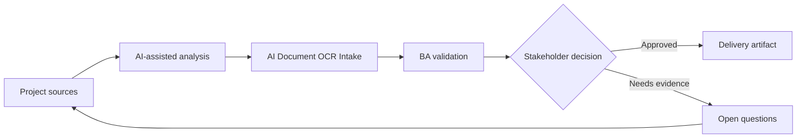

# AI Document OCR Intake

<div class="case-meta">
  <span>AI-enabled product use cases</span>
  <span>Document automation</span>
  <span>Project use case</span>
</div>

## Project context

An onboarding process requires customers to upload identity and compliance documents. Operations spends time reading PDFs, extracting fields, detecting missing pages, and asking customers to resubmit unclear documents. In a real delivery environment, this work usually appears under time pressure: stakeholders want clarity, delivery needs a backlog, QA needs testable behavior, and operations needs a process that can survive exceptions. The BA uses AI here to accelerate analysis and synthesis, but the BA remains accountable for evidence, business meaning, stakeholder decisioning, and artifact quality.

## BA challenge

The BA must specify AI-assisted document extraction and validation while protecting against OCR errors, missing evidence, privacy issues, and incorrect automated rejection. Human review and fallback are essential. The practical difficulty is that AI can make early material look more complete than it is. A strong BA keeps the output reviewable by separating source-backed facts, assumptions, unsupported claims, decision gaps, and recommended next actions. The objective is not to make the document longer; it is to make the project decision clearer and safer.

## Where AI fits

<div class="ba-workbench-panel">
AI is useful in this use case when it is constrained to analysis support, pattern detection, structured drafting, and critique. It should not approve scope, invent policy, decide business trade-offs, or replace accountable stakeholder judgment.
</div>

- Identify document types, required fields, and validation rules.
- Draft extraction output schema and confidence behavior.
- Generate exception scenarios for missing, unreadable, or inconsistent documents.
- Create human review and audit requirements.

## Inputs to prepare

- Document type list
- Field validation rules
- Compliance policy
- Sample documents
- Operations exception logs

A BA should label these inputs before using AI: source owner, source date, approval status, sensitivity level, and whether the source is fact, opinion, policy, draft, or historical evidence. This preparation prevents the model from treating every input as equally current and authoritative.

## BA workflow

1. Inventory document types and required fields with source policy.
2. Ask AI to draft extraction schema and validation scenarios.
3. Define confidence thresholds per field and per document.
4. Specify review triggers for low confidence, mismatch, missing page, or regulated decision.
5. Design customer messaging for resubmission without exposing sensitive logic.
6. Create evaluation set with real-world document variation.

The workflow works best as a staged AI collaboration: first organize the evidence, then ask for analysis, then create the artifact, then run a critique pass. The BA should keep a visible decision log throughout the process so that AI-generated suggestions do not silently become approved scope.

## Diagram



## Deliverables

| Deliverable | What it contains | Owner | Done signal |
| --- | --- | --- | --- |
| Extraction schema | Document type, field, format, confidence, and source rule | BA and data team | Schema covers required fields |
| Validation rule matrix | Rule, evidence, pass condition, failure condition, and review trigger | Compliance owner | Rules are source-backed |
| Human review workflow | Trigger, reviewer action, SLA, audit, and correction capture | Operations | Review queue is operational |
| Evaluation set | Document samples, expected extraction, and error categories | QA and data team | Test cases cover messy documents |

These deliverables should be treated as BA-owned artifacts. AI can draft them, but the BA must validate source support, stakeholder meaning, traceability, and whether the artifact is ready for handoff.

## Prompt to try

```text
Act as a senior AI-aware Business Analyst. Help me apply the "AI Document OCR Intake" use case to my project. First ask for source evidence and constraints. Then create a structured analysis with project context, assumptions, AI-fit boundary, workflow steps, deliverables, risks, controls, open questions, and stakeholder decisions. Do not invent policy, thresholds, or approvals.
```

## Review checklist

- Every AI-produced statement is tied to a source, assumption, or validation question.
- The BA has separated drafting assistance from business approval.
- Workflow steps identify the human owner for decisions, review, and exceptions.
- Deliverables are traceable to project inputs and can be reviewed by QA, product, or operations.
- Risk controls are practical enough to be used in a real project meeting.
- Success metric: Document handling becomes faster while sensitive decisions remain reviewable and evidence-backed.

## Risks and controls

| Risk | Why it matters | BA control |
| --- | --- | --- |
| OCR error | Incorrect field extraction can create wrong decisions | Use field confidence and human review for material fields |
| Automated rejection harm | Customers may be rejected because AI misread a document | Require fallback and manual review before high-impact rejection |
| Privacy exposure | Documents contain sensitive data | Specify retention, access, masking, and audit |
| Unrealistic samples | Clean test documents may not match production | Use varied samples with blur, rotation, and missing pages |

The key control is to make uncertainty visible. If evidence is weak, the output should create a validation question or decision item, not a final requirement. If the artifact influences delivery, release, compliance, customer experience, or operational workload, the BA should require explicit human review before handoff.
