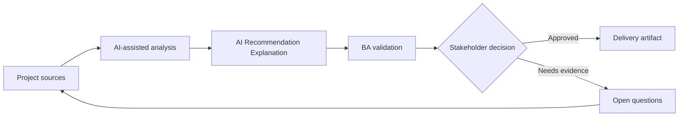

# AI Recommendation Explanation

<div class="case-meta">
  <span>AI-enabled product use cases</span>
  <span>Decision support</span>
  <span>AI product design</span>
  <span>Advanced</span>
  <span>Recommendation canvas</span>
  <span>Project use case</span>
</div>

## Project context

A B2B platform recommends next-best actions to account managers. Stakeholders want the system to suggest outreach actions, but sales leaders worry users will distrust opaque recommendations. In Decision support, this work usually starts when AI behavior affects users directly and must include uncertainty, fallback, evaluation, and human review. The BA should treat Business goal and User journey as evidence to organize, not as raw material for an unconstrained AI answer. The goal is to make the next decision clearer for the people who own the outcome.

## BA challenge

The BA must specify recommendation behavior, explanation requirements, user controls, feedback capture, evaluation metrics, and boundaries between decision support and automated decisioning. For AI Recommendation Explanation, the practical difficulty is over-automation and unsafe confidence. AI can accelerate AI task framing, output contract drafting, evaluation planning, and safety-control critique, but the BA must still expose assumptions, missing approvals, and the point where stakeholder judgment is required.

## Where AI fits

<div class="ba-workbench-panel">
AI fits this AI-enabled product use cases use case when it is constrained to AI task framing, output contract drafting, evaluation planning, and safety-control critique. A useful first AI task is: Draft recommendation output contract and explanation fields. AI should not approve scope, invent policy, bypass approved sources, model limits, evaluation cases, and human decision triggers, or turn a draft into a final decision.
</div>

- Draft recommendation output contract and explanation fields.
- Generate user trust and override scenarios.
- Identify data inputs, prohibited signals, and fairness concerns.
- Create acceptance criteria for feedback and monitoring.

## Inputs to prepare

- Business goal
- User journey
- Candidate data signals
- Sales playbook
- Risk and compliance constraints

Before prompting for AI Recommendation Explanation, label each input by owner, date, approval status, sensitivity, and role in the decision. The most important evidence lens is approved sources, model limits, evaluation cases, and human decision triggers; without it, AI may rank old notes, draft designs, and approved rules as if they had equal authority.

## BA workflow

1. Define the user decision the recommendation supports.
2. Ask AI to separate recommendation, explanation, confidence, and user action.
3. Specify allowed data signals and prohibited sensitive attributes.
4. Design feedback actions such as accept, dismiss, edit, and reason code.
5. Create evaluation metrics for usefulness, accuracy, adoption, and harm.
6. Review decision ownership and user messaging with stakeholders.

Run the workflow as AI operating contract before build: start with "Define the user decision the recommendation supports.", then keep a visible decision log as the artifact moves toward Recommendation canvas. This prevents AI suggestions from silently becoming backlog, design, release, or operational commitments.

## Diagram



## Deliverables

| Deliverable | What it contains | Owner | Done signal |
| --- | --- | --- | --- |
| Recommendation canvas | Goal, user, trigger, input signals, output, and action | BA | Decision support boundary is clear |
| Explanation requirements | Why shown, evidence, confidence, and uncertainty language | Product owner | Users can understand recommendation rationale |
| Feedback design | Accept, reject, edit, reason codes, and correction loop | UX and BA | Feedback is captured for learning |
| Evaluation plan | Offline and live metrics, adoption, override, and harm signals | Data team | Quality is measured after launch |

Treat Recommendation canvas as a BA-owned AI behavior specification. AI may draft structure, but the BA must validate whether "Decision support boundary is clear" is actually true, whether the artifact is traceable to source evidence, and whether the receiving team can act on it.

## Prompt to try

```text
Act as a senior AI-aware Business Analyst. Help me apply the "AI Recommendation Explanation" use case to my project. First ask for source evidence and constraints. Then create a structured analysis with project context, assumptions, AI-fit boundary, workflow steps, deliverables, risks, controls, open questions, and stakeholder decisions. Do not invent policy, thresholds, or approvals.
```

## Review checklist

- Business goal is labeled with owner, date, approval status, and sensitivity.
- Recommendation canvas traces to source evidence and has a named human owner.
- The AI task stays inside AI task framing, output contract drafting, evaluation planning, and safety-control critique and does not approve scope or policy.
- The "Opaque recommendation" risk has a practical control: Require explanation and uncertainty language.
- Open assumptions are converted into validation questions or stakeholder decisions.
- Success metric: Users understand recommendations, retain decision control, and provide feedback that improves the product.

## Risks and controls

| Risk | Why it matters | BA control |
| --- | --- | --- |
| Opaque recommendation | Users may ignore or misuse suggestions | Require explanation and uncertainty language |
| Automation creep | Decision support may become automated decisioning | Define user control and approval boundary |
| Sensitive signal use | Model may use inappropriate attributes | List prohibited data and review fairness |
| Feedback gap | The team may not learn from overrides | Capture reason codes and monitor patterns |

The main control for the "Opaque recommendation" risk is explicit human accountability: Require explanation and uncertainty language. If evidence is weak, the output should create a validation question or decision item, not a final requirement.
