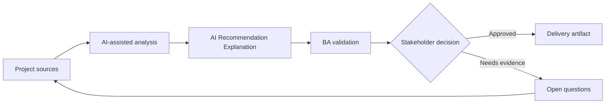

# AI Recommendation Explanation

<div class="case-meta">
  <span>AI-enabled product use cases</span>
  <span>Decision support</span>
  <span>Project use case</span>
</div>

## Project context

A B2B platform recommends next-best actions to account managers. Stakeholders want the system to suggest outreach actions, but sales leaders worry users will distrust opaque recommendations. In a real delivery environment, this work usually appears under time pressure: stakeholders want clarity, delivery needs a backlog, QA needs testable behavior, and operations needs a process that can survive exceptions. The BA uses AI here to accelerate analysis and synthesis, but the BA remains accountable for evidence, business meaning, stakeholder decisioning, and artifact quality.

## BA challenge

The BA must specify recommendation behavior, explanation requirements, user controls, feedback capture, evaluation metrics, and boundaries between decision support and automated decisioning. The practical difficulty is that AI can make early material look more complete than it is. A strong BA keeps the output reviewable by separating source-backed facts, assumptions, unsupported claims, decision gaps, and recommended next actions. The objective is not to make the document longer; it is to make the project decision clearer and safer.

## Where AI fits

<div class="ba-workbench-panel">
AI is useful in this use case when it is constrained to analysis support, pattern detection, structured drafting, and critique. It should not approve scope, invent policy, decide business trade-offs, or replace accountable stakeholder judgment.
</div>

- Draft recommendation output contract and explanation fields.
- Generate user trust and override scenarios.
- Identify data inputs, prohibited signals, and fairness concerns.
- Create acceptance criteria for feedback and monitoring.

## Inputs to prepare

- Business goal
- User journey
- Candidate data signals
- Sales playbook
- Risk and compliance constraints

A BA should label these inputs before using AI: source owner, source date, approval status, sensitivity level, and whether the source is fact, opinion, policy, draft, or historical evidence. This preparation prevents the model from treating every input as equally current and authoritative.

## BA workflow

1. Define the user decision the recommendation supports.
2. Ask AI to separate recommendation, explanation, confidence, and user action.
3. Specify allowed data signals and prohibited sensitive attributes.
4. Design feedback actions such as accept, dismiss, edit, and reason code.
5. Create evaluation metrics for usefulness, accuracy, adoption, and harm.
6. Review decision ownership and user messaging with stakeholders.

The workflow works best as a staged AI collaboration: first organize the evidence, then ask for analysis, then create the artifact, then run a critique pass. The BA should keep a visible decision log throughout the process so that AI-generated suggestions do not silently become approved scope.

## Diagram



## Deliverables

| Deliverable | What it contains | Owner | Done signal |
| --- | --- | --- | --- |
| Recommendation canvas | Goal, user, trigger, input signals, output, and action | BA | Decision support boundary is clear |
| Explanation requirements | Why shown, evidence, confidence, and uncertainty language | Product owner | Users can understand recommendation rationale |
| Feedback design | Accept, reject, edit, reason codes, and correction loop | UX and BA | Feedback is captured for learning |
| Evaluation plan | Offline and live metrics, adoption, override, and harm signals | Data team | Quality is measured after launch |

These deliverables should be treated as BA-owned artifacts. AI can draft them, but the BA must validate source support, stakeholder meaning, traceability, and whether the artifact is ready for handoff.

## Prompt to try

```text
Act as a senior AI-aware Business Analyst. Help me apply the "AI Recommendation Explanation" use case to my project. First ask for source evidence and constraints. Then create a structured analysis with project context, assumptions, AI-fit boundary, workflow steps, deliverables, risks, controls, open questions, and stakeholder decisions. Do not invent policy, thresholds, or approvals.
```

## Review checklist

- Every AI-produced statement is tied to a source, assumption, or validation question.
- The BA has separated drafting assistance from business approval.
- Workflow steps identify the human owner for decisions, review, and exceptions.
- Deliverables are traceable to project inputs and can be reviewed by QA, product, or operations.
- Risk controls are practical enough to be used in a real project meeting.
- Success metric: Users understand recommendations, retain decision control, and provide feedback that improves the product.

## Risks and controls

| Risk | Why it matters | BA control |
| --- | --- | --- |
| Opaque recommendation | Users may ignore or misuse suggestions | Require explanation and uncertainty language |
| Automation creep | Decision support may become automated decisioning | Define user control and approval boundary |
| Sensitive signal use | Model may use inappropriate attributes | List prohibited data and review fairness |
| Feedback gap | The team may not learn from overrides | Capture reason codes and monitor patterns |

The key control is to make uncertainty visible. If evidence is weak, the output should create a validation question or decision item, not a final requirement. If the artifact influences delivery, release, compliance, customer experience, or operational workload, the BA should require explicit human review before handoff.
