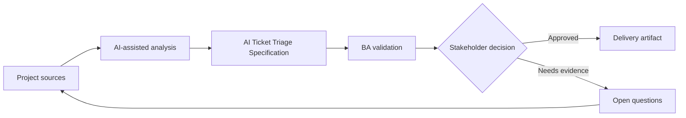

# AI Ticket Triage Specification

<div class="case-meta">
  <span>AI-enabled product use cases</span>
  <span>Support automation</span>
  <span>Project use case</span>
</div>

## Project context

A support organization wants AI to classify incoming tickets by category, urgency, product area, and routing queue. Incorrect routing increases SLA breaches and customer frustration. In a real delivery environment, this work usually appears under time pressure: stakeholders want clarity, delivery needs a backlog, QA needs testable behavior, and operations needs a process that can survive exceptions. The BA uses AI here to accelerate analysis and synthesis, but the BA remains accountable for evidence, business meaning, stakeholder decisioning, and artifact quality.

## BA challenge

The BA must specify probabilistic triage behavior, confidence thresholds, human review, correction capture, training data constraints, metrics, and operational monitoring. The feature is not just a classifier; it is a support workflow change. The practical difficulty is that AI can make early material look more complete than it is. A strong BA keeps the output reviewable by separating source-backed facts, assumptions, unsupported claims, decision gaps, and recommended next actions. The objective is not to make the document longer; it is to make the project decision clearer and safer.

## Where AI fits

<div class="ba-workbench-panel">
AI is useful in this use case when it is constrained to analysis support, pattern detection, structured drafting, and critique. It should not approve scope, invent policy, decide business trade-offs, or replace accountable stakeholder judgment.
</div>

- Draft label taxonomy and routing requirements.
- Generate confidence and human review scenarios.
- Create evaluation cases for category precision and high-risk routing.
- Identify operational metrics and correction feedback loop.

## Inputs to prepare

- Historical ticket data
- Support category taxonomy
- SLA rules
- Queue ownership
- Escalation policy

A BA should label these inputs before using AI: source owner, source date, approval status, sensitivity level, and whether the source is fact, opinion, policy, draft, or historical evidence. This preparation prevents the model from treating every input as equally current and authoritative.

## BA workflow

1. Define allowed labels, queue owners, and routing consequences.
2. Ask AI to identify ambiguous categories and required training examples.
3. Specify model output contract and confidence threshold behavior.
4. Design human review queue for low-confidence or high-impact tickets.
5. Create evaluation set and acceptance thresholds.
6. Define correction capture and monitoring metrics after launch.

The workflow works best as a staged AI collaboration: first organize the evidence, then ask for analysis, then create the artifact, then run a critique pass. The BA should keep a visible decision log throughout the process so that AI-generated suggestions do not silently become approved scope.

## Diagram



## Deliverables

| Deliverable | What it contains | Owner | Done signal |
| --- | --- | --- | --- |
| Triage taxonomy | Category, definition, examples, owner, and SLA impact | Support operations | Labels are mutually understandable |
| AI output contract | Required fields, confidence, explanation, and fallback | BA | Output can drive workflow safely |
| Evaluation plan | Test cases, expected labels, precision target, and high-risk focus | QA and data team | Metrics reflect business risk |
| Operational workflow | Human review, correction capture, and monitoring events | Support lead | Corrections improve future quality |

These deliverables should be treated as BA-owned artifacts. AI can draft them, but the BA must validate source support, stakeholder meaning, traceability, and whether the artifact is ready for handoff.

## Prompt to try

```text
Act as a senior AI-aware Business Analyst. Help me apply the "AI Ticket Triage Specification" use case to my project. First ask for source evidence and constraints. Then create a structured analysis with project context, assumptions, AI-fit boundary, workflow steps, deliverables, risks, controls, open questions, and stakeholder decisions. Do not invent policy, thresholds, or approvals.
```

## Review checklist

- Every AI-produced statement is tied to a source, assumption, or validation question.
- The BA has separated drafting assistance from business approval.
- Workflow steps identify the human owner for decisions, review, and exceptions.
- Deliverables are traceable to project inputs and can be reviewed by QA, product, or operations.
- Risk controls are practical enough to be used in a real project meeting.
- Success metric: Ticket routing improves SLA performance while low-confidence and high-risk cases receive human review.

## Risks and controls

| Risk | Why it matters | BA control |
| --- | --- | --- |
| Ambiguous taxonomy | Model cannot classify cleanly if humans disagree | Define labels with examples and owner decisions |
| Low-confidence automation | Tickets may route incorrectly without review | Use confidence threshold and human queue |
| Feedback loss | Corrections may not be captured | Specify reason codes and correction events |
| Metric mismatch | Overall accuracy may hide high-risk category errors | Measure precision for priority categories |

The key control is to make uncertainty visible. If evidence is weak, the output should create a validation question or decision item, not a final requirement. If the artifact influences delivery, release, compliance, customer experience, or operational workload, the BA should require explicit human review before handoff.
