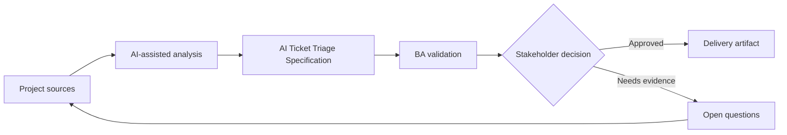

# AI Ticket Triage Specification

<div class="case-meta">
  <span>AI-enabled product use cases</span>
  <span>Support automation</span>
  <span>Project use case</span>
</div>

## Project context

A support organization wants AI to classify incoming tickets by category, urgency, product area, and routing queue. Incorrect routing increases SLA breaches and customer frustration. In Support automation, this work usually starts when AI behavior affects users directly and must include uncertainty, fallback, evaluation, and human review. The BA should treat Historical ticket data and Support category taxonomy as evidence to organize, not as raw material for an unconstrained AI answer. The goal is to make the next decision clearer for the people who own the outcome.

## BA challenge

The BA must specify probabilistic triage behavior, confidence thresholds, human review, correction capture, training data constraints, metrics, and operational monitoring. The feature is not just a classifier; it is a support workflow change. For AI Ticket Triage Specification, the practical difficulty is over-automation and unsafe confidence. AI can accelerate AI task framing, output contract drafting, evaluation planning, and safety-control critique, but the BA must still expose assumptions, missing approvals, and the point where stakeholder judgment is required.

## Where AI fits

<div class="ba-workbench-panel">
AI fits this AI-enabled product use cases use case when it is constrained to AI task framing, output contract drafting, evaluation planning, and safety-control critique. A useful first AI task is: Draft label taxonomy and routing requirements. AI should not approve scope, invent policy, bypass approved sources, model limits, evaluation cases, and human decision triggers, or turn a draft into a final decision.
</div>

- Draft label taxonomy and routing requirements.
- Generate confidence and human review scenarios.
- Create evaluation cases for category precision and high-risk routing.
- Identify operational metrics and correction feedback loop.

## Inputs to prepare

- Historical ticket data
- Support category taxonomy
- SLA rules
- Queue ownership
- Escalation policy

Before prompting for AI Ticket Triage Specification, label each input by owner, date, approval status, sensitivity, and role in the decision. The most important evidence lens is approved sources, model limits, evaluation cases, and human decision triggers; without it, AI may rank old notes, draft designs, and approved rules as if they had equal authority.

## BA workflow

1. Define allowed labels, queue owners, and routing consequences.
2. Ask AI to identify ambiguous categories and required training examples.
3. Specify model output contract and confidence threshold behavior.
4. Design human review queue for low-confidence or high-impact tickets.
5. Create evaluation set and acceptance thresholds.
6. Define correction capture and monitoring metrics after launch.

Run the workflow as AI operating contract before build: start with "Define allowed labels, queue owners, and routing consequences.", then keep a visible decision log as the artifact moves toward Triage taxonomy. This prevents AI suggestions from silently becoming backlog, design, release, or operational commitments.

## Diagram



## Deliverables

| Deliverable | What it contains | Owner | Done signal |
| --- | --- | --- | --- |
| Triage taxonomy | Category, definition, examples, owner, and SLA impact | Support operations | Labels are mutually understandable |
| AI output contract | Required fields, confidence, explanation, and fallback | BA | Output can drive workflow safely |
| Evaluation plan | Test cases, expected labels, precision target, and high-risk focus | QA and data team | Metrics reflect business risk |
| Operational workflow | Human review, correction capture, and monitoring events | Support lead | Corrections improve future quality |

Treat Triage taxonomy as a BA-owned AI behavior specification. AI may draft structure, but the BA must validate whether "Labels are mutually understandable" is actually true, whether the artifact is traceable to source evidence, and whether the receiving team can act on it.

## Prompt to try

```text
Act as a senior AI-aware Business Analyst. Help me apply the "AI Ticket Triage Specification" use case to my project. First ask for source evidence and constraints. Then create a structured analysis with project context, assumptions, AI-fit boundary, workflow steps, deliverables, risks, controls, open questions, and stakeholder decisions. Do not invent policy, thresholds, or approvals.
```

## Review checklist

- Historical ticket data is labeled with owner, date, approval status, and sensitivity.
- Triage taxonomy traces to source evidence and has a named human owner.
- The AI task stays inside AI task framing, output contract drafting, evaluation planning, and safety-control critique and does not approve scope or policy.
- The "Ambiguous taxonomy" risk has a practical control: Define labels with examples and owner decisions.
- Open assumptions are converted into validation questions or stakeholder decisions.
- Success metric: Ticket routing improves SLA performance while low-confidence and high-risk cases receive human review.

## Risks and controls

| Risk | Why it matters | BA control |
| --- | --- | --- |
| Ambiguous taxonomy | Model cannot classify cleanly if humans disagree | Define labels with examples and owner decisions |
| Low-confidence automation | Tickets may route incorrectly without review | Use confidence threshold and human queue |
| Feedback loss | Corrections may not be captured | Specify reason codes and correction events |
| Metric mismatch | Overall accuracy may hide high-risk category errors | Measure precision for priority categories |

The main control for the "Ambiguous taxonomy" risk is explicit human accountability: Define labels with examples and owner decisions. If evidence is weak, the output should create a validation question or decision item, not a final requirement.
