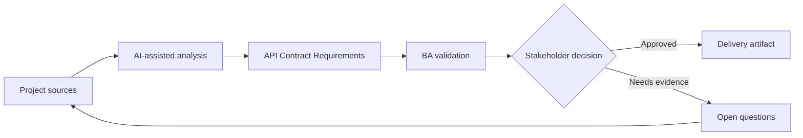

# API Contract Requirements

<div class="case-meta">
  <span>Backend and API</span>
  <span>API contracts</span>
  <span>Backend/API refinement</span>
  <span>Practitioner</span>
  <span>API behavior spec</span>
  <span>Project use case</span>
</div>

## Project context

Frontend and backend teams must integrate a new customer profile API. Stories describe the screen, but the request fields, response fields, validation behavior, error responses, and pagination rules are not agreed. In API contracts, this work usually starts when API contracts, permissions, errors, audit, and operational behavior must be explicit enough for backend delivery. The BA should treat Screen behavior spec and Data field definitions as evidence to organize, not as raw material for an unconstrained AI answer. The goal is to make the next decision clearer for the people who own the outcome.

## BA challenge

The BA must help define API behavior in business terms so frontend, backend, QA, and product align. API requirements should cover data meaning, not just technical schema. For API Contract Requirements, the practical difficulty is ambiguous service behavior and security gaps. AI can accelerate contract critique, rule extraction, error taxonomy, permission review, and NFR gap detection, but the BA must still expose assumptions, missing approvals, and the point where stakeholder judgment is required.

## Where AI fits

<div class="ba-workbench-panel">
AI fits this Backend and API use case when it is constrained to contract critique, rule extraction, error taxonomy, permission review, and NFR gap detection. A useful first AI task is: Draft an API contract checklist from screen requirements. AI should not approve scope, invent policy, bypass API draft, data model, auth rules, error samples, audit policy, and integration needs, or turn a draft into a final decision.
</div>

- Draft an API contract checklist from screen requirements.
- Identify missing request, response, validation, error, and pagination rules.
- Generate API acceptance criteria and integration questions.
- Critique schema fields for unclear business meaning.

## Inputs to prepare

- Screen behavior spec
- Data field definitions
- Backend domain model
- Existing API examples
- Validation rules

Before prompting for API Contract Requirements, label each input by owner, date, approval status, sensitivity, and role in the decision. The most important evidence lens is API draft, data model, auth rules, error samples, audit policy, and integration needs; without it, AI may rank old notes, draft designs, and approved rules as if they had equal authority.

## BA workflow

1. Map UI behavior to required API operations.
2. Ask AI to propose contract fields and missing business definitions.
3. Define request, response, filtering, sorting, pagination, validation, and error behavior.
4. Review schema with backend and frontend for feasibility.
5. Add API acceptance criteria and contract test scenarios.
6. Track unresolved contract decisions in a decision log.

Run the workflow as contract validation before implementation: start with "Map UI behavior to required API operations.", then keep a visible decision log as the artifact moves toward API behavior spec. This prevents AI suggestions from silently becoming backlog, design, release, or operational commitments.

## Diagram



## Deliverables

| Deliverable | What it contains | Owner | Done signal |
| --- | --- | --- | --- |
| API behavior spec | Operation, request, response, rule, pagination, and owner | BA and backend | API behavior is business-readable |
| Field definition catalog | Field, meaning, source, type, nullability, and example | BA | No unclear data fields |
| Error behavior table | Condition, status, code, message, frontend action, and owner | Backend | Errors are actionable |
| Contract test scenarios | Input, expected response, validation, and edge cases | QA | API can be tested before UI completion |

Treat API behavior spec as a BA-owned backend behavior contract. AI may draft structure, but the BA must validate whether "API behavior is business-readable" is actually true, whether the artifact is traceable to source evidence, and whether the receiving team can act on it.

## Prompt to try

```text
Act as a senior AI-aware Business Analyst. Help me apply the "API Contract Requirements" use case to my project. First ask for source evidence and constraints. Then create a structured analysis with project context, assumptions, AI-fit boundary, workflow steps, deliverables, risks, controls, open questions, and stakeholder decisions. Do not invent policy, thresholds, or approvals.
```

## Review checklist

- Screen behavior spec is labeled with owner, date, approval status, and sensitivity.
- API behavior spec traces to source evidence and has a named human owner.
- The AI task stays inside contract critique, rule extraction, error taxonomy, permission review, and NFR gap detection and does not approve scope or policy.
- The "Schema without meaning" risk has a practical control: Document field meaning and examples.
- Open assumptions are converted into validation questions or stakeholder decisions.
- Success metric: Frontend and backend integrate against a contract that is traceable to business behavior.

## Risks and controls

| Risk | Why it matters | BA control |
| --- | --- | --- |
| Schema without meaning | Teams may agree on fields but not business interpretation | Document field meaning and examples |
| Frontend-backend mismatch | UI expects behavior API does not provide | Trace UI behavior to API operations |
| Error ambiguity | Frontend cannot guide users from generic errors | Define error taxonomy and action |
| Late contract decision | Integration is delayed by unresolved fields | Track contract decisions early |

The main control for the "Schema without meaning" risk is explicit human accountability: Document field meaning and examples. If evidence is weak, the output should create a validation question or decision item, not a final requirement.
