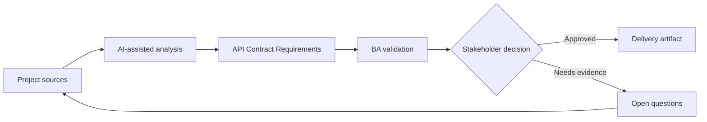

# API Contract Requirements

<div class="case-meta">
  <span>Backend and API</span>
  <span>API contracts</span>
  <span>Project use case</span>
</div>

## Project context

Frontend and backend teams must integrate a new customer profile API. Stories describe the screen, but the request fields, response fields, validation behavior, error responses, and pagination rules are not agreed. In a real delivery environment, this work usually appears under time pressure: stakeholders want clarity, delivery needs a backlog, QA needs testable behavior, and operations needs a process that can survive exceptions. The BA uses AI here to accelerate analysis and synthesis, but the BA remains accountable for evidence, business meaning, stakeholder decisioning, and artifact quality.

## BA challenge

The BA must help define API behavior in business terms so frontend, backend, QA, and product align. API requirements should cover data meaning, not just technical schema. The practical difficulty is that AI can make early material look more complete than it is. A strong BA keeps the output reviewable by separating source-backed facts, assumptions, unsupported claims, decision gaps, and recommended next actions. The objective is not to make the document longer; it is to make the project decision clearer and safer.

## Where AI fits

<div class="ba-workbench-panel">
AI is useful in this use case when it is constrained to analysis support, pattern detection, structured drafting, and critique. It should not approve scope, invent policy, decide business trade-offs, or replace accountable stakeholder judgment.
</div>

- Draft an API contract checklist from screen requirements.
- Identify missing request, response, validation, error, and pagination rules.
- Generate API acceptance criteria and integration questions.
- Critique schema fields for unclear business meaning.

## Inputs to prepare

- Screen behavior spec
- Data field definitions
- Backend domain model
- Existing API examples
- Validation rules

A BA should label these inputs before using AI: source owner, source date, approval status, sensitivity level, and whether the source is fact, opinion, policy, draft, or historical evidence. This preparation prevents the model from treating every input as equally current and authoritative.

## BA workflow

1. Map UI behavior to required API operations.
2. Ask AI to propose contract fields and missing business definitions.
3. Define request, response, filtering, sorting, pagination, validation, and error behavior.
4. Review schema with backend and frontend for feasibility.
5. Add API acceptance criteria and contract test scenarios.
6. Track unresolved contract decisions in a decision log.

The workflow works best as a staged AI collaboration: first organize the evidence, then ask for analysis, then create the artifact, then run a critique pass. The BA should keep a visible decision log throughout the process so that AI-generated suggestions do not silently become approved scope.

## Diagram



## Deliverables

| Deliverable | What it contains | Owner | Done signal |
| --- | --- | --- | --- |
| API behavior spec | Operation, request, response, rule, pagination, and owner | BA and backend | API behavior is business-readable |
| Field definition catalog | Field, meaning, source, type, nullability, and example | BA | No unclear data fields |
| Error behavior table | Condition, status, code, message, frontend action, and owner | Backend | Errors are actionable |
| Contract test scenarios | Input, expected response, validation, and edge cases | QA | API can be tested before UI completion |

These deliverables should be treated as BA-owned artifacts. AI can draft them, but the BA must validate source support, stakeholder meaning, traceability, and whether the artifact is ready for handoff.

## Prompt to try

```text
Act as a senior AI-aware Business Analyst. Help me apply the "API Contract Requirements" use case to my project. First ask for source evidence and constraints. Then create a structured analysis with project context, assumptions, AI-fit boundary, workflow steps, deliverables, risks, controls, open questions, and stakeholder decisions. Do not invent policy, thresholds, or approvals.
```

## Review checklist

- Every AI-produced statement is tied to a source, assumption, or validation question.
- The BA has separated drafting assistance from business approval.
- Workflow steps identify the human owner for decisions, review, and exceptions.
- Deliverables are traceable to project inputs and can be reviewed by QA, product, or operations.
- Risk controls are practical enough to be used in a real project meeting.
- Success metric: Frontend and backend integrate against a contract that is traceable to business behavior.

## Risks and controls

| Risk | Why it matters | BA control |
| --- | --- | --- |
| Schema without meaning | Teams may agree on fields but not business interpretation | Document field meaning and examples |
| Frontend-backend mismatch | UI expects behavior API does not provide | Trace UI behavior to API operations |
| Error ambiguity | Frontend cannot guide users from generic errors | Define error taxonomy and action |
| Late contract decision | Integration is delayed by unresolved fields | Track contract decisions early |

The key control is to make uncertainty visible. If evidence is weak, the output should create a validation question or decision item, not a final requirement. If the artifact influences delivery, release, compliance, customer experience, or operational workload, the BA should require explicit human review before handoff.
