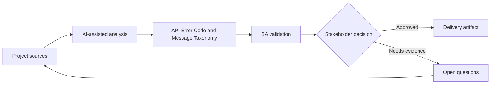

# API Error Code and Message Taxonomy

<div class="case-meta">
  <span>Backend and API</span>
  <span>Error handling</span>
  <span>Backend/API refinement</span>
  <span>Practitioner</span>
  <span>Error taxonomy</span>
  <span>Project use case</span>
</div>

## Project context

A mobile app consumes backend APIs that return inconsistent errors. Some errors are generic, some expose technical details, and some do not tell the UI what user action is possible. In Error handling, this work usually starts when API contracts, permissions, errors, audit, and operational behavior must be explicit enough for backend delivery. The BA should treat Existing error responses and API contract as evidence to organize, not as raw material for an unconstrained AI answer. The goal is to make the next decision clearer for the people who own the outcome.

## BA challenge

The BA must define error taxonomy as product behavior. Error codes should support user guidance, support diagnostics, security, retry logic, and QA testability. For API Error Code and Message Taxonomy, the practical difficulty is ambiguous service behavior and security gaps. AI can accelerate contract critique, rule extraction, error taxonomy, permission review, and NFR gap detection, but the BA must still expose assumptions, missing approvals, and the point where stakeholder judgment is required.

## Where AI fits

<div class="ba-workbench-panel">
AI fits this Backend and API use case when it is constrained to contract critique, rule extraction, error taxonomy, permission review, and NFR gap detection. A useful first AI task is: Cluster existing API errors into business categories. AI should not approve scope, invent policy, bypass API draft, data model, auth rules, error samples, audit policy, and integration needs, or turn a draft into a final decision.
</div>

- Cluster existing API errors into business categories.
- Draft error taxonomy with frontend action and support meaning.
- Identify security-sensitive messages that need safe wording.
- Generate negative API test scenarios.

## Inputs to prepare

- Existing error responses
- API contract
- Security guidelines
- Support runbooks
- UI error message catalog

Before prompting for API Error Code and Message Taxonomy, label each input by owner, date, approval status, sensitivity, and role in the decision. The most important evidence lens is API draft, data model, auth rules, error samples, audit policy, and integration needs; without it, AI may rank old notes, draft designs, and approved rules as if they had equal authority.

## BA workflow

1. Inventory current error responses and user-facing effects.
2. Ask AI to cluster errors by business condition and recovery action.
3. Define error code, HTTP status, safe message, frontend action, support meaning, and retry behavior.
4. Review security-sensitive errors with security owners.
5. Add acceptance criteria for negative cases and retry behavior.
6. Publish taxonomy and update frontend copy.

Run the workflow as contract validation before implementation: start with "Inventory current error responses and user-facing effects.", then keep a visible decision log as the artifact moves toward Error taxonomy. This prevents AI suggestions from silently becoming backlog, design, release, or operational commitments.

## Diagram



## Deliverables

| Deliverable | What it contains | Owner | Done signal |
| --- | --- | --- | --- |
| Error taxonomy | Condition, code, status, safe message, frontend action, and retry behavior | BA and backend | Errors are consistent |
| Security message review | Sensitive error, exposure risk, safe copy, and approval | Security | Messages do not leak internals |
| Frontend error action map | Code, UI message, user action, support path, and analytics | Frontend and UX | UI can guide recovery |
| Negative test set | Input, expected error code, expected UI, and support meaning | QA | Error behavior is testable |

Treat Error taxonomy as a BA-owned backend behavior contract. AI may draft structure, but the BA must validate whether "Errors are consistent" is actually true, whether the artifact is traceable to source evidence, and whether the receiving team can act on it.

## Prompt to try

```text
Act as a senior AI-aware Business Analyst. Help me apply the "API Error Code and Message Taxonomy" use case to my project. First ask for source evidence and constraints. Then create a structured analysis with project context, assumptions, AI-fit boundary, workflow steps, deliverables, risks, controls, open questions, and stakeholder decisions. Do not invent policy, thresholds, or approvals.
```

## Review checklist

- Existing error responses is labeled with owner, date, approval status, and sensitivity.
- Error taxonomy traces to source evidence and has a named human owner.
- The AI task stays inside contract critique, rule extraction, error taxonomy, permission review, and NFR gap detection and does not approve scope or policy.
- The "Generic error" risk has a practical control: Map each error to user and support action.
- Open assumptions are converted into validation questions or stakeholder decisions.
- Success metric: API errors become consistent product behavior that frontend, QA, and support can use.

## Risks and controls

| Risk | Why it matters | BA control |
| --- | --- | --- |
| Generic error | Users cannot recover and support cannot diagnose | Map each error to user and support action |
| Sensitive leakage | Errors may expose system internals | Use safe messages and security review |
| Retry confusion | UI may retry when it should not | Define retryable versus non-retryable |
| Inconsistent teams | APIs may use different codes for same condition | Publish shared taxonomy |

The main control for the "Generic error" risk is explicit human accountability: Map each error to user and support action. If evidence is weak, the output should create a validation question or decision item, not a final requirement.
