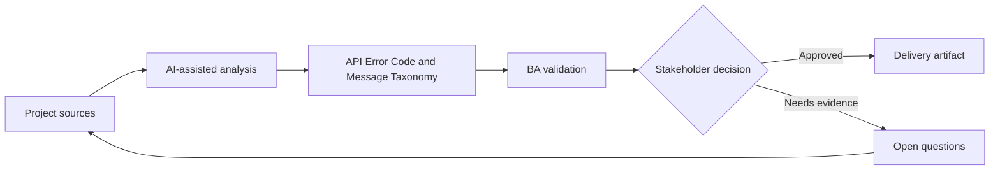

# API Error Code and Message Taxonomy

<div class="case-meta">
  <span>Backend and API</span>
  <span>Error handling</span>
  <span>Project use case</span>
</div>

## Project context

A mobile app consumes backend APIs that return inconsistent errors. Some errors are generic, some expose technical details, and some do not tell the UI what user action is possible. In a real delivery environment, this work usually appears under time pressure: stakeholders want clarity, delivery needs a backlog, QA needs testable behavior, and operations needs a process that can survive exceptions. The BA uses AI here to accelerate analysis and synthesis, but the BA remains accountable for evidence, business meaning, stakeholder decisioning, and artifact quality.

## BA challenge

The BA must define error taxonomy as product behavior. Error codes should support user guidance, support diagnostics, security, retry logic, and QA testability. The practical difficulty is that AI can make early material look more complete than it is. A strong BA keeps the output reviewable by separating source-backed facts, assumptions, unsupported claims, decision gaps, and recommended next actions. The objective is not to make the document longer; it is to make the project decision clearer and safer.

## Where AI fits

<div class="ba-workbench-panel">
AI is useful in this use case when it is constrained to analysis support, pattern detection, structured drafting, and critique. It should not approve scope, invent policy, decide business trade-offs, or replace accountable stakeholder judgment.
</div>

- Cluster existing API errors into business categories.
- Draft error taxonomy with frontend action and support meaning.
- Identify security-sensitive messages that need safe wording.
- Generate negative API test scenarios.

## Inputs to prepare

- Existing error responses
- API contract
- Security guidelines
- Support runbooks
- UI error message catalog

A BA should label these inputs before using AI: source owner, source date, approval status, sensitivity level, and whether the source is fact, opinion, policy, draft, or historical evidence. This preparation prevents the model from treating every input as equally current and authoritative.

## BA workflow

1. Inventory current error responses and user-facing effects.
2. Ask AI to cluster errors by business condition and recovery action.
3. Define error code, HTTP status, safe message, frontend action, support meaning, and retry behavior.
4. Review security-sensitive errors with security owners.
5. Add acceptance criteria for negative cases and retry behavior.
6. Publish taxonomy and update frontend copy.

The workflow works best as a staged AI collaboration: first organize the evidence, then ask for analysis, then create the artifact, then run a critique pass. The BA should keep a visible decision log throughout the process so that AI-generated suggestions do not silently become approved scope.

## Diagram



## Deliverables

| Deliverable | What it contains | Owner | Done signal |
| --- | --- | --- | --- |
| Error taxonomy | Condition, code, status, safe message, frontend action, and retry behavior | BA and backend | Errors are consistent |
| Security message review | Sensitive error, exposure risk, safe copy, and approval | Security | Messages do not leak internals |
| Frontend error action map | Code, UI message, user action, support path, and analytics | Frontend and UX | UI can guide recovery |
| Negative test set | Input, expected error code, expected UI, and support meaning | QA | Error behavior is testable |

These deliverables should be treated as BA-owned artifacts. AI can draft them, but the BA must validate source support, stakeholder meaning, traceability, and whether the artifact is ready for handoff.

## Prompt to try

```text
Act as a senior AI-aware Business Analyst. Help me apply the "API Error Code and Message Taxonomy" use case to my project. First ask for source evidence and constraints. Then create a structured analysis with project context, assumptions, AI-fit boundary, workflow steps, deliverables, risks, controls, open questions, and stakeholder decisions. Do not invent policy, thresholds, or approvals.
```

## Review checklist

- Every AI-produced statement is tied to a source, assumption, or validation question.
- The BA has separated drafting assistance from business approval.
- Workflow steps identify the human owner for decisions, review, and exceptions.
- Deliverables are traceable to project inputs and can be reviewed by QA, product, or operations.
- Risk controls are practical enough to be used in a real project meeting.
- Success metric: API errors become consistent product behavior that frontend, QA, and support can use.

## Risks and controls

| Risk | Why it matters | BA control |
| --- | --- | --- |
| Generic error | Users cannot recover and support cannot diagnose | Map each error to user and support action |
| Sensitive leakage | Errors may expose system internals | Use safe messages and security review |
| Retry confusion | UI may retry when it should not | Define retryable versus non-retryable |
| Inconsistent teams | APIs may use different codes for same condition | Publish shared taxonomy |

The key control is to make uncertainty visible. If evidence is weak, the output should create a validation question or decision item, not a final requirement. If the artifact influences delivery, release, compliance, customer experience, or operational workload, the BA should require explicit human review before handoff.
