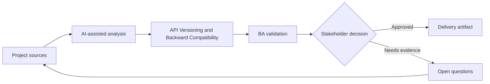

# API Versioning and Backward Compatibility

<div class="case-meta">
  <span>Backend and API</span>
  <span>API lifecycle</span>
  <span>Backend/API refinement</span>
  <span>Practitioner</span>
  <span>Change impact matrix</span>
  <span>Project use case</span>
</div>

## Project context

A public API used by partners needs new fields and behavior. Some partners cannot upgrade quickly, and breaking changes could disrupt revenue operations. In API lifecycle, this work usually starts when API contracts, permissions, errors, audit, and operational behavior must be explicit enough for backend delivery. The BA should treat Existing API contract and Proposed changes as evidence to organize, not as raw material for an unconstrained AI answer. The goal is to make the next decision clearer for the people who own the outcome.

## BA challenge

The BA must specify versioning and compatibility behavior in business terms: who is affected, what changes are breaking, migration timeline, deprecation communication, and support path. For API Versioning and Backward Compatibility, the practical difficulty is ambiguous service behavior and security gaps. AI can accelerate contract critique, rule extraction, error taxonomy, permission review, and NFR gap detection, but the BA must still expose assumptions, missing approvals, and the point where stakeholder judgment is required.

## Where AI fits

<div class="ba-workbench-panel">
AI fits this Backend and API use case when it is constrained to contract critique, rule extraction, error taxonomy, permission review, and NFR gap detection. A useful first AI task is: Classify proposed API changes as breaking or non-breaking. AI should not approve scope, invent policy, bypass API draft, data model, auth rules, error samples, audit policy, and integration needs, or turn a draft into a final decision.
</div>

- Classify proposed API changes as breaking or non-breaking.
- Generate partner impact questions and migration scenarios.
- Draft deprecation communication requirements.
- Create compatibility test cases.

## Inputs to prepare

- Existing API contract
- Proposed changes
- Partner usage data
- Support commitments
- Deprecation policy

Before prompting for API Versioning and Backward Compatibility, label each input by owner, date, approval status, sensitivity, and role in the decision. The most important evidence lens is API draft, data model, auth rules, error samples, audit policy, and integration needs; without it, AI may rank old notes, draft designs, and approved rules as if they had equal authority.

## BA workflow

1. Inventory current consumers and usage patterns.
2. Ask AI to classify change impact and identify migration questions.
3. Define versioning strategy, compatibility behavior, and support window.
4. Review revenue and partner impact with business owners.
5. Create migration, documentation, and communication requirements.
6. Add compatibility and regression tests for old and new versions.

Run the workflow as contract validation before implementation: start with "Inventory current consumers and usage patterns.", then keep a visible decision log as the artifact moves toward Change impact matrix. This prevents AI suggestions from silently becoming backlog, design, release, or operational commitments.

## Diagram



## Deliverables

| Deliverable | What it contains | Owner | Done signal |
| --- | --- | --- | --- |
| Change impact matrix | Change, breaking status, affected consumer, mitigation, and owner | BA | Impact is visible |
| Versioning requirement | Version strategy, support window, default behavior, and migration path | Backend | Compatibility behavior is clear |
| Partner communication plan | Notice, documentation, timeline, support, and escalation | Partner manager | Partners know what to do |
| Compatibility test set | Old contract, new contract, edge case, and regression expectation | QA | Old and new behavior are tested |

Treat Change impact matrix as a BA-owned backend behavior contract. AI may draft structure, but the BA must validate whether "Impact is visible" is actually true, whether the artifact is traceable to source evidence, and whether the receiving team can act on it.

## Prompt to try

```text
Act as a senior AI-aware Business Analyst. Help me apply the "API Versioning and Backward Compatibility" use case to my project. First ask for source evidence and constraints. Then create a structured analysis with project context, assumptions, AI-fit boundary, workflow steps, deliverables, risks, controls, open questions, and stakeholder decisions. Do not invent policy, thresholds, or approvals.
```

## Review checklist

- Existing API contract is labeled with owner, date, approval status, and sensitivity.
- Change impact matrix traces to source evidence and has a named human owner.
- The AI task stays inside contract critique, rule extraction, error taxonomy, permission review, and NFR gap detection and does not approve scope or policy.
- The "Unexpected breaking change" risk has a practical control: Classify and test breaking changes.
- Open assumptions are converted into validation questions or stakeholder decisions.
- Success metric: API changes ship with clear compatibility behavior, migration support, and partner impact visibility.

## Risks and controls

| Risk | Why it matters | BA control |
| --- | --- | --- |
| Unexpected breaking change | Partners may fail after release | Classify and test breaking changes |
| Communication gap | Consumers may not know migration timeline | Define notice and support plan |
| Long tail support | Old versions may linger | Set deprecation window and owner |
| Revenue disruption | Critical partners may be affected | Prioritize partner impact review |

The main control for the "Unexpected breaking change" risk is explicit human accountability: Classify and test breaking changes. If evidence is weak, the output should create a validation question or decision item, not a final requirement.
