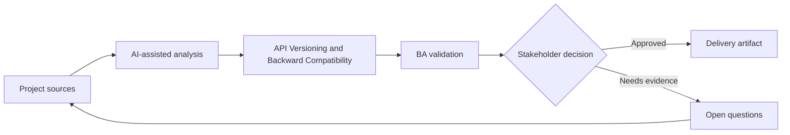

# API Versioning and Backward Compatibility

<div class="case-meta">
  <span>Backend and API</span>
  <span>API lifecycle</span>
  <span>Project use case</span>
</div>

## Project context

A public API used by partners needs new fields and behavior. Some partners cannot upgrade quickly, and breaking changes could disrupt revenue operations. In a real delivery environment, this work usually appears under time pressure: stakeholders want clarity, delivery needs a backlog, QA needs testable behavior, and operations needs a process that can survive exceptions. The BA uses AI here to accelerate analysis and synthesis, but the BA remains accountable for evidence, business meaning, stakeholder decisioning, and artifact quality.

## BA challenge

The BA must specify versioning and compatibility behavior in business terms: who is affected, what changes are breaking, migration timeline, deprecation communication, and support path. The practical difficulty is that AI can make early material look more complete than it is. A strong BA keeps the output reviewable by separating source-backed facts, assumptions, unsupported claims, decision gaps, and recommended next actions. The objective is not to make the document longer; it is to make the project decision clearer and safer.

## Where AI fits

<div class="ba-workbench-panel">
AI is useful in this use case when it is constrained to analysis support, pattern detection, structured drafting, and critique. It should not approve scope, invent policy, decide business trade-offs, or replace accountable stakeholder judgment.
</div>

- Classify proposed API changes as breaking or non-breaking.
- Generate partner impact questions and migration scenarios.
- Draft deprecation communication requirements.
- Create compatibility test cases.

## Inputs to prepare

- Existing API contract
- Proposed changes
- Partner usage data
- Support commitments
- Deprecation policy

A BA should label these inputs before using AI: source owner, source date, approval status, sensitivity level, and whether the source is fact, opinion, policy, draft, or historical evidence. This preparation prevents the model from treating every input as equally current and authoritative.

## BA workflow

1. Inventory current consumers and usage patterns.
2. Ask AI to classify change impact and identify migration questions.
3. Define versioning strategy, compatibility behavior, and support window.
4. Review revenue and partner impact with business owners.
5. Create migration, documentation, and communication requirements.
6. Add compatibility and regression tests for old and new versions.

The workflow works best as a staged AI collaboration: first organize the evidence, then ask for analysis, then create the artifact, then run a critique pass. The BA should keep a visible decision log throughout the process so that AI-generated suggestions do not silently become approved scope.

## Diagram



## Deliverables

| Deliverable | What it contains | Owner | Done signal |
| --- | --- | --- | --- |
| Change impact matrix | Change, breaking status, affected consumer, mitigation, and owner | BA | Impact is visible |
| Versioning requirement | Version strategy, support window, default behavior, and migration path | Backend | Compatibility behavior is clear |
| Partner communication plan | Notice, documentation, timeline, support, and escalation | Partner manager | Partners know what to do |
| Compatibility test set | Old contract, new contract, edge case, and regression expectation | QA | Old and new behavior are tested |

These deliverables should be treated as BA-owned artifacts. AI can draft them, but the BA must validate source support, stakeholder meaning, traceability, and whether the artifact is ready for handoff.

## Prompt to try

```text
Act as a senior AI-aware Business Analyst. Help me apply the "API Versioning and Backward Compatibility" use case to my project. First ask for source evidence and constraints. Then create a structured analysis with project context, assumptions, AI-fit boundary, workflow steps, deliverables, risks, controls, open questions, and stakeholder decisions. Do not invent policy, thresholds, or approvals.
```

## Review checklist

- Every AI-produced statement is tied to a source, assumption, or validation question.
- The BA has separated drafting assistance from business approval.
- Workflow steps identify the human owner for decisions, review, and exceptions.
- Deliverables are traceable to project inputs and can be reviewed by QA, product, or operations.
- Risk controls are practical enough to be used in a real project meeting.
- Success metric: API changes ship with clear compatibility behavior, migration support, and partner impact visibility.

## Risks and controls

| Risk | Why it matters | BA control |
| --- | --- | --- |
| Unexpected breaking change | Partners may fail after release | Classify and test breaking changes |
| Communication gap | Consumers may not know migration timeline | Define notice and support plan |
| Long tail support | Old versions may linger | Set deprecation window and owner |
| Revenue disruption | Critical partners may be affected | Prioritize partner impact review |

The key control is to make uncertainty visible. If evidence is weak, the output should create a validation question or decision item, not a final requirement. If the artifact influences delivery, release, compliance, customer experience, or operational workload, the BA should require explicit human review before handoff.
