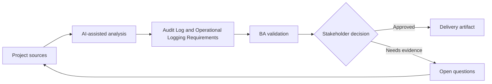

# Audit Log and Operational Logging Requirements

<div class="case-meta">
  <span>Backend and API</span>
  <span>Audit and observability</span>
  <span>Project use case</span>
</div>

## Project context

A regulated admin module lets users change customer status, override limits, export data, and approve exceptions. Compliance asks what evidence will exist when decisions are challenged. In Audit and observability, this work usually starts when API contracts, permissions, errors, audit, and operational behavior must be explicit enough for backend delivery. The BA should treat Sensitive action list and Compliance policy as evidence to organize, not as raw material for an unconstrained AI answer. The goal is to make the next decision clearer for the people who own the outcome.

## BA challenge

The BA must distinguish audit logs for accountability from operational logs for support and monitoring. Requirements must define event, actor, timestamp, before/after values, reason, correlation ID, retention, and access. For Audit Log and Operational Logging Requirements, the practical difficulty is ambiguous service behavior and security gaps. AI can accelerate contract critique, rule extraction, error taxonomy, permission review, and NFR gap detection, but the BA must still expose assumptions, missing approvals, and the point where stakeholder judgment is required.

## Where AI fits

<div class="ba-workbench-panel">
AI fits this Backend and API use case when it is constrained to contract critique, rule extraction, error taxonomy, permission review, and NFR gap detection. A useful first AI task is: Generate audit event candidates from sensitive workflows. AI should not approve scope, invent policy, bypass API draft, data model, auth rules, error samples, audit policy, and integration needs, or turn a draft into a final decision.
</div>

- Generate audit event candidates from sensitive workflows.
- Identify missing reason codes and before/after fields.
- Draft operational logging questions for support diagnostics.
- Create retention and access control checklist.

## Inputs to prepare

- Sensitive action list
- Compliance policy
- Support runbook
- Data retention rules
- Admin workflow specs

Before prompting for Audit Log and Operational Logging Requirements, label each input by owner, date, approval status, sensitivity, and role in the decision. The most important evidence lens is API draft, data model, auth rules, error samples, audit policy, and integration needs; without it, AI may rank old notes, draft designs, and approved rules as if they had equal authority.

## BA workflow

1. List actions requiring accountability, support diagnostics, or monitoring.
2. Ask AI to draft audit and operational event catalog.
3. Define required fields, reason codes, correlation IDs, and retention.
4. Review access rules for who can view logs.
5. Add acceptance criteria for log creation, export, and search.
6. Create QA scenarios for sensitive actions and failed attempts.

Run the workflow as contract validation before implementation: start with "List actions requiring accountability, support diagnostics, or monitoring.", then keep a visible decision log as the artifact moves toward Audit event catalog. This prevents AI suggestions from silently becoming backlog, design, release, or operational commitments.

## Diagram



## Deliverables

| Deliverable | What it contains | Owner | Done signal |
| --- | --- | --- | --- |
| Audit event catalog | Action, actor, before/after value, reason, source, and retention | BA and compliance | Audit evidence is complete |
| Operational log requirements | Event, correlation ID, diagnostic field, severity, and owner | Operations | Support can diagnose issues |
| Reason code set | Allowed reasons, when required, reviewer, and reporting use | Product owner | Sensitive actions have rationale |
| Log access matrix | Role, log type, visibility, export, and retention | Security | Logs are protected |

Treat Audit event catalog as a BA-owned backend behavior contract. AI may draft structure, but the BA must validate whether "Audit evidence is complete" is actually true, whether the artifact is traceable to source evidence, and whether the receiving team can act on it.

## Prompt to try

```text
Act as a senior AI-aware Business Analyst. Help me apply the "Audit Log and Operational Logging Requirements" use case to my project. First ask for source evidence and constraints. Then create a structured analysis with project context, assumptions, AI-fit boundary, workflow steps, deliverables, risks, controls, open questions, and stakeholder decisions. Do not invent policy, thresholds, or approvals.
```

## Review checklist

- Sensitive action list is labeled with owner, date, approval status, and sensitivity.
- Audit event catalog traces to source evidence and has a named human owner.
- The AI task stays inside contract critique, rule extraction, error taxonomy, permission review, and NFR gap detection and does not approve scope or policy.
- The "Audit gap" risk has a practical control: Capture actor, reason, source, and before/after values.
- Open assumptions are converted into validation questions or stakeholder decisions.
- Success metric: Sensitive backend actions produce audit evidence and operational logs that support compliance and support work.

## Risks and controls

| Risk | Why it matters | BA control |
| --- | --- | --- |
| Audit gap | A decision cannot be reconstructed later | Capture actor, reason, source, and before/after values |
| Log leakage | Logs may expose sensitive data | Define access and masking |
| Operational blindness | Support cannot trace failures | Specify correlation ID and diagnostic events |
| Reason quality | Users may choose meaningless reasons | Use controlled reason codes and comments when needed |

The main control for the "Audit gap" risk is explicit human accountability: Capture actor, reason, source, and before/after values. If evidence is weak, the output should create a validation question or decision item, not a final requirement.
