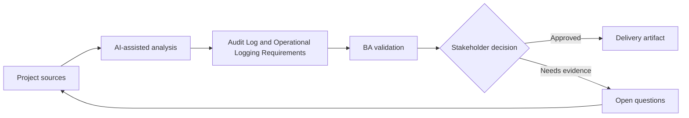

# Audit Log and Operational Logging Requirements

<div class="case-meta">
  <span>Backend and API</span>
  <span>Audit and observability</span>
  <span>Project use case</span>
</div>

## Project context

A regulated admin module lets users change customer status, override limits, export data, and approve exceptions. Compliance asks what evidence will exist when decisions are challenged. In a real delivery environment, this work usually appears under time pressure: stakeholders want clarity, delivery needs a backlog, QA needs testable behavior, and operations needs a process that can survive exceptions. The BA uses AI here to accelerate analysis and synthesis, but the BA remains accountable for evidence, business meaning, stakeholder decisioning, and artifact quality.

## BA challenge

The BA must distinguish audit logs for accountability from operational logs for support and monitoring. Requirements must define event, actor, timestamp, before/after values, reason, correlation ID, retention, and access. The practical difficulty is that AI can make early material look more complete than it is. A strong BA keeps the output reviewable by separating source-backed facts, assumptions, unsupported claims, decision gaps, and recommended next actions. The objective is not to make the document longer; it is to make the project decision clearer and safer.

## Where AI fits

<div class="ba-workbench-panel">
AI is useful in this use case when it is constrained to analysis support, pattern detection, structured drafting, and critique. It should not approve scope, invent policy, decide business trade-offs, or replace accountable stakeholder judgment.
</div>

- Generate audit event candidates from sensitive workflows.
- Identify missing reason codes and before/after fields.
- Draft operational logging questions for support diagnostics.
- Create retention and access control checklist.

## Inputs to prepare

- Sensitive action list
- Compliance policy
- Support runbook
- Data retention rules
- Admin workflow specs

A BA should label these inputs before using AI: source owner, source date, approval status, sensitivity level, and whether the source is fact, opinion, policy, draft, or historical evidence. This preparation prevents the model from treating every input as equally current and authoritative.

## BA workflow

1. List actions requiring accountability, support diagnostics, or monitoring.
2. Ask AI to draft audit and operational event catalog.
3. Define required fields, reason codes, correlation IDs, and retention.
4. Review access rules for who can view logs.
5. Add acceptance criteria for log creation, export, and search.
6. Create QA scenarios for sensitive actions and failed attempts.

The workflow works best as a staged AI collaboration: first organize the evidence, then ask for analysis, then create the artifact, then run a critique pass. The BA should keep a visible decision log throughout the process so that AI-generated suggestions do not silently become approved scope.

## Diagram



## Deliverables

| Deliverable | What it contains | Owner | Done signal |
| --- | --- | --- | --- |
| Audit event catalog | Action, actor, before/after value, reason, source, and retention | BA and compliance | Audit evidence is complete |
| Operational log requirements | Event, correlation ID, diagnostic field, severity, and owner | Operations | Support can diagnose issues |
| Reason code set | Allowed reasons, when required, reviewer, and reporting use | Product owner | Sensitive actions have rationale |
| Log access matrix | Role, log type, visibility, export, and retention | Security | Logs are protected |

These deliverables should be treated as BA-owned artifacts. AI can draft them, but the BA must validate source support, stakeholder meaning, traceability, and whether the artifact is ready for handoff.

## Prompt to try

```text
Act as a senior AI-aware Business Analyst. Help me apply the "Audit Log and Operational Logging Requirements" use case to my project. First ask for source evidence and constraints. Then create a structured analysis with project context, assumptions, AI-fit boundary, workflow steps, deliverables, risks, controls, open questions, and stakeholder decisions. Do not invent policy, thresholds, or approvals.
```

## Review checklist

- Every AI-produced statement is tied to a source, assumption, or validation question.
- The BA has separated drafting assistance from business approval.
- Workflow steps identify the human owner for decisions, review, and exceptions.
- Deliverables are traceable to project inputs and can be reviewed by QA, product, or operations.
- Risk controls are practical enough to be used in a real project meeting.
- Success metric: Sensitive backend actions produce audit evidence and operational logs that support compliance and support work.

## Risks and controls

| Risk | Why it matters | BA control |
| --- | --- | --- |
| Audit gap | A decision cannot be reconstructed later | Capture actor, reason, source, and before/after values |
| Log leakage | Logs may expose sensitive data | Define access and masking |
| Operational blindness | Support cannot trace failures | Specify correlation ID and diagnostic events |
| Reason quality | Users may choose meaningless reasons | Use controlled reason codes and comments when needed |

The key control is to make uncertainty visible. If evidence is weak, the output should create a validation question or decision item, not a final requirement. If the artifact influences delivery, release, compliance, customer experience, or operational workload, the BA should require explicit human review before handoff.
