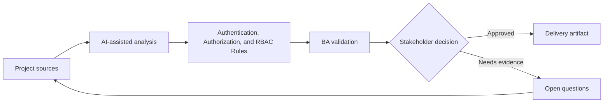

# Authentication, Authorization, and RBAC Rules

<div class="case-meta">
  <span>Backend and API</span>
  <span>Authorization</span>
  <span>Project use case</span>
</div>

## Project context

A SaaS admin system introduces tenant admins, billing admins, read-only auditors, and external partners. Role permissions affect screens, APIs, exports, approvals, and audit logs. In a real delivery environment, this work usually appears under time pressure: stakeholders want clarity, delivery needs a backlog, QA needs testable behavior, and operations needs a process that can survive exceptions. The BA uses AI here to accelerate analysis and synthesis, but the BA remains accountable for evidence, business meaning, stakeholder decisioning, and artifact quality.

## BA challenge

The BA must create RBAC requirements that are precise enough for backend enforcement and frontend behavior. The BA must also capture authentication assumptions, session behavior, escalation, and audit needs. The practical difficulty is that AI can make early material look more complete than it is. A strong BA keeps the output reviewable by separating source-backed facts, assumptions, unsupported claims, decision gaps, and recommended next actions. The objective is not to make the document longer; it is to make the project decision clearer and safer.

## Where AI fits

<div class="ba-workbench-panel">
AI is useful in this use case when it is constrained to analysis support, pattern detection, structured drafting, and critique. It should not approve scope, invent policy, decide business trade-offs, or replace accountable stakeholder judgment.
</div>

- Generate permission matrix from roles and user tasks.
- Identify conflicting permissions and segregation-of-duty risks.
- Draft API authorization scenarios and UI visibility rules.
- Create QA cases for unauthorized access and audit events.

## Inputs to prepare

- Role definitions
- User task list
- API operations
- Screen list
- Security and audit policy

A BA should label these inputs before using AI: source owner, source date, approval status, sensitivity level, and whether the source is fact, opinion, policy, draft, or historical evidence. This preparation prevents the model from treating every input as equally current and authoritative.

## BA workflow

1. List roles, business tasks, screens, data objects, and API operations.
2. Ask AI to draft permission matrix and find conflicts.
3. Review matrix with security, product, backend, frontend, and operations.
4. Define authentication and session behavior where relevant.
5. Create acceptance criteria for allowed and blocked actions.
6. Add audit and reporting requirements for sensitive actions.

The workflow works best as a staged AI collaboration: first organize the evidence, then ask for analysis, then create the artifact, then run a critique pass. The BA should keep a visible decision log throughout the process so that AI-generated suggestions do not silently become approved scope.

## Diagram



## Deliverables

| Deliverable | What it contains | Owner | Done signal |
| --- | --- | --- | --- |
| RBAC matrix | Role, task, data object, API operation, UI behavior, and audit | BA and security | Permissions are explicit |
| Authorization scenario set | Allowed, denied, cross-tenant, expired session, and escalation cases | QA | Security cases are testable |
| Segregation risk list | Conflicting roles, sensitive action, and approval rule | Security | High-risk combinations are controlled |
| Session behavior spec | Login, timeout, refresh, logout, and re-authentication rules | Backend | Auth behavior is predictable |

These deliverables should be treated as BA-owned artifacts. AI can draft them, but the BA must validate source support, stakeholder meaning, traceability, and whether the artifact is ready for handoff.

## Prompt to try

```text
Act as a senior AI-aware Business Analyst. Help me apply the "Authentication, Authorization, and RBAC Rules" use case to my project. First ask for source evidence and constraints. Then create a structured analysis with project context, assumptions, AI-fit boundary, workflow steps, deliverables, risks, controls, open questions, and stakeholder decisions. Do not invent policy, thresholds, or approvals.
```

## Review checklist

- Every AI-produced statement is tied to a source, assumption, or validation question.
- The BA has separated drafting assistance from business approval.
- Workflow steps identify the human owner for decisions, review, and exceptions.
- Deliverables are traceable to project inputs and can be reviewed by QA, product, or operations.
- Risk controls are practical enough to be used in a real project meeting.
- Success metric: RBAC behavior is enforceable by backend, understandable in UI, and testable by QA.

## Risks and controls

| Risk | Why it matters | BA control |
| --- | --- | --- |
| Role ambiguity | Same role name may mean different permissions | Define permissions by task and data object |
| Backend-only thinking | UI behavior may not match authorization | Trace backend permissions to UI state |
| Tenant leakage | Cross-tenant access can be severe | Add cross-tenant negative scenarios |
| Missing audit | Sensitive actions may lack trace | Specify audit event and reportability |

The key control is to make uncertainty visible. If evidence is weak, the output should create a validation question or decision item, not a final requirement. If the artifact influences delivery, release, compliance, customer experience, or operational workload, the BA should require explicit human review before handoff.
