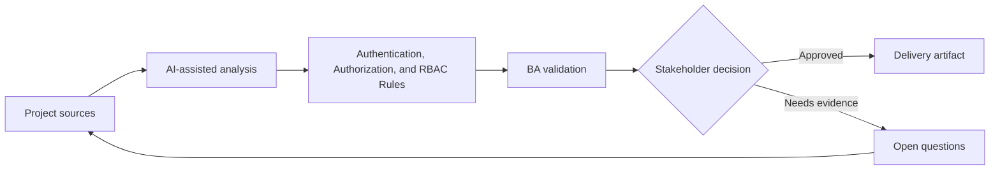

# Authentication, Authorization, and RBAC Rules

<div class="case-meta">
  <span>Backend and API</span>
  <span>Authorization</span>
  <span>Backend/API refinement</span>
  <span>Practitioner</span>
  <span>RBAC matrix</span>
  <span>Project use case</span>
</div>

## Project context

A SaaS admin system introduces tenant admins, billing admins, read-only auditors, and external partners. Role permissions affect screens, APIs, exports, approvals, and audit logs. In Authorization, this work usually starts when API contracts, permissions, errors, audit, and operational behavior must be explicit enough for backend delivery. The BA should treat Role definitions and User task list as evidence to organize, not as raw material for an unconstrained AI answer. The goal is to make the next decision clearer for the people who own the outcome.

## BA challenge

The BA must create RBAC requirements that are precise enough for backend enforcement and frontend behavior. The BA must also capture authentication assumptions, session behavior, escalation, and audit needs. For Authentication, Authorization, and RBAC Rules, the practical difficulty is ambiguous service behavior and security gaps. AI can accelerate contract critique, rule extraction, error taxonomy, permission review, and NFR gap detection, but the BA must still expose assumptions, missing approvals, and the point where stakeholder judgment is required.

## Where AI fits

<div class="ba-workbench-panel">
AI fits this Backend and API use case when it is constrained to contract critique, rule extraction, error taxonomy, permission review, and NFR gap detection. A useful first AI task is: Generate permission matrix from roles and user tasks. AI should not approve scope, invent policy, bypass API draft, data model, auth rules, error samples, audit policy, and integration needs, or turn a draft into a final decision.
</div>

- Generate permission matrix from roles and user tasks.
- Identify conflicting permissions and segregation-of-duty risks.
- Draft API authorization scenarios and UI visibility rules.
- Create QA cases for unauthorized access and audit events.

## Inputs to prepare

- Role definitions
- User task list
- API operations
- Screen list
- Security and audit policy

Before prompting for Authentication, Authorization, and RBAC Rules, label each input by owner, date, approval status, sensitivity, and role in the decision. The most important evidence lens is API draft, data model, auth rules, error samples, audit policy, and integration needs; without it, AI may rank old notes, draft designs, and approved rules as if they had equal authority.

## BA workflow

1. List roles, business tasks, screens, data objects, and API operations.
2. Ask AI to draft permission matrix and find conflicts.
3. Review matrix with security, product, backend, frontend, and operations.
4. Define authentication and session behavior where relevant.
5. Create acceptance criteria for allowed and blocked actions.
6. Add audit and reporting requirements for sensitive actions.

Run the workflow as contract validation before implementation: start with "List roles, business tasks, screens, data objects, and API operations.", then keep a visible decision log as the artifact moves toward RBAC matrix. This prevents AI suggestions from silently becoming backlog, design, release, or operational commitments.

## Diagram



## Deliverables

| Deliverable | What it contains | Owner | Done signal |
| --- | --- | --- | --- |
| RBAC matrix | Role, task, data object, API operation, UI behavior, and audit | BA and security | Permissions are explicit |
| Authorization scenario set | Allowed, denied, cross-tenant, expired session, and escalation cases | QA | Security cases are testable |
| Segregation risk list | Conflicting roles, sensitive action, and approval rule | Security | High-risk combinations are controlled |
| Session behavior spec | Login, timeout, refresh, logout, and re-authentication rules | Backend | Auth behavior is predictable |

Treat RBAC matrix as a BA-owned backend behavior contract. AI may draft structure, but the BA must validate whether "Permissions are explicit" is actually true, whether the artifact is traceable to source evidence, and whether the receiving team can act on it.

## Prompt to try

```text
Act as a senior AI-aware Business Analyst. Help me apply the "Authentication, Authorization, and RBAC Rules" use case to my project. First ask for source evidence and constraints. Then create a structured analysis with project context, assumptions, AI-fit boundary, workflow steps, deliverables, risks, controls, open questions, and stakeholder decisions. Do not invent policy, thresholds, or approvals.
```

## Review checklist

- Role definitions is labeled with owner, date, approval status, and sensitivity.
- RBAC matrix traces to source evidence and has a named human owner.
- The AI task stays inside contract critique, rule extraction, error taxonomy, permission review, and NFR gap detection and does not approve scope or policy.
- The "Role ambiguity" risk has a practical control: Define permissions by task and data object.
- Open assumptions are converted into validation questions or stakeholder decisions.
- Success metric: RBAC behavior is enforceable by backend, understandable in UI, and testable by QA.

## Risks and controls

| Risk | Why it matters | BA control |
| --- | --- | --- |
| Role ambiguity | Same role name may mean different permissions | Define permissions by task and data object |
| Backend-only thinking | UI behavior may not match authorization | Trace backend permissions to UI state |
| Tenant leakage | Cross-tenant access can be severe | Add cross-tenant negative scenarios |
| Missing audit | Sensitive actions may lack trace | Specify audit event and reportability |

The main control for the "Role ambiguity" risk is explicit human accountability: Define permissions by task and data object. If evidence is weak, the output should create a validation question or decision item, not a final requirement.
