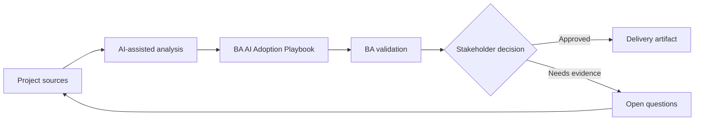

# BA AI Adoption Playbook

<div class="case-meta">
  <span>Governance and adoption</span>
  <span>BA practice leadership</span>
  <span>Governance</span>
  <span>Advanced</span>
  <span>Use-case portfolio</span>
  <span>Project use case</span>
</div>

## Project context

A BA manager wants to scale AI use across a 20-person BA practice. Some BAs are advanced, some are skeptical, and there is no shared standard for prompts, data handling, review, or artifact quality. In BA practice leadership, this work usually starts when AI usage must scale across teams without leaking sensitive data or creating unreviewable decisions. The BA should treat BA workflow list and Current artifacts as evidence to organize, not as raw material for an unconstrained AI answer. The goal is to make the next decision clearer for the people who own the outcome.

## BA challenge

The BA lead must turn AI enthusiasm into a managed capability with use-case tiers, training, prompt library, quality gates, governance, measurement, and coaching. Adoption must improve BA quality, not just activity. For BA AI Adoption Playbook, the practical difficulty is shadow AI use and weak accountability. AI can accelerate portfolio analysis, policy drafting, risk-tiering, playbook creation, and adoption measurement, but the BA must still expose assumptions, missing approvals, and the point where stakeholder judgment is required.

## Where AI fits

<div class="ba-workbench-panel">
AI fits this Governance and adoption use case when it is constrained to portfolio analysis, policy drafting, risk-tiering, playbook creation, and adoption measurement. A useful first AI task is: Inventory BA workflows and classify AI use cases by value and risk. AI should not approve scope, invent policy, bypass data policy, approved tools, risk appetite, audit need, and team capability, or turn a draft into a final decision.
</div>

- Inventory BA workflows and classify AI use cases by value and risk.
- Generate standard prompt patterns and review rubrics.
- Draft training paths by skill level.
- Create adoption metrics beyond tool usage.

## Inputs to prepare

- BA workflow list
- Current artifacts
- Tool policy
- Quality pain points
- Team skill assessment

Before prompting for BA AI Adoption Playbook, label each input by owner, date, approval status, sensitivity, and role in the decision. The most important evidence lens is data policy, approved tools, risk appetite, audit need, and team capability; without it, AI may rank old notes, draft designs, and approved rules as if they had equal authority.

## BA workflow

1. Map BA workflows where AI can support drafting, synthesis, review, and analysis.
2. Classify use cases into low, medium, and high-risk tiers.
3. Create approved prompt patterns with context and evidence rules.
4. Define quality gates for AI-assisted artifacts.
5. Pilot with selected BAs and measure quality, cycle time, and rework.
6. Scale through coaching, playbooks, and community review rituals.

Run the workflow as governance design before broad rollout: start with "Map BA workflows where AI can support drafting, synthesis, review, and analysis.", then keep a visible decision log as the artifact moves toward Use-case portfolio. This prevents AI suggestions from silently becoming backlog, design, release, or operational commitments.

## Diagram



## Deliverables

| Deliverable | What it contains | Owner | Done signal |
| --- | --- | --- | --- |
| Use-case portfolio | Workflow, value, risk, allowed data, approved tool, and review need | BA lead | Use cases are risk-tiered |
| Prompt and context library | Reusable prompts, input checklist, output schema, and review rubric | BA practice | BAs reuse shared standards |
| Training plan | Foundation, practitioner, reviewer, and lead modules | BA manager | Training matches skill level |
| Adoption scorecard | Usage, artifact quality, cycle time, defects, and rework | Sponsor | Success is quality-based |

Treat Use-case portfolio as a BA-owned AI adoption control pack. AI may draft structure, but the BA must validate whether "Use cases are risk-tiered" is actually true, whether the artifact is traceable to source evidence, and whether the receiving team can act on it.

## Prompt to try

```text
Act as a senior AI-aware Business Analyst. Help me apply the "BA AI Adoption Playbook" use case to my project. First ask for source evidence and constraints. Then create a structured analysis with project context, assumptions, AI-fit boundary, workflow steps, deliverables, risks, controls, open questions, and stakeholder decisions. Do not invent policy, thresholds, or approvals.
```

## Review checklist

- BA workflow list is labeled with owner, date, approval status, and sensitivity.
- Use-case portfolio traces to source evidence and has a named human owner.
- The AI task stays inside portfolio analysis, policy drafting, risk-tiering, playbook creation, and adoption measurement and does not approve scope or policy.
- The "Tool-first adoption" risk has a practical control: Start from BA workflows and problems.
- Open assumptions are converted into validation questions or stakeholder decisions.
- Success metric: The BA practice adopts AI through shared patterns, review gates, and measurable quality improvement.

## Risks and controls

| Risk | Why it matters | BA control |
| --- | --- | --- |
| Tool-first adoption | Teams may focus on features instead of work quality | Start from BA workflows and problems |
| Inconsistent artifacts | Each BA may create different standards | Use shared prompt library and rubrics |
| Unsafe data use | People may paste sensitive data into AI tools | Define approved tools and data rules |
| No quality proof | Adoption may look successful but not improve outcomes | Measure defects, rework, and stakeholder confidence |

The main control for the "Tool-first adoption" risk is explicit human accountability: Start from BA workflows and problems. If evidence is weak, the output should create a validation question or decision item, not a final requirement.
