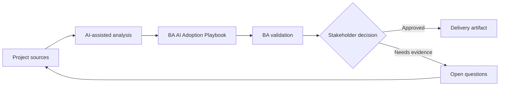

# BA AI Adoption Playbook

<div class="case-meta">
  <span>Governance and adoption</span>
  <span>BA practice leadership</span>
  <span>Project use case</span>
</div>

## Project context

A BA manager wants to scale AI use across a 20-person BA practice. Some BAs are advanced, some are skeptical, and there is no shared standard for prompts, data handling, review, or artifact quality. In a real delivery environment, this work usually appears under time pressure: stakeholders want clarity, delivery needs a backlog, QA needs testable behavior, and operations needs a process that can survive exceptions. The BA uses AI here to accelerate analysis and synthesis, but the BA remains accountable for evidence, business meaning, stakeholder decisioning, and artifact quality.

## BA challenge

The BA lead must turn AI enthusiasm into a managed capability with use-case tiers, training, prompt library, quality gates, governance, measurement, and coaching. Adoption must improve BA quality, not just activity. The practical difficulty is that AI can make early material look more complete than it is. A strong BA keeps the output reviewable by separating source-backed facts, assumptions, unsupported claims, decision gaps, and recommended next actions. The objective is not to make the document longer; it is to make the project decision clearer and safer.

## Where AI fits

<div class="ba-workbench-panel">
AI is useful in this use case when it is constrained to analysis support, pattern detection, structured drafting, and critique. It should not approve scope, invent policy, decide business trade-offs, or replace accountable stakeholder judgment.
</div>

- Inventory BA workflows and classify AI use cases by value and risk.
- Generate standard prompt patterns and review rubrics.
- Draft training paths by skill level.
- Create adoption metrics beyond tool usage.

## Inputs to prepare

- BA workflow list
- Current artifacts
- Tool policy
- Quality pain points
- Team skill assessment

A BA should label these inputs before using AI: source owner, source date, approval status, sensitivity level, and whether the source is fact, opinion, policy, draft, or historical evidence. This preparation prevents the model from treating every input as equally current and authoritative.

## BA workflow

1. Map BA workflows where AI can support drafting, synthesis, review, and analysis.
2. Classify use cases into low, medium, and high-risk tiers.
3. Create approved prompt patterns with context and evidence rules.
4. Define quality gates for AI-assisted artifacts.
5. Pilot with selected BAs and measure quality, cycle time, and rework.
6. Scale through coaching, playbooks, and community review rituals.

The workflow works best as a staged AI collaboration: first organize the evidence, then ask for analysis, then create the artifact, then run a critique pass. The BA should keep a visible decision log throughout the process so that AI-generated suggestions do not silently become approved scope.

## Diagram



## Deliverables

| Deliverable | What it contains | Owner | Done signal |
| --- | --- | --- | --- |
| Use-case portfolio | Workflow, value, risk, allowed data, approved tool, and review need | BA lead | Use cases are risk-tiered |
| Prompt and context library | Reusable prompts, input checklist, output schema, and review rubric | BA practice | BAs reuse shared standards |
| Training plan | Foundation, practitioner, reviewer, and lead modules | BA manager | Training matches skill level |
| Adoption scorecard | Usage, artifact quality, cycle time, defects, and rework | Sponsor | Success is quality-based |

These deliverables should be treated as BA-owned artifacts. AI can draft them, but the BA must validate source support, stakeholder meaning, traceability, and whether the artifact is ready for handoff.

## Prompt to try

```text
Act as a senior AI-aware Business Analyst. Help me apply the "BA AI Adoption Playbook" use case to my project. First ask for source evidence and constraints. Then create a structured analysis with project context, assumptions, AI-fit boundary, workflow steps, deliverables, risks, controls, open questions, and stakeholder decisions. Do not invent policy, thresholds, or approvals.
```

## Review checklist

- Every AI-produced statement is tied to a source, assumption, or validation question.
- The BA has separated drafting assistance from business approval.
- Workflow steps identify the human owner for decisions, review, and exceptions.
- Deliverables are traceable to project inputs and can be reviewed by QA, product, or operations.
- Risk controls are practical enough to be used in a real project meeting.
- Success metric: The BA practice adopts AI through shared patterns, review gates, and measurable quality improvement.

## Risks and controls

| Risk | Why it matters | BA control |
| --- | --- | --- |
| Tool-first adoption | Teams may focus on features instead of work quality | Start from BA workflows and problems |
| Inconsistent artifacts | Each BA may create different standards | Use shared prompt library and rubrics |
| Unsafe data use | People may paste sensitive data into AI tools | Define approved tools and data rules |
| No quality proof | Adoption may look successful but not improve outcomes | Measure defects, rework, and stakeholder confidence |

The key control is to make uncertainty visible. If evidence is weak, the output should create a validation question or decision item, not a final requirement. If the artifact influences delivery, release, compliance, customer experience, or operational workload, the BA should require explicit human review before handoff.
