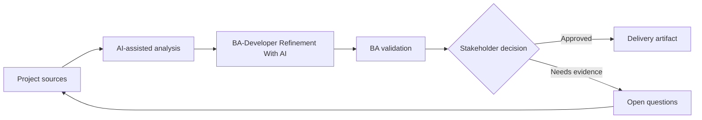

# BA-Developer Refinement With AI

<div class="case-meta">
  <span>Cross-functional BA Collaboration</span>
  <span>BA and developers</span>
  <span>Project use case</span>
</div>

## Project context

A squad prepares backlog refinement for a feature touching UI, API, validation, and permissions. Developers need clearer behavior and BA wants to find gaps before the meeting. In BA and developers, this work usually starts when different roles need different artifacts, but the BA must keep decisions consistent across product, design, engineering, QA, data, and operations. The BA should treat User stories and Design notes as evidence to organize, not as raw material for an unconstrained AI answer. The goal is to make the next decision clearer for the people who own the outcome.

## BA challenge

The BA must use AI to prepare better refinement, not to replace developer judgment. The output should surface assumptions, technical questions, API dependencies, edge cases, and decisions needed. For BA-Developer Refinement With AI, the practical difficulty is role misalignment and hidden trade-offs. AI can accelerate role-specific synthesis, decision memo drafting, conflict surfacing, and shared artifact critique, but the BA must still expose assumptions, missing approvals, and the point where stakeholder judgment is required.

## Where AI fits

<div class="ba-workbench-panel">
AI fits this Cross-functional BA Collaboration use case when it is constrained to role-specific synthesis, decision memo drafting, conflict surfacing, and shared artifact critique. A useful first AI task is: Critique stories from developer, API, data, and integration perspectives. AI should not approve scope, invent policy, bypass role feedback, decision log, design notes, technical constraints, test concerns, and support needs, or turn a draft into a final decision.
</div>

- Critique stories from developer, API, data, and integration perspectives.
- Generate refinement questions and missing behavior list.
- Draft acceptance criteria and technical dependency notes.
- Create meeting agenda focused on decisions.

## Inputs to prepare

- User stories
- Design notes
- API notes
- Current architecture constraints
- Open decisions

Before prompting for BA-Developer Refinement With AI, label each input by owner, date, approval status, sensitivity, and role in the decision. The most important evidence lens is role feedback, decision log, design notes, technical constraints, test concerns, and support needs; without it, AI may rank old notes, draft designs, and approved rules as if they had equal authority.

## BA workflow

1. Package story context, design, known rules, and constraints.
2. Ask AI to review from frontend, backend, QA, and operations lenses.
3. Convert findings into refinement questions with owners.
4. Separate business decisions from technical design questions.
5. Update stories and acceptance criteria before the meeting.
6. Use the meeting to close decisions and confirm dependencies.

Run the workflow as cross-role decision alignment before handoff: start with "Package story context, design, known rules, and constraints.", then keep a visible decision log as the artifact moves toward Refinement prep pack. This prevents AI suggestions from silently becoming backlog, design, release, or operational commitments.

## Diagram



## Deliverables

| Deliverable | What it contains | Owner | Done signal |
| --- | --- | --- | --- |
| Refinement prep pack | Story context, assumptions, gaps, questions, and dependency notes | BA | Meeting starts with decisions |
| Technical question log | Question, category, owner, impact, and resolution | BA and tech lead | Questions are tracked |
| Updated acceptance criteria | Behavior, edge case, API dependency, and test signal | BA | Stories are development-ready |
| Decision summary | Decision, rationale, owner, and impact on backlog | Product owner | Refinement outcomes are captured |

Treat Refinement prep pack as a BA-owned collaboration decision artifact. AI may draft structure, but the BA must validate whether "Meeting starts with decisions" is actually true, whether the artifact is traceable to source evidence, and whether the receiving team can act on it.

## Prompt to try

```text
Act as a senior AI-aware Business Analyst. Help me apply the "BA-Developer Refinement With AI" use case to my project. First ask for source evidence and constraints. Then create a structured analysis with project context, assumptions, AI-fit boundary, workflow steps, deliverables, risks, controls, open questions, and stakeholder decisions. Do not invent policy, thresholds, or approvals.
```

## Review checklist

- User stories is labeled with owner, date, approval status, and sensitivity.
- Refinement prep pack traces to source evidence and has a named human owner.
- The AI task stays inside role-specific synthesis, decision memo drafting, conflict surfacing, and shared artifact critique and does not approve scope or policy.
- The "AI oversteps technical design" risk has a practical control: Use AI to ask questions, not decide architecture.
- Open assumptions are converted into validation questions or stakeholder decisions.
- Success metric: Refinement meetings spend more time deciding and less time discovering missing requirement basics.

## Risks and controls

| Risk | Why it matters | BA control |
| --- | --- | --- |
| AI oversteps technical design | AI may suggest architecture without context | Use AI to ask questions, not decide architecture |
| Meeting overload | Too many generated questions waste time | Prioritize by risk and dependency |
| Business/technical confusion | Teams may mix decision types | Separate business decisions and design questions |
| Untracked decisions | Refinement conclusions may disappear | Capture decision summary |

The main control for the "AI oversteps technical design" risk is explicit human accountability: Use AI to ask questions, not decide architecture. If evidence is weak, the output should create a validation question or decision item, not a final requirement.
